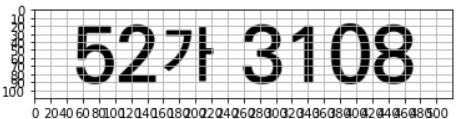
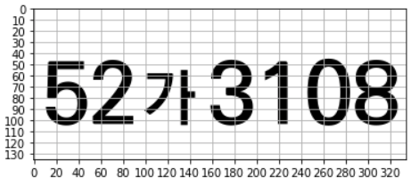
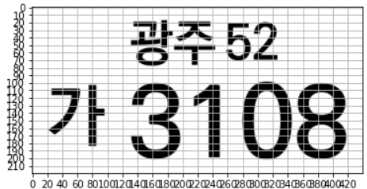
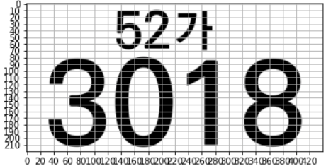

# ANPR EU (European Union)
### Auto Number Plate Recognition for EU countries
<br>

**🦋 Available Countries:** (We are adding more contries.)
```
🇦🇱 Albania                  🇨🇿 Czechia
🇦🇩 Andorra                  🇩🇰 Denmark
🇦🇹 Austria                  🇫🇮 Finland
🇧🇪 Belgium                  🇫🇷 France
🇧🇦 Bosnia and Herzegovina   🇩🇪 Germany
🇧🇬 Bulgaria                 🇬🇷 Greece
🇭🇷 Croatia                  🇭🇺 Hungary
🇨🇾 Cyprus                   🇮🇪 Ireland
```
<br>

**🦋 Recognisable characters:**
```python
char_list = [
    "-", ".", "0", "1", "2", "3", "4", "5", "6", "7", "8", "9",
    "A", "B", "C", "D", "E", "F", "G", "H", "I", "J", "K", "L", "M", "N",
    "O", "P", "Q", "R", "S", "T", "U", "V", "W", "X", "Y", "Z", "a", "d", "i", "m", "o",
    "Ö", "Ü", "Ć", "Č", "Đ", "Š", "Ž", "П"
]
```
<br>

# ANPR Korea
### 한국 자동차 번호판 인식 솔루션
<br>

### 🦋 인식 가능 번호판 종류
**다음과 같은 대표적인 6가지 종류등의 번호판 인식 가능합니다.** (특수, 오토바이 번호판을 추가 중입니다.)









### **인식 가능 문자**

```yaml
char_list = [
    '0', '1', '2', '3', '4', '5', '6', '7', '8', '9', 
    '가', '강', '거', '경', '고', '광', '구', '기',
    '나', '남', '너', '노', '누',
    '다', '대', '더', '도', '동', '두',
    '라', '러', '로', '루',
    '마', '머', '모', '무', '문',
    '바', '배', '버', '보', '부', '북',
    '사', '산', '서', '세', '소', '수',
    '아', '어', '오', '우', '울', '원', '육', '인',
    '자', '저', '전', '제', '조', '종', '주',
    '천', '충',
    '하', '허', '호'
]
```
<br>

## 🤖 Live Test
- **Performance can be improved with your usage data. 🙇🏻‍♂️**
- 📧 [Email us](mailto:hello@marearts.com) for further information.
- [**MareArts 🎬 Live**](http://live.marearts.com/)
<br>
<br>

## 📺 ANPR Result Videos
Check the license plate recognition results in these [YouTube videos](https://www.youtube.com/playlist?list=PLvX6vpRszMkxJBJf4EjQ5VCnmkjfE59-J).
<br>
<br>

## 📝 Using API

### 🔬 API Usage
- **Use curl or Python examples provided for API calls.**
```python
#shell script
./kr_curl_request.sh
./eu_curl_request.sh
```
```python
#python code
python ./kr_api_request.oy
python ./eu_api_request.py
```
- **For private keys,** [contact us.](mailto:hello@marearts.com)
- **Public key limits:** 1000 requests per day.
```yaml
# Public keys
user-id : marearts@public
x-api-key : J4K9L2Wory34@G7T1Y8rt-PP83uSSvkV3Z6ioSTR!
```
### 🔬 Returns
- **results:** Contains OCR text, probabilities, and detection locations.
- **Processing Speeds:** Provided for license plate detection and OCR.
- **Usage:** Current day’s usage and maximum usage.

```python
# Example 1 JSON
{
    "results": [{
        "ocr": "KU17ZY", "ocr_conf": 99,
        "ltrb": [619, 327, 775, 393], "ltrb_conf": 93
    }],
    "ltrb_proc_sec": 0.14, "ocr_proc_sec": 0.34,
    "usage": "1", "day_max": "10000"
}
```
---

## ETC
```python
# box display code with label
ex_box_display.py
```

---
<br>

🙇🏻‍♂️ **Thank you! We look forward to improving performance with your valuable feedback and data.**
