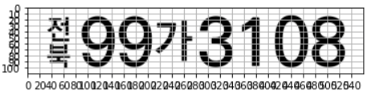
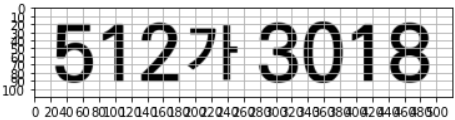

# ANPR EU (European Union)
### Auto Number Plate Recognition for EU countries
<br>

**🦋 Available Countries:**
```
🇦🇱 Albania                  🇨🇿 Czechia
🇦🇩 Andorra                  🇩🇰 Denmark
🇦🇹 Austria                  🇫🇮 Finland
🇧🇪 Belgium                  🇫🇷 France
🇧🇦 Bosnia and Herzegovina   🇩🇪 Germany
🇧🇬 Bulgaria                 🇬🇷 Greece
🇭🇷 Croatia                  🇭🇺 Hungary
🇨🇾 Cyprus                   🇮🇪 Ireland
```
<br>

**🦋 Recognisable characters:**
```python
char_list = [
    "-", ".", "0", "1", "2", "3", "4", "5", "6", "7", "8", "9",
    "A", "B", "C", "D", "E", "F", "G", "H", "I", "J", "K", "L", "M", "N",
    "O", "P", "Q", "R", "S", "T", "U", "V", "W", "X", "Y", "Z", "a", "d", "i", "m", "o",
    "Ö", "Ü", "Ć", "Č", "Đ", "Š", "Ž", "П"
]
```
<br>

# ANPR Korea
## 한국 자동차 번호판 인식 솔루션

### 🦋 인식 가능 번호판 종류

**다음과 같은 대표적인 6가지 종류등의 번호판 인식 가능합니다.**






### **인식 가능 문자**

```yaml
char_list = [
    '0', '1', '2', '3', '4', '5', '6', '7', '8', '9', 
    '가', '강', '거', '경', '고', '광', '구', '기',
    '나', '남', '너', '노', '누',
    '다', '대', '더', '도', '동', '두',
    '라', '러', '로', '루',
    '마', '머', '모', '무', '문',
    '바', '배', '버', '보', '부', '북',
    '사', '산', '서', '세', '소', '수',
    '아', '어', '오', '우', '울', '원', '육', '인',
    '자', '저', '전', '제', '조', '종', '주',
    '천', '충',
    '하', '허', '호'
]
```
<br>

## 🤖 Live Test
- **Performance can be improved with your usage data. 🙇🏻‍♂️**
- 📧 [Email us](mailto:hello@marearts.com) for further information.
- [**MareArts 🎬 Live**](http://live.marearts.com/)
<br>
<br>

## 📺 ANPR Result Videos
Check the license plate recognition results in these [YouTube videos](https://www.youtube.com/playlist?list=PLvX6vpRszMkxJBJf4EjQ5VCnmkjfE59-J).
<br>
<br>

## 📝 Using API
### 🔬 Returns
- **results:** Contains OCR text, probabilities, and detection locations.
- **Processing Speeds:** Provided for license plate detection and OCR.
- **Usage:** Current day’s usage and maximum usage.

```python
# Example 1 JSON
{
    "results": [{
        "ocr": "KU17ZY", "ocr_conf": 99,
        "ltrb": [619, 327, 775, 393], "ltrb_conf": 93
    }],
    "ltrb_proc_sec": 0.14, "ocr_proc_sec": 0.34,
    "usage": "1", "day_max": "10000"
}
```


### 🔬 API Usage
- Use curl or Python examples provided for API calls.
- **For private keys,** [contact us.](mailto:hello@marearts.com)
- **Public key limits:** 1000 requests per day.

```python
# Public keys
user-id : marearts@public
x-api-key : J4K9L2Wory34@G7T1Y8rt-PP83uSSvkV3Z6ioSTR!
```

---

## ETC
- **Source code provided for labeling results in JSON.**
- **Note:** For drawing characters on an image, a font file like `NanumBarunGothicBold.ttf` is required.

```python
def plot_one_box_PIL(box, img, color=None, label=None, line_thickness=None):
    img = Image.fromarray(img)
    draw = ImageDraw.Draw(img)
    line_thickness = line_thickness or max(int(min(img.size) / 200), 2)
    draw.rectangle(box, width=line_thickness, outline=tuple(color))  # plot
    if label:
        fontsize = max(round(max(img.size) / 70), 10)
        font = ImageFont.truetype("NanumBarunGothicBold.ttf", fontsize)
        txt_width, txt_height = font.getsize(label)
        draw.rectangle([box[0], box[1] - txt_height, box[0] + txt_width, box[1]+2], fill=tuple(color))
        draw.text((box[0], box[1] - txt_height + 1), label, fill=(255, 255, 255), font=font)
    return np.asarray(img)


def drawing_rect(drawing_img, lp_result):

    #make gray 3ch image
    drawing_img = cv2.cvtColor(drawing_img, cv2.COLOR_BGR2GRAY)
    drawing_img = cv2.cvtColor(drawing_img,cv2.COLOR_GRAY2RGB)

    #drawing rect
    colors = [random.randint(0, 128) for _ in range(3)]
    for dict_el in lp_result['lp_detect']:
        x1, y1, x2, y2 = dict_el['ltrb']
        han_lp = dict_el['lp_rec']
        lp_d_conf = dict_el['lp_detect_conf']
        lp_r_conf = dict_el['lp_detect_conf']

        label = '{} D{}/R{}'.format(han_lp, int(lp_d_conf*100), int(lp_r_conf*100))
        drawing_img = plot_one_box_PIL([int(x1), int(y1), int(x2), int(y2)], drawing_img, color=colors, label=label, line_thickness=3)

    #resize 840 x Y image
    target_w = 840.0
    if drawing_img.shape[1] > target_w:
        ratio = target_w /drawing_img.shape[1]
        width = int(target_w)
        height = int(drawing_img.shape[0] * ratio)
        dim = (width, height)
        # resize image
        drawing_img = cv2.resize(drawing_img, dim)

    #return gray & green drawing box by 640 size thubnail image
    return drawing_img
```

---
<br>

🙇🏻‍♂️ **Thank you! We look forward to improving performance with your valuable feedback and data.**
