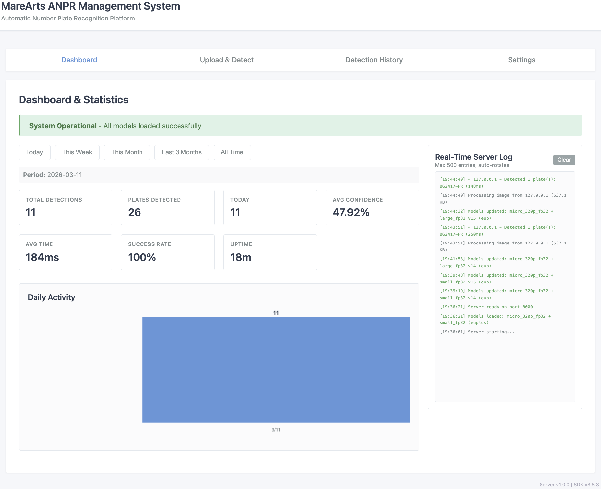

# MareArts ANPR SDK

[](https://badge.fury.io/py/marearts-anpr)
[](https://pypi.org/project/marearts-anpr/)
[](https://pepy.tech/project/marearts-anpr)
[](https://www.marearts.com/products/anpr)
[](http://live.marearts.com)

[](https://pypi.org/project/marearts-anpr/)
[](https://apps.apple.com/app/marearts-anpr/id6753904859)

<div align="center">

| ANPR Detection | Road Objects Detection | Mobile App |
|:---:|:---:|:---:|
|  |  |  |

</div>

Automatic Number Plate Recognition (ANPR) SDK for multiple regions with GPU acceleration support.

**💎 One License, All Access:** SDK + Mobile App + Road Objects Detection - Use everywhere with a single license.

---

## 🎉 MareArts ANPR Mobile App - v1.9.4

**📱 Now available on iOS! Android coming soon.**

Fast, accurate, on-device license plate recognition for parking management, security, and vehicle tracking.

[](https://apps.apple.com/us/app/marearts-anpr/id6753904859)

✨ **Key Features:**
- 🚀 Fast on-device AI processing (~100-160ms)
- 🔗 Webhook integration - Send detections to Discord, Slack, or your own server
- 📊 CSV export with bounding box, notes, reporter, auto-detected device info
- 🔄 Cloud sync - Two-way background sync across devices
- 📋 Smart rules grouping - Organized A-Z for easy navigation
- 🌐 Download rules from web - Upload on marearts.com, download on phone
- 🔒 100% offline capable - privacy first
- 🗺️ Map view with GPS tracking
- ✅ Whitelist/Blacklist management
- 🌍 Multi-region support (Universal, Europe+, Korea, North America, China)

📖 **[Read the complete Mobile App Guide →](https://github.com/MareArts/MareArts-ANPR/blob/main/mobile_app/README.md)**

> Use the mobile app as your ANPR license - no additional purchase required.  
> Get your license at [marearts.com/products/anpr](https://www.marearts.com/products/anpr)

---

## 🌐 NEW: ANPR Management Server

**Professional server with REST API and Web Dashboard**

Deploy a complete ANPR management system with real-time monitoring, detection history, and visual analytics.

<div align="center">

</div>

**Quick Start:**
```bash
cd management_server
pip install -r requirements.txt  # First time only
ma-anpr config                   # Configure credentials
python server.py                 # Start server
# Open http://localhost:8000/
```

**Features:** REST API, Web Dashboard, Real-time logs, SQLite database, Live model switching

📖 **[Full Documentation →](management_server/)**

---

<br>

## 🎉 MareArts SDK v3.8.0

**V15 OCR - Next Generation Recognition** ⭐

- 🎯 **Improved Accuracy**: Enhanced recognition across all regions
- 📝 **Better Multi-line Handling**: Improved recognition of plates with multiple text lines
- 🚀 **Better Performance**: Higher accuracy with strong real-time throughput
- 🔄 **Easy Upgrade to V15**: Simple drop-in replacement for V14 OCR
- ✅ **Recommended**: V15 OCR is now the default for new projects

**Backward Compatible**: V14 OCR continues to be fully supported

---

<br>

## MareArts ANPR SDK Features

- 🌍 **Multi-Region Support**: Korean, Europe+, North America, China, and Universal license plates
- 🔄 **Dynamic Region Switching**: Change regions instantly with `set_region()` without model reload
- ⚡ **GPU Acceleration**: CUDA, DirectML support for real-time processing
- 🎯 **High Accuracy**: Advanced models with regional vocabulary optimization
- 📦 **Batch Processing**: Process multiple plates simultaneously
- 🐳 **Production Ready**: Docker API with smart model caching and multi-architecture support

<br>

## Quick Start

### Installation

```bash
# CPU Installation
pip install marearts-anpr

# GPU Installation (CUDA, DirectML)
pip install marearts-anpr[gpu]        # NVIDIA CUDA
pip install marearts-anpr[directml]   # Windows GPU (AMD/Intel/NVIDIA)
```

📦 [See complete installation guide](https://github.com/MareArts/MareArts-ANPR/blob/main/docs/installation.md)

### Basic Usage


```python
from marearts_anpr import ma_anpr_detector_v14, ma_anpr_ocr_v15, marearts_anpr_from_image_file

# Initialize V14 Detector
detector = ma_anpr_detector_v14(
    "micro_320p_fp32",
    # 320p models (Fast): pico_320p_fp32/fp16, micro_320p_fp32/fp16, small_320p_fp32/fp16, medium_320p_fp32/fp16, large_320p_fp32/fp16
    # 640p models (High detection): pico_640p_fp32/fp16, micro_640p_fp32/fp16, small_640p_fp32/fp16, medium_640p_fp32/fp16, large_640p_fp32/fp16
    user_name,
    serial_key,
    signature,
    backend="cuda",  # cpu, cuda, directml (auto-selected if "auto")
    conf_thres=0.25,  # Detection confidence threshold (default: 0.25)
    iou_thres=0.5     # IoU threshold for NMS (default: 0.5)
)

# Initialize V15 OCR with regional vocabulary (Recommended - Latest)
ocr = ma_anpr_ocr_v15(
    "small_fp32",       # Model: pico_fp32, micro_fp32, small_fp32, medium_fp32, large_fp32
                        # int8 models available: pico_int8, micro_int8, small_int8, medium_int8, large_int8 (smaller, faster)
    "univ",             # Region: kor/kr, euplus/eup, na, china/cn, univ (choose specific region for best accuracy)
    user_name,
    serial_key,
    signature,
    backend="cuda",  # cpu, cuda, directml (auto-selected if "auto") 
)

# Or use V14 OCR (backward compatible)
# from marearts_anpr import ma_anpr_ocr_v14
# ocr = ma_anpr_ocr_v14("small_fp32", "univ", user_name, serial_key, signature, backend="cuda")

# Or use unified interface with version parameter
# from marearts_anpr import ma_anpr_ocr
# ocr = ma_anpr_ocr("small_fp32", "univ", user_name, serial_key, signature, version='v15', backend="cuda")  # v15: Latest, or version='v14': Stable  

# Process image
result = marearts_anpr_from_image_file(detector, ocr, "image.jpg")
print(result)
# Output: {'results': [{'ocr': 'ABC123', 'ocr_conf': 99, ...}], ...}
```
💡 🔄 [Learn more about usage](https://github.com/MareArts/MareArts-ANPR/blob/main/docs/usage.md#dynamic-region-switching)

#### Dynamic Region Switching

Switch regions without reinitialization (works with both V14 and V15 OCR):

```python
ocr.set_region('euplus')  # Europe+ (or 'eup')
ocr.set_region('kr')   # Korean
ocr.set_region('na')   # North America
ocr.set_region('cn')   # China
ocr.set_region('univ') # Universal (all regions)
```

🔄 [Learn more about dynamic region switching](https://github.com/MareArts/MareArts-ANPR/blob/main/docs/usage.md#dynamic-region-switching)

#### Multiple Input Formats & CLI

**From different image sources:**
```python
import cv2
from PIL import Image
from marearts_anpr import marearts_anpr_from_cv2, marearts_anpr_from_pil

result = marearts_anpr_from_cv2(detector, ocr, cv2.imread("image.jpg"))
result = marearts_anpr_from_pil(detector, ocr, Image.open("image.jpg"))
result = marearts_anpr_from_image_file(detector, ocr, "image.jpg")
```

**CLI commands:**
```bash
ma-anpr image.jpg                    # Process image (V15 OCR is default)
ma-anpr image.jpg --ocr-version v15  # Use V15 OCR (explicit)
ma-anpr image.jpg --ocr-version v14  # Use V14 OCR
ma-anpr test-api image.jpg           # Test API (1000/day limit)
ma-anpr validate                     # Validate license
ma-anpr models                       # List available V14 and V15 models
```

🔧 [See complete usage examples and CLI reference](https://github.com/MareArts/MareArts-ANPR/blob/main/docs/usage.md)

<br>

## Model Performance

### Detector Performance (V14)

| Model Name | Detection Rate | Speed (GPU) | Notes |
|------------|----------------|-------------|-------|
| pico_320p_fp32 | 96.02% | 129 FPS (7.8ms) | 📱 Smallest + fast |
| pico_640p_fp32 | 98.54% | 66 FPS (15.2ms) | Balanced |
| **micro_320p_fp32** | **97.13%** | **128 FPS** (7.8ms) | 🏆 Best overall |
| **micro_320p_fp16** | **97.13%** | **56 FPS** (17.9ms) | 🏆 Best mobile (50% smaller) |
| micro_640p_fp32 | 98.99% | 68 FPS (14.6ms) | Highest detection |
| small_320p_fp32 | 98.00% | 142 FPS (7.0ms) | ⚡ Fastest |
| medium_320p_fp32 | 98.06% | 136 FPS (7.4ms) | High detection |
| large_320p_fp32 | 98.40% | 131 FPS (7.6ms) | Strong performance |

**Note:** 320p models are 2× faster than 640p. FP16 models are 50% smaller with same detection rate.

<br>

### OCR Performance (V15)

*Average across all regions*

| Model Name | Exact Match | Character Accuracy | Speed (GPU) | Notes |
|------------|-------------|-------------------|-------------|-------|
| pico_fp32 | 98.66% | 99.74% | 235.1 FPS (4.32ms) | 📱 Smallest, fast |
| micro_fp32 | 99.01% | 99.80% | 245.8 FPS (4.07ms) | Fast with high accuracy |
| small_fp32 | 98.66% | 99.75% | 280.2 FPS (3.57ms) | ⚡ Fastest inference |
| **medium_fp32** | **99.13%** | **99.83%** | 254.5 FPS (3.92ms) | 🎯 Best accuracy |
| large_fp32 | 98.99% | 99.81% | 241.5 FPS (4.14ms) | High accuracy |

**int8 Models** (smaller files):
- pico_int8, micro_int8, small_int8, medium_int8, large_int8
- 75% smaller file size, similar accuracy

**Supported Regions**: Korea (`kor` or `kr`), Europe+ (`euplus` or `eup`), North America (`na`), China (`china` or `cn`), Universal (`univ`)

*Note: Both short codes and full names are accepted*

📊 [See all models and benchmarks](https://github.com/MareArts/MareArts-ANPR/blob/main/docs/models.md)

<br>

## Regional Support

MareArts ANPR supports license plates from multiple regions with specialized vocabulary optimization:

- 🇰🇷 **Korean (`kr`)** - Korean license plates with Hangul characters (best accuracy: 99.56%)
- 🇪🇺 **Europe+ (`eup`)** - EU countries + Albania, Andorra, Bosnia & Herzegovina, Indonesia, and more
- 🇺🇸🇨🇦🇲🇽 **North America (`na`)** - USA, Canada, and Mexico license plates
- 🇨🇳 **China (`cn`)** - Chinese license plates with province codes
- 🌍 **Universal (`univ`)** - All regions (default, but choose specific region for best accuracy)

💡 **Dynamic Region Switching**: Use `ocr.set_region('kr')` to switch regions instantly without reloading the model, saving ~180 MB per additional region.

🌍 [See complete regional support and character sets](https://github.com/MareArts/MareArts-ANPR/blob/main/docs/regional-support.md)

<br>

## Documentation

- 📦 [Installation Guide](https://github.com/MareArts/MareArts-ANPR/blob/main/docs/installation.md) - Detailed installation options and requirements
- 🔧 [Usage Examples](https://github.com/MareArts/MareArts-ANPR/blob/main/docs/usage.md) - Python SDK, CLI usage, dynamic region switching, and environment variables
- 💻 [Example Code](https://github.com/MareArts/MareArts-ANPR/tree/main/example_code) - Basic, advanced, and batch processing examples
- 🚀 [Model Versions](https://github.com/MareArts/MareArts-ANPR/blob/main/docs/models.md) - Available models, benchmarks, and performance metrics
- 🌍 [Regional Support](https://github.com/MareArts/MareArts-ANPR/blob/main/docs/regional-support.md) - Supported countries and character sets
- 🐳 [Docker Deployment](https://github.com/MareArts/MareArts-ANPR/blob/main/docs/docker.md) - Container setup, API server, and multi-architecture builds
- 🧪 [Try ANPR](https://github.com/MareArts/MareArts-ANPR/blob/main/docs/api-testing.md) - Test our ANPR without license (1000 requests/day)
- ❓ [FAQ](https://github.com/MareArts/MareArts-ANPR/blob/main/docs/faq.md) - Licensing, regions, features, and troubleshooting

<br>

## MareArts Ecosystem

Explore our AI toolkit:

- **marearts-anpr** - Automatic Number Plate Recognition ([GitHub](https://github.com/MareArts/MareArts-ANPR))
- **🎉 marearts-anpr Mobile App** - ANPR on iOS & Android ([App Store](https://apps.apple.com/us/app/marearts-anpr/id6753904859) | [Guide](https://github.com/MareArts/MareArts-ANPR/blob/main/mobile_app/README.md))
- **marearts-road-objects** - Road object detection for persons, vehicles, and 2-wheelers ([GitHub](https://github.com/MareArts/MareArts-Road-Objects))
- **marearts-xcolor** - Color extraction and similarity analysis ([GitHub](https://github.com/MareArts/MareArts-Xcolor))
- **marearts-mast** - Real-time panoramic stitching ([GitHub](https://github.com/MareArts/MareArts-MAST))
- **marearts-crystal** - Encryption and decryption toolkit ([PyPI](https://pypi.org/project/marearts-crystal/))

<br>

## Support & Resources

| Resource | Link |
|----------|------|
| 📧 **Contact** | [hello@marearts.com](mailto:hello@marearts.com) |
| 🏠 **Homepage** | [https://marearts.com](https://marearts.com) |
| 💳 **License Purchase** | [ANPR Solution](https://www.marearts.com/products/anpr) |
| 🎮 **Live Demo** | [http://live.marearts.com](http://live.marearts.com) |
| 📺 **Video Examples** | [YouTube Playlist](https://www.youtube.com/playlist?list=PLvX6vpRszMkxJBJf4EjQ5VCnmkjfE59-J) |

<br>

## License

© 2024 MareArts. All rights reserved.

This software requires a valid license key. Visit [MareArts ANPR Solution](https://www.marearts.com/products/anpr) for licensing options.

---

<div align="center">

<a href='https://clustrmaps.com/site/1c8t6' title='Visit tracker'></a>

</div>