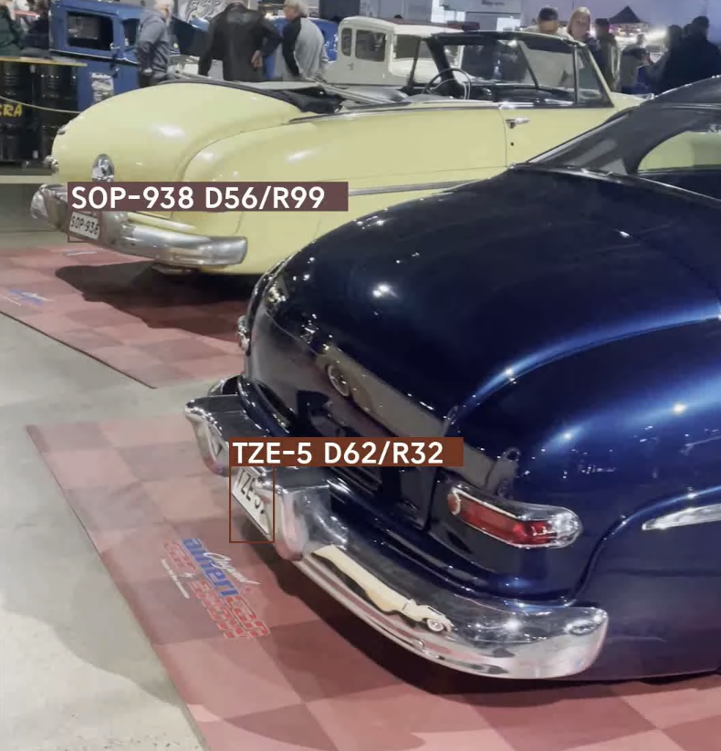
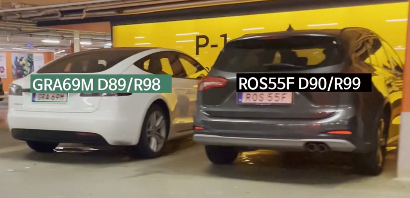
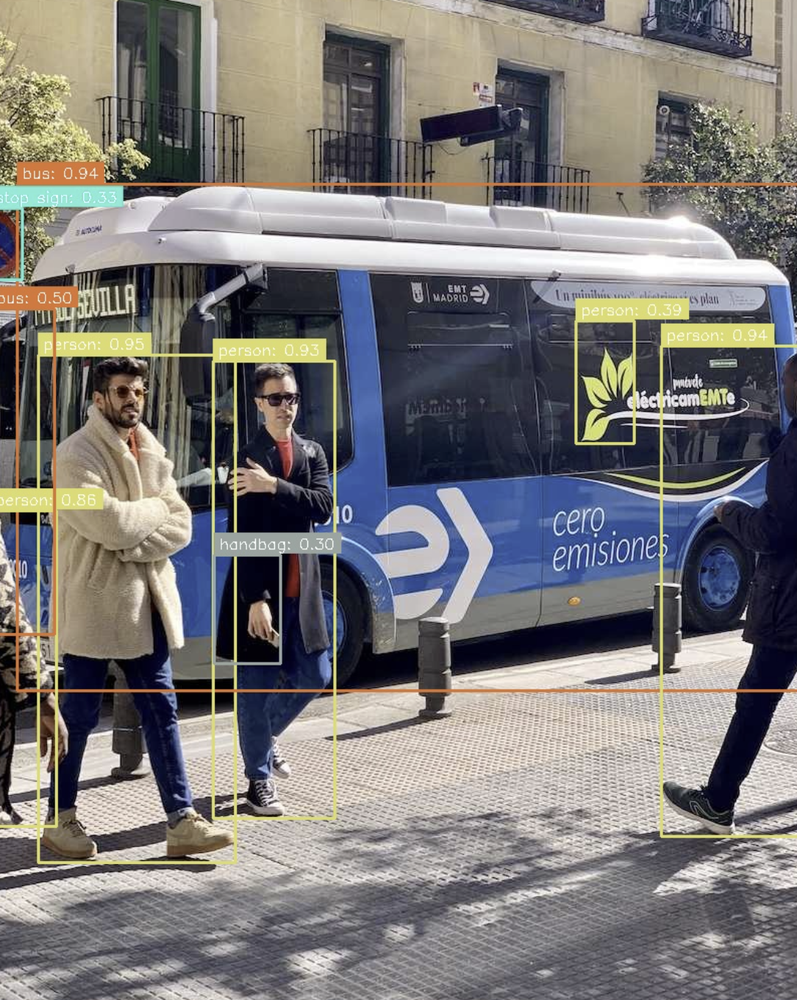
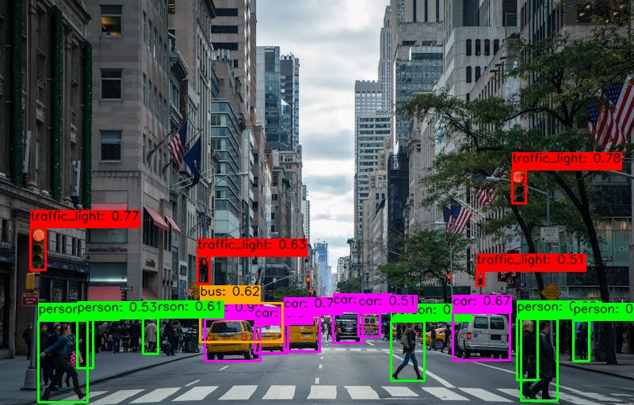
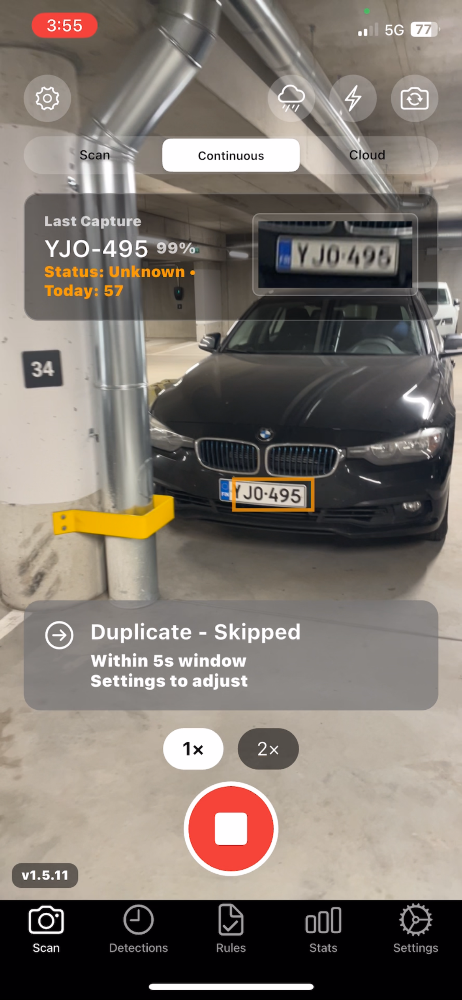
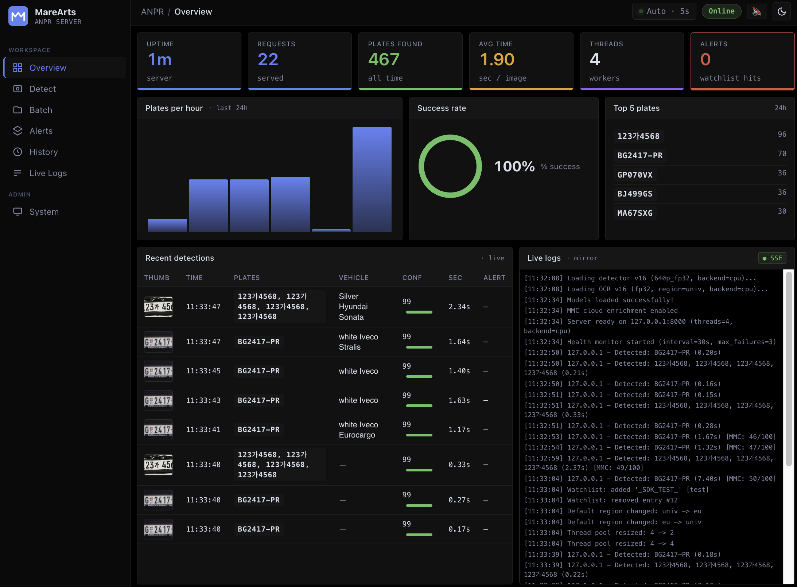
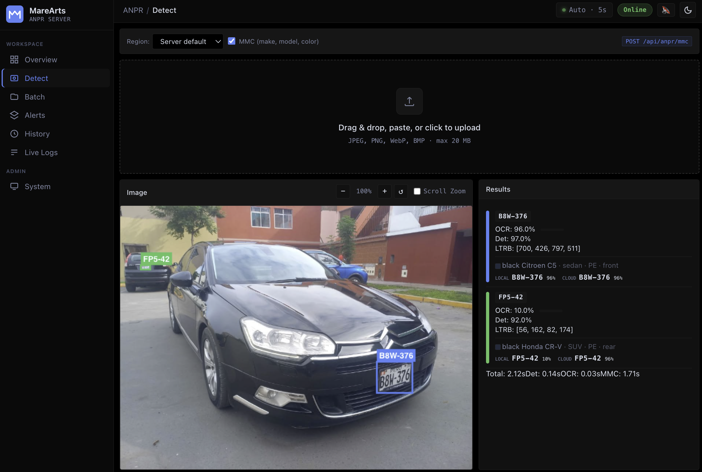
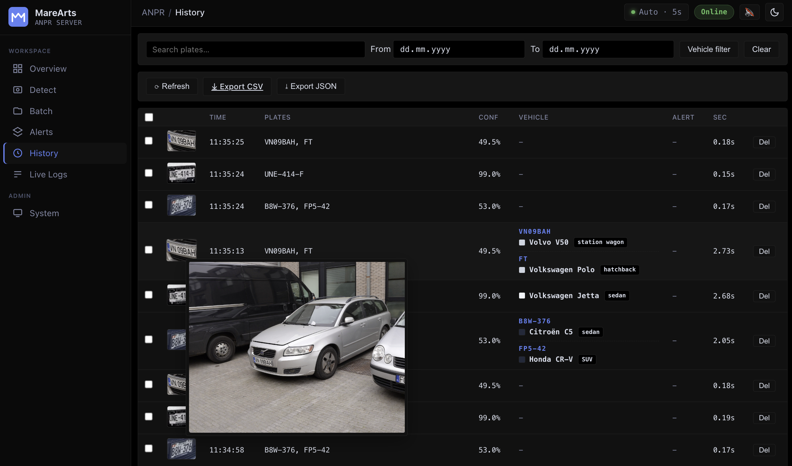

# MareArts ANPR

[](https://badge.fury.io/py/marearts-anpr)
[](https://pypi.org/project/marearts-anpr/)
[](https://pepy.tech/project/marearts-anpr)
[](https://www.marearts.com/products/anpr)
[](http://live.marearts.com)

<div align="center">

| ANPR Detection | Road Object Detection | Mobile App |
|:---:|:---:|:---:|
| <br/> | <br/> |  |

</div>

Automatic Number Plate Recognition — detection + OCR for **80+ countries**, GPU acceleration, ARM/Windows support, and **cloud Vehicle Intelligence** (make, model, color, type, face, plate nation, and server-side OCR).

**One license covers everything:** Python SDK · REST API Server · Mobile App · Road Object Detection

> Get your license at [marearts.com/products/anpr](https://www.marearts.com/products/anpr). Same intro on the site: [marearts.com/pages/marearts-anpr-sdk](https://www.marearts.com/pages/marearts-anpr-sdk).

---

## What's Included in One License

| Component | What It Does |
|-----------|-------------|
| **Python SDK** | Detect & read plates in your own code — CPU, CUDA, DirectML |
| **REST API Server** | Production server with web dashboard, history, alerts, watchlist |
| **Mobile App** | On-device ANPR for iOS & Android (~100-160 ms per scan) |
| **Road Object Detection** | Detect persons, vehicles, and 2-wheelers ([MareArts Road Objects](https://github.com/MareArts/MareArts-Road-Objects)) |
| **Vehicle Intelligence** | Cloud AI: make, model, color, type, face, plate nation, server-side OCR |

---

## Mobile App

On-device ANPR for iOS and Android — parking, security, fleet management.

[](https://apps.apple.com/us/app/marearts-anpr/id6753904859) [](https://play.google.com/store/apps/details?id=com.marearts.anpr)

- **On-device AI** — ~100-160 ms, 100% offline capable
- **Team Work** — leader/member collaboration with shared data
- **Webhooks** — Discord, Slack, or any custom endpoint
- **Cloud Sync** — sync across devices via marearts.com
- **Vehicle Intelligence** — make, model, color, type, face, plate nation, server-side OCR
- **Map View, CSV Export, Whitelist/Blacklist, Stats**

> No additional license required — the app works as your ANPR license.

> A free read-only **Desktop Viewer** for macOS / Windows / Linux syncs the same account for big-screen review — [download](https://www.marearts.com/pages/anpr-desktop-download) · [details in the guide](mobile_app/).

**[Mobile App Guide →](mobile_app/)**

---

## Python SDK

Detect and read license plates in 5 lines of Python.

```bash
pip install marearts-anpr
ma-anpr gpu-setup cuda              # NVIDIA
ma-anpr gpu-setup directml          # Windows AMD / Intel / NVIDIA
```

```python
from marearts_anpr import (
    ma_anpr_detector_v16, ma_anpr_ocr_v16, marearts_anpr_from_image_file
)

detector = ma_anpr_detector_v16("640p_fp32", user_name, serial_key, signature)
ocr = ma_anpr_ocr_v16("fp32", "univ", user_name, serial_key, signature)

result = marearts_anpr_from_image_file(detector, ocr, "car.jpg")
print(result)
# {'results': [{'ocr': 'ABC1234', 'ocr_conf': 99, 'ltrb': [...], ...}], ...}
```

**[Full SDK Documentation & Examples →](python-sdk/)**

---

## REST API Server

Production-ready server with web dashboard — zero code deployment.

```bash
ma-anpr config                     # one-time credential setup
ma-anpr server start               # http://localhost:8000
```

```bash
curl -X POST http://localhost:8000/api/anpr -F "image=@car.jpg"
```

<div align="center">

| Dashboard | Detection | History |
|:---:|:---:|:---:|
|  |  |  |

</div>

20+ API endpoints: detect, batch, history, watchlist, alerts, stats, config, model selection, and more.

**[Server Documentation →](server/)**

---

## Docker

Build the server image from [`docker/`](docker/), then run it. GPU needs the NVIDIA Container Toolkit. The CPU image does not use `--gpus`.

```bash
git clone https://github.com/MareArts/MareArts-ANPR.git
cd MareArts-ANPR/docker
docker build -t marearts-anpr-server:latest .
docker run -d --gpus all --name marearts-anpr-server -p 8000:8000 \
  -e MAREARTS_ANPR_USERNAME="your@email.com" \
  -e MAREARTS_ANPR_SERIAL_KEY="your_serial_key" \
  -e MAREARTS_ANPR_SIGNATURE="your_signature" \
  -v ~/.marearts:/root/.marearts \
  marearts-anpr-server:latest
```

CPU: `docker build -t marearts-anpr-server-cpu:latest -f Dockerfile.cpu .` then run without `--gpus`.

**[Docker Guide →](docker/)**

---

## Vehicle Intelligence (Cloud AI)

Go beyond plate text — identify the vehicle itself with a single API call.

| Feature | Example Output |
|---------|---------------|
| **Make** | Toyota, BMW, Hyundai, … |
| **Model** | Camry, 3 Series, Tucson, … |
| **Color** | White, Black, Silver, … |
| **Type** | Sedan, SUV, Truck, Van, … |
| **Face** | front, rear |
| **Plate Nation** | KR, DE, US, … |
| **Server-side OCR** | Cross-check plate text via cloud |

```python
from marearts_anpr import ma_anpr_mmc

mmc = ma_anpr_mmc(user_name, serial_key, signature)
info = mmc.enrich(image, anpr_results)
print(info["make"], info["model"], info["color"])
# Toyota Camry White
```

> Run local ANPR first, then pass the results to `mmc.enrich()` for cloud enrichment.
> See the **[full MMC example →](python-sdk/examples/mmc_vehicle_info.py)**

Also available via the REST API server — just call the `/api/anpr/mmc` endpoint.

### On-Device (Offline) Vehicle Intelligence

Prefer to run enrichment locally with **no internet and no quota**? Switch to
the on-device backend, powered by a compact vision-language model
(Qwen3-VL-2B) that runs on your GPU or CPU.

```bash
ma-anpr mmc-setup                  # download model + prebuilt engine (~1.5 GB)
ma-anpr mmc-backend local          # switch enrichment to on-device (or: cloud)
ma-anpr mmc-uninstall --all        # cleanly remove the engine + model when done
```

In the SDK, only the import line changes from the cloud path:

```python
from marearts_anpr import ma_anpr_mmc_local   # on-device backend

mmc = ma_anpr_mmc_local()          # loads the local model
# ... use mmc.enrich(...) exactly like the cloud client ...
mmc.close()                        # releases the model and frees VRAM
```

The REST server exposes the same choice via `GET /api/mmc/status`,
`PUT /api/mmc/backend`, and the dashboard System page — the `/api/anpr/mmc`
response fields are identical for both backends.

---

## Road Object Detection

Detect **persons, vehicles, and 2-wheelers** in real-time — included in your ANPR license at no extra cost.

```python
from marearts_road_objects import ma_road_object_detector

rod = ma_road_object_detector("640p_fp32", user_name, serial_key, signature)
result = rod.detect("street.jpg")
# [{'class': 'car', 'conf': 0.97, 'ltrb': [...]}, {'class': 'person', ...}]
```

Use it alongside ANPR for complete traffic scene understanding — plate reading + vehicle/pedestrian awareness in one pipeline.

**[Road Objects Documentation →](https://github.com/MareArts/MareArts-Road-Objects)**

---

## Supported Regions

**80+ countries** across 12 regional groups with per-country character sets for maximum accuracy.

| Region | Code |
|--------|------|
| Europe (37) | `eu` |
| Ex-USSR (15) | `exussr` |
| Europe+ | `eup` |
| Asia (17) | `asia` |
| North America | `na` |
| South America | `southamerica` |
| Africa | `africa` |
| Oceania | `oceania` |
| UK | `uk` / `gb` |
| China | `cn` |
| Korea | `kr` |
| Japan | `jp` |
| Universal | `univ` |

Pass a 2-letter country code (e.g. `de`, `au`, `th`) for best accuracy, or use a group code. Unknown codes fall back to `univ`.

**[Full Region & Country Reference →](python-sdk/README.md#regions)**

---

## Performance (V16)

V16 ships one unified model for detection and one for OCR — no model-size selection needed.

| Component | Model | Notes |
|-----------|-------|-------|
| **Detector** | `640p_fp32` | High detection — best for distant/small plates. Recommended. |
| **Detector** | `320p_fp32` | Faster, when every millisecond counts |
| **OCR** | `fp32` | Single model, all regions, dynamic switching |

Measured end-to-end (detection + OCR), one process on an RTX 4090:

| Input resolution | `640p_fp32` + OCR | `320p_fp32` + OCR |
|------------------|-------------------|-------------------|
| 640×480 | 22 ms · 46 fps | 16 ms · 64 fps |
| 960×540 | 24 ms · 42 fps | 17 ms · 59 fps |
| 1280×720 | 26 ms · 38 fps | 19 ms · 53 fps |
| 1920×1080 | 33 ms · 31 fps | 25 ms · 40 fps |

The two detectors are close on a GPU, so prefer `640p_fp32` for its accuracy.
Feed the smallest frame that still shows the plate clearly: 4K input costs about
twice as much per frame as 1080p and buys nothing once the plate is legible.

Throughput scales with worker processes rather than with a bigger GPU: one
RTX 4090 running 8 processes reaches 103 fps with `640p_fp32`, which covers
roughly 20 cameras at 5 analysed frames per second each.

**[Full measured figures, hardware sizing and multi-camera guidance →](python-sdk/README.md#measured-performance)**

---

## Testing

We include a full test suite to verify SDK and server functionality.

```bash
cd tests/
python test_sdk.py       # SDK unit tests
python test_server.py    # Server API integration tests
```

**[Test Documentation →](tests/)**

---

## More from MareArts

- **[MareArts Xcolor](https://github.com/MareArts/MareArts-Xcolor)** — Color extraction and similarity
- **[MareArts MAST](https://github.com/MareArts/MareArts-MAST)** — Real-time panoramic stitching

---

## Support

| | |
|---|---|
| Homepage | [marearts.com](https://marearts.com) |
| License | [marearts.com/products/anpr](https://www.marearts.com/products/anpr) |
| SDK page | [marearts.com/pages/marearts-anpr-sdk](https://www.marearts.com/pages/marearts-anpr-sdk) |
| Short answers | [ANPR in Python](https://www.marearts.com/pages/anpr-in-python) |
| AI assistants | [ANPR for AI assistants](https://www.marearts.com/pages/anpr-for-agents) · [SKILL.md](SKILL.md) |
| Mobile guide | [marearts.com/pages/marearts-anpr-mobile-app](https://www.marearts.com/pages/marearts-anpr-mobile-app) |
| Live Demo | [live.marearts.com](http://live.marearts.com) |
| Contact | [hello@marearts.com](mailto:hello@marearts.com) |
| YouTube | [Video Examples](https://www.youtube.com/playlist?list=PLvX6vpRszMkxJBJf4EjQ5VCnmkjfE59-J) |

---

© 2026 MareArts. All rights reserved.
