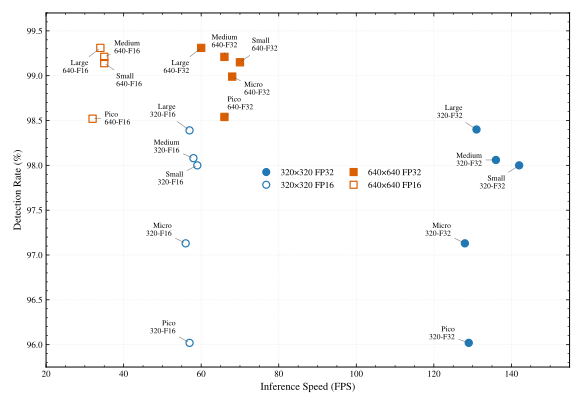

# Model Versions & Performance

**Last Updated: March 4, 2026**

**Current Version: V14 Detector + V15 OCR** - Latest generation with advanced architecture

This document covers V14 detector models and V14/V15 OCR models. For legacy V13 and earlier models, see [Legacy Models Documentation](legacy-models.md).

📊 **[V14 vs V15 OCR Comparison →](v14-vs-v15-comparison.md)** - Side-by-side comparison with benchmarks and migration guide

## Model Storage

All models are automatically downloaded to `~/.marearts/marearts_anpr_data/` on first use and cached for subsequent requests.

```
~/.marearts/marearts_anpr_data/
├── marearts_anpr_d_v14_micro_320p_fp32.dat  # V14 Detector model
├── marearts_anpr_d_v14_micro_320p_fp16.dat  # V14 Detector model (FP16)
├── marearts_anpr_d_v14_micro_640p_fp32.dat  # V14 Detector model (640p)
├── marearts_anpr_r_v14_large_fp32.dat       # V14 OCR model
├── marearts_anpr_r_v14_large_fp32_config.dat # V14 OCR config
├── marearts_anpr_r_v15_large_fp32.dat       # V15 OCR model
├── marearts_anpr_r_v15_large_fp32_config.dat # V15 OCR config
└── ... (other models downloaded as needed)
```

**Environment Variable**: Set `MAREARTS_ANPR_SKIP_UPDATE=1` to skip update checks and use cached models directly (faster initialization in production).

---

## Detector Models

Detection models locate license plates in images.

### V14 Detector Models

The V14 detector series introduces advanced detection with digital signature authentication and multiple inference backends.

**Available Resolutions:**
- **320p models** (320×320) - Faster speed, excellent detection (96-98%)
- **640p models** (640×640) - Highest detection rates (98-99%), larger input

**Note:** test-api (free trial) only supports 640p models. 320p available for licensed local processing.

**Available Precisions:**
- **FP32** - High GPU throughput, standard size
- **FP16** - 50% smaller file size, same detection rate, compact deployment profile

#### V14 Detector Models - Performance Comparison



#### V14 Detector Models - Performance Metrics

| Model Name | Detection Rate | Speed (GPU) | Size | Recommendation |
|------------|----------------|-------------|------|----------------|
| pico_320p_fp32 | 96.02% | 129 FPS (7.8ms) | 75 MB | 📱 Smallest + fast |
| pico_640p_fp32 | 98.54% | 66 FPS (15.2ms) | 75 MB | Balanced |
| **micro_320p_fp32** | **97.13%** | **128 FPS** (7.8ms) | 83 MB | 🏆 Best overall |
| **micro_320p_fp16** | **97.13%** | **56 FPS** (17.9ms) | 42 MB | 🏆 Best mobile (50% smaller) |
| micro_640p_fp32 | 98.99% | 68 FPS (14.6ms) | 83 MB | Highest detection rate |
| small_320p_fp32 | 98.00% | 142 FPS (7.0ms) | 114 MB | ⚡ Fastest |
| small_640p_fp32 | 99.15% | 70 FPS (14.3ms) | 114 MB | High detection |
| medium_320p_fp32 | 98.06% | 136 FPS (7.4ms) | 153 MB | High detection |
| medium_640p_fp32 | 99.21% | 66 FPS (15.1ms) | 153 MB | Very high detection |
| large_320p_fp32 | 98.40% | 131 FPS (7.6ms) | 164 MB | Strong performance |
| large_640p_fp32 | 99.31% | 60 FPS (16.7ms) | 164 MB | Highest detection |

**Key Findings:**
- **320p models**: 2× faster than 640p with excellent detection rates (96-98%)
- **640p models**: Highest detection rates (98-99%) for difficult cases
- **FP16 models**: 50% smaller size with the same detection rate
- **Best overall (local)**: micro_320p_fp32 (97.13% detection, 128 FPS)
- **Best mobile**: micro_320p_fp16 (97.13% detection, 56 FPS, 42 MB)
- **Best for test-api**: medium_640p_fp32 (99.21% detection, 640p required for cloud API)

*Use these model names directly in `ma_anpr_detector_v14()` function*

---

## OCR Models

OCR models read text from detected license plates.

### V15 OCR Models ⭐ (Recommended - Latest)

The V15 OCR series delivers improved accuracy and better multi-line plate handling with batch processing support and regional vocabulary filtering.

**Why choose V15?** 6.7-7.4% better accuracy with strong real-time throughput. [See detailed comparison →](v14-vs-v15-comparison.md)

📊 [View V15 OCR Benchmarks](benchmarks/v15_ocr_evaluation_report_cuda_20260304_093504.txt) *(Mar 4, 2026)*

#### V15 OCR Models - Performance by Region (FP32)

**Universal (univ) - All Character Sets**

| Model | Exact Match | Char Accuracy | FPS (GPU) | Time | Recommendation |
|-------|-------------|---------------|-----------|------|----------------|
| pico_fp32 | 98.94% | 99.77% | 247.2 | 4.04ms | 📱 Smallest |
| micro_fp32 | 99.22% | 99.81% | 239.2 | 4.18ms | Fast |
| small_fp32 | 99.06% | 99.79% | 272.6 | 3.67ms | ⚡ Fastest |
| medium_fp32 | 99.29% | 99.83% | 250.5 | 3.99ms | Balanced |
| large_fp32 | 99.21% | 99.82% | 245.7 | 4.07ms | 🏆 Best accuracy |

**Korean (kor) - Best Overall Accuracy**

| Model | Exact Match | Char Accuracy | FPS (GPU) | Time | Recommendation |
|-------|-------------|---------------|-----------|------|----------------|
| pico_fp32 | 99.36% | 99.88% | 180.1 | 5.55ms | 📱 Smallest |
| micro_fp32 | 99.49% | 99.90% | 233.2 | 4.29ms | Fast |
| small_fp32 | 99.45% | 99.89% | 278.2 | 3.60ms | ⚡ Fastest |
| medium_fp32 | 99.56% | 99.91% | 251.0 | 3.98ms | Balanced |
| large_fp32 | 99.54% | 99.91% | 242.4 | 4.13ms | 🏆 Best accuracy |

**Europe+ (euplus) - EU + Additional Countries**

| Model | Exact Match | Char Accuracy | FPS (GPU) | Time | Recommendation |
|-------|-------------|---------------|-----------|------|----------------|
| pico_fp32 | 97.93% | 99.53% | 250.6 | 3.99ms | 📱 Smallest |
| micro_fp32 | 98.40% | 99.62% | 253.2 | 3.95ms | Fast |
| small_fp32 | 98.07% | 99.58% | 285.2 | 3.51ms | ⚡ Fastest |
| medium_fp32 | 98.67% | 99.70% | 258.3 | 3.87ms | Balanced |
| large_fp32 | 98.60% | 99.71% | 231.7 | 4.32ms | 🏆 Best accuracy |

**North America (na)**

| Model | Exact Match | Char Accuracy | FPS (GPU) | Time | Recommendation |
|-------|-------------|---------------|-----------|------|----------------|
| pico_fp32 | 97.27% | 99.56% | 247.1 | 4.05ms | 📱 Smallest |
| micro_fp32 | 98.11% | 99.71% | 253.0 | 3.95ms | Fast |
| small_fp32 | 96.86% | 99.53% | 285.7 | 3.50ms | ⚡ Fastest |
| medium_fp32 | 98.22% | 99.74% | 255.5 | 3.91ms | Balanced |
| large_fp32 | 97.69% | 99.62% | 236.9 | 4.22ms | 🏆 Best accuracy |

**China (china)**

| Model | Exact Match | Char Accuracy | FPS (GPU) | Time | Recommendation |
|-------|-------------|---------------|-----------|------|----------------|
| pico_fp32 | 99.83% | 99.98% | 250.5 | 3.99ms | 📱 Smallest |
| micro_fp32 | 99.83% | 99.98% | 250.5 | 3.99ms | Fast |
| small_fp32 | 99.87% | 99.98% | 279.6 | 3.58ms | ⚡ Fastest |
| medium_fp32 | 99.91% | 99.99% | 257.4 | 3.88ms | Balanced |
| large_fp32 | 99.91% | 99.99% | 251.0 | 3.98ms | 🏆 Best accuracy |

#### V15 Model Averages (All Regions)

**FP32 Models:**

| Model | Exact Match | Char Accuracy | Avg FPS | Avg Time | Size |
|-------|-------------|---------------|---------|----------|------|
| pico_fp32 | 98.66% | 99.74% | 235.1 | 4.32ms | 20 MB |
| micro_fp32 | 99.01% | 99.80% | 245.8 | 4.07ms | 71 MB |
| small_fp32 | 98.66% | 99.75% | **280.2** | 3.57ms | 112 MB |
| medium_fp32 | 99.13% | 99.83% | 254.5 | 3.92ms | 164 MB |
| large_fp32 | 98.99% | 99.81% | 241.5 | 4.14ms | 179 MB |

**INT8 Models:**

| Model | Exact Match | Char Accuracy | Avg FPS | Avg Time | Size |
|-------|-------------|---------------|---------|----------|------|
| pico_int8 | 95.56% | 98.78% | 52.7 | 18.96ms | ~15 MB |
| micro_int8 | 98.92% | 99.79% | 35.9 | 27.82ms | ~18 MB |
| small_int8 | 98.63% | 99.74% | 47.1 | 21.29ms | ~28 MB |
| medium_int8 | 99.14% | 99.83% | 36.0 | 27.82ms | ~41 MB |
| large_int8 | 98.96% | 99.80% | 30.2 | 33.07ms | ~45 MB |

**Note:** INT8 models are 75% smaller with similar accuracy. FP32 models are faster on GPU.

#### V15 Regional Vocabularies

| Region | Code | Short Code | Description | Characters |
|--------|------|------------|-------------|------------|
| Universal | `univ` | - | All regions | All character sets |
| Korea | `kor` | `kr` | Korean plates | Hangul + Latin + Digits |
| Europe+ | `euplus` | `eup` | EU + additional countries | Latin + Cyrillic + Special |
| North America | `na` | - | USA/Canada | Latin + Digits |
| China | `china` | `cn` | Chinese plates | Chinese + Latin + Digits |

*Use these region codes in `ma_anpr_ocr_v15()` function. Both full names and short codes are accepted (e.g., `kor` or `kr`)*

**Notes:**
- All V15 models support native batch processing
- FP32 and INT8 variants available
- Region parameter is optional (default: `univ`)
- **Recommendation**: Choose specific region for best accuracy, only use `univ` when region is unknown

---

### V14 OCR Models (Backward Compatible)

V14 OCR models remain fully supported for existing projects.

📊 [View V14 OCR Benchmarks](benchmarks/v14_ocr_evaluation_report_cuda_20260204_101220.txt) *(Feb 4, 2026)*

**Recommendation:** New projects should use V15 OCR for improved accuracy and better regional robustness. [Compare V14 vs V15 →](v14-vs-v15-comparison.md)

---

## Usage Examples

### V15 OCR Configuration (Recommended)

```python
from marearts_anpr import ma_anpr_detector_v14, ma_anpr_ocr_v15

# V14 detector with CUDA backend (GPU acceleration)
detector = ma_anpr_detector_v14(
    "small_640p_fp32",        # Model name
    user_name,                # Your username
    serial_key,               # Serial key
    signature,                # Signature provided with license
    backend="cuda",           # Backend: cpu, cuda, directml
    conf_thres=0.25,          # Optional: Detection confidence threshold
    iou_thres=0.5             # Optional: IoU threshold for NMS
)

# V15 OCR with regional vocabulary (Latest - Improved accuracy)
ocr = ma_anpr_ocr_v15(
    model_name='small_fp32',  # Model: pico/micro/small/medium/large_fp32 or _int8
    region='univ',            # Region: kor/euplus/na/china/univ (default: univ)
    user_name=user_name,
    serial_key=serial_key,
    signature=signature
)

# Or use V14 OCR (backward compatible)
# from marearts_anpr import ma_anpr_ocr_v14
# ocr = ma_anpr_ocr_v14('small_fp32', 'univ', user_name, serial_key, signature)

# Or use unified interface with version parameter
# from marearts_anpr import ma_anpr_ocr
# ocr = ma_anpr_ocr('small_fp32', 'univ', user_name, serial_key, signature, version='v15')  # v15 or v14


# Single image inference
text, confidence = ocr.predict(plate_image)
print(f"{text} ({confidence}%)")

# Batch processing (4 images)
results = ocr.predict([img1, img2, img3, img4])
for text, conf in results:
    print(f"{text}: {conf}%")

# Dynamic region switching (saves memory - works with V14 and V15)
ocr.set_region('euplus')  # Switch to Europe+
ocr.set_region('kor')     # Switch to Korea
ocr.set_region('na')      # Switch to North America
ocr.set_region('china')   # Switch to China
ocr.set_region('univ')    # Switch to Universal
# Use ONE instance instead of creating multiple - saves ~360 MB for 3 regions!
```

### Fast Processing Configuration

```python
# Fastest V14 detector
detector = ma_anpr_detector_v14(
    "small_320p_fp32", user_name, serial_key, signature, backend="cuda"
)

# Fastest V15 OCR
ocr = ma_anpr_ocr_v15('small_fp32', 'univ', user_name, serial_key, signature)
```

### Higher Accuracy Configuration

```python
# Best accuracy V14 detector
detector = ma_anpr_detector_v14(
    "large_640p_fp32", user_name, serial_key, signature, backend="cuda"
)

# Best accuracy V15 OCR
ocr = ma_anpr_ocr_v15('large_fp32', 'kor', user_name, serial_key, signature)
```

---

**Model Version Summary:**
- **V15 OCR**: Latest, recommended (improved accuracy, multi-line support)
- **V14 OCR**: Stable, backward compatible
- **V14 Detector**: Current detector version (works with both V14 and V15 OCR)
- **V13 and earlier**: See [Legacy Models Documentation](legacy-models.md)

---

## Performance Notes

- All benchmarks performed with GPU (CUDA) acceleration
- GPU delivers the highest throughput; CPU remains fully supported across platforms
- FP32 models are faster on GPU than INT8
- INT8 models are 75% smaller files with similar accuracy
- FP16 detector models: 50% smaller size with the same detection rate
- All V14 and V15 models require V2 license with signature for authentication
- **V15 OCR recommended** for new projects (improved accuracy)


