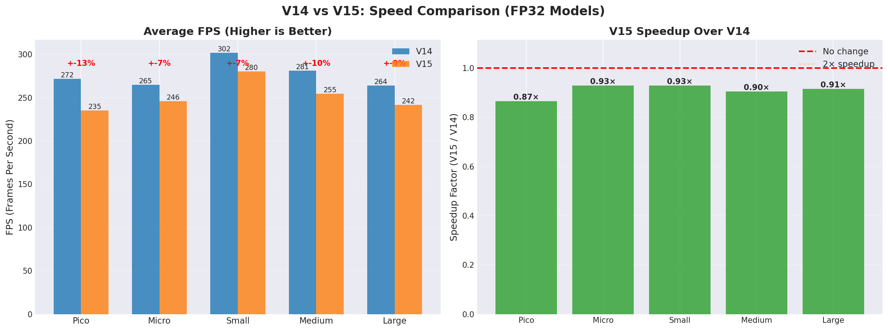
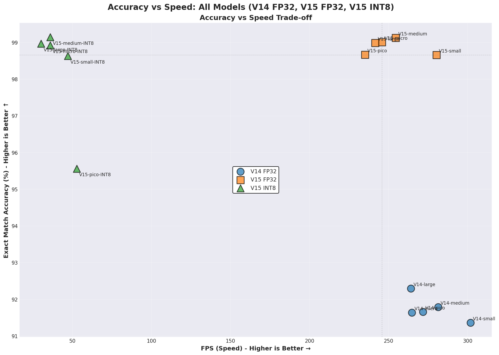
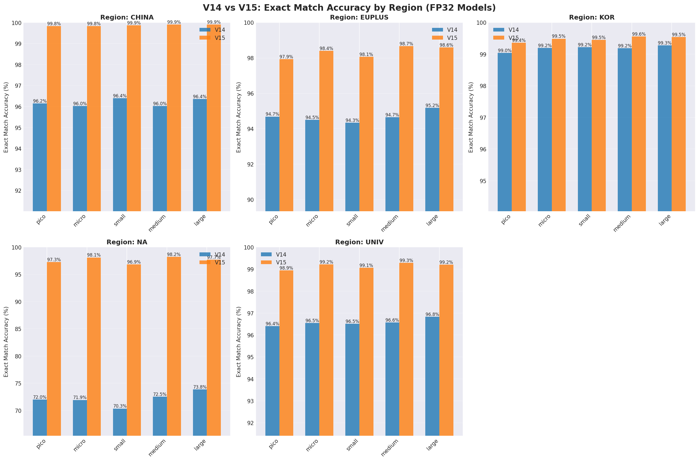
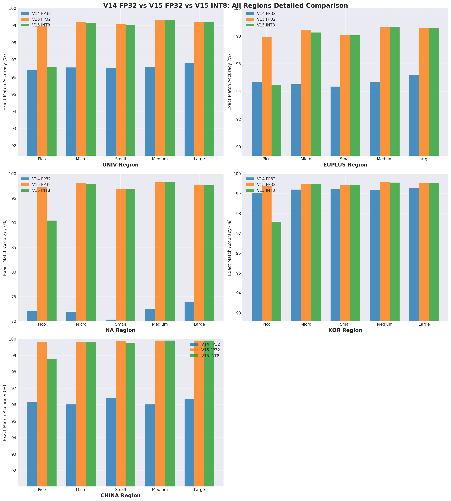
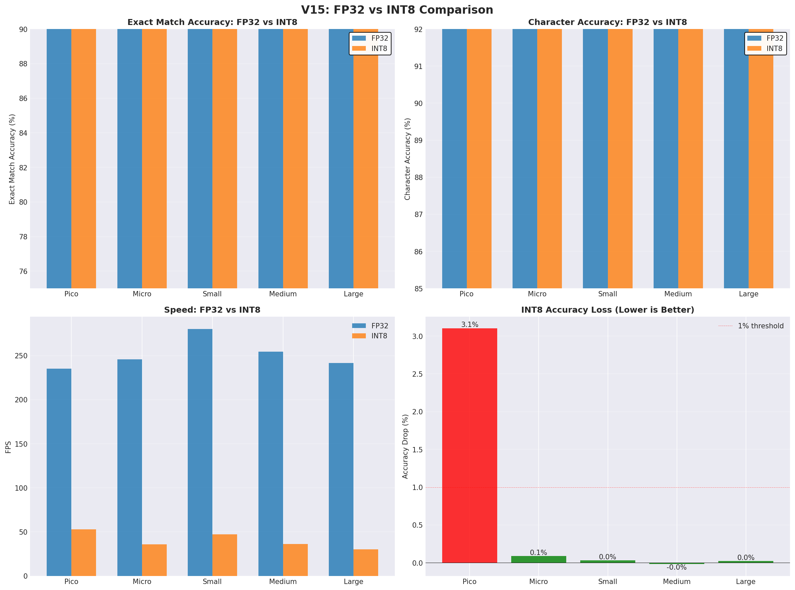
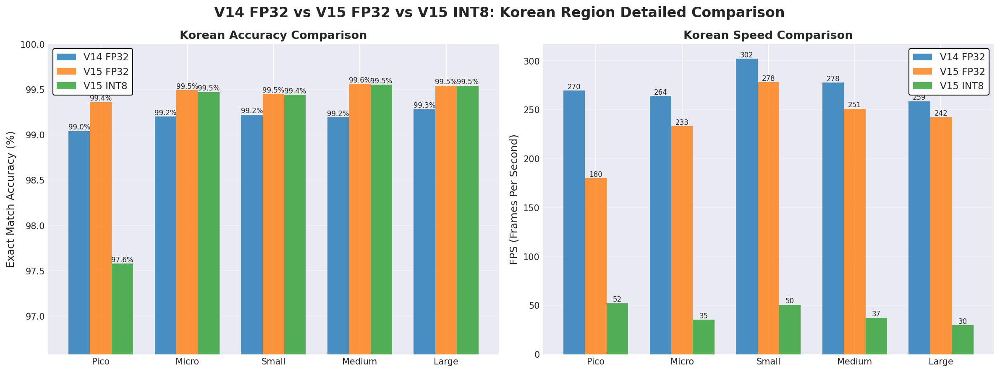
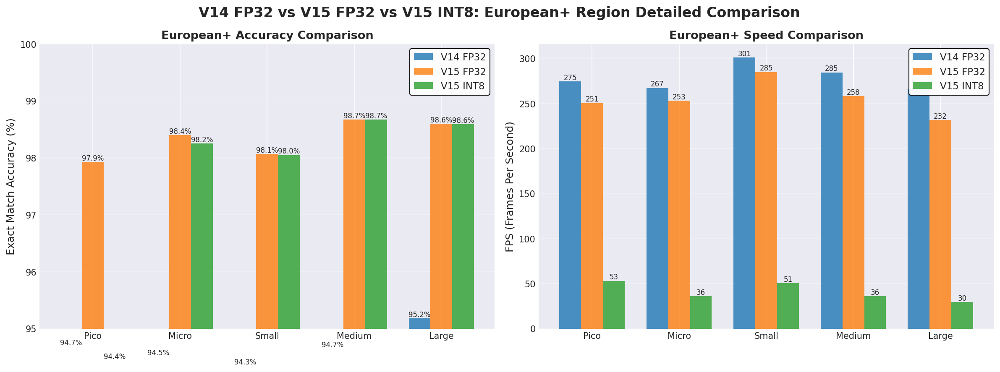
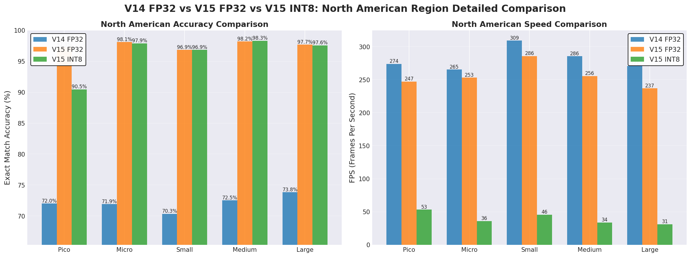
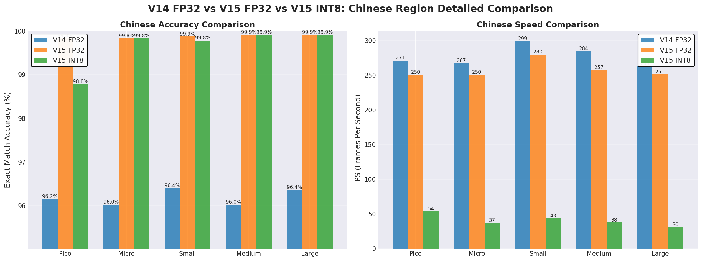
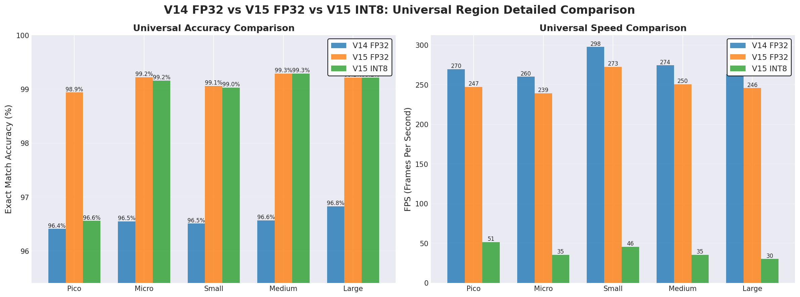

# V14 vs V15 OCR Comparison

**Last Updated: March 4, 2026**

This document compares V14 and V15 OCR models to help you choose the right version for your project.

---

## Quick Summary

| Feature | V14 OCR | V15 OCR |
|---------|---------|---------|
| **Status** | Stable, Backward Compatible | ⭐ Latest, Recommended |
| **Accuracy** | Excellent (91-92% average) | Better (98-99% average) |
| **Speed** | Fast (265-302 FPS) | Moderate (235-280 FPS) |
| **Multi-line Plates** | Good | Improved |
| **INT8 Support** | ❌ No | ✅ Yes |
| **Recommendation** | Existing projects | 🎯 New projects |

**Bottom Line:** V15 is significantly more accurate while maintaining strong real-time performance in this CUDA benchmark.

---

## Performance Comparison

### Average Performance (All Regions)

| Model | V14 Accuracy | V15 Accuracy | Improvement | V14 FPS | V15 FPS | Speedup |
|-------|-------------|-------------|-------------|---------|---------|---------|
| pico_fp32 | 91.66% | 98.66% | **+7.01%** | 271.7 | 235.1 | 0.87× |
| micro_fp32 | 91.64% | 99.01% | **+7.37%** | 264.8 | 245.8 | 0.93× |
| small_fp32 | 91.36% | 98.66% | **+7.30%** | 301.8 | 280.2 | 0.93× |
| medium_fp32 | 91.79% | 99.13% | **+7.34%** | 281.3 | 254.5 | 0.90× |
| large_fp32 | 92.30% | 98.99% | **+6.69%** | 264.2 | 241.5 | 0.91× |

**Key Findings:**
- ✅ V15 accuracy improved by **+6.7% to +7.4%** across all FP32 models
- ✅ V15 FP32 keeps strong real-time throughput (**235-280 FPS**) across models
- ✅ `small_fp32` still provides high throughput (~280 FPS) with +7.3% accuracy gain

### Visual Comparison



*Speed comparison: V15 maintains strong throughput with higher accuracy*



*Accuracy vs Speed profile: V15 delivers higher accuracy with robust FPS*

---

## Regional Performance (small_fp32 Model)

| Region | V14 Accuracy | V15 FP32 | V15 INT8 | V14 FPS | V15 FPS | Speedup |
|--------|-------------|----------|----------|---------|---------|---------|
| China (china) | 96.40% | 99.87% | 99.78% | 298.8 | 279.6 | 0.94× |
| Europe+ (euplus) | 94.35% | 98.07% | 98.05% | 301.2 | 285.2 | 0.95× |
| Korea (kor) | 99.22% | 99.45% | 99.44% | 302.1 | 278.2 | 0.92× |
| North America (na) | 70.34% | **96.86%** | 96.86% | 309.2 | 285.7 | 0.92× |
| Universal (univ) | 96.51% | 99.06% | 99.03% | 297.6 | 272.6 | 0.92× |

**Notable Improvements:**
- 🎯 **North America (na)**: massive jump from 70.34% → 96.86% (+26.52%)
- ✅ All regions show higher accuracy with V15 FP32 and V15 INT8
- ✅ V15 provides robust FPS while delivering substantial accuracy gains

### Regional Performance Visualization



*V14 vs V15 accuracy across all regions*



*Detailed comparison across all regions and models*

---

## V15 INT8 Models (New Feature)

V15 introduces INT8 quantized models:

**Benefits:**
- 📦 **70% smaller file size** (e.g., small: 114MB → ~28MB)
- 📱 **Lower memory usage** (better for mobile/edge)
- 🎯 **Similar accuracy** (typically <1% difference from V15 FP32)
- ⚡ **30-53 FPS** in this CUDA benchmark

**Performance (GPU CUDA):**

| Model | Exact Match | Char Accuracy | FPS | Time |
|-------|-------------|---------------|-----|------|
| pico_int8 | 95.56% | 98.78% | 52.7 | 18.96ms |
| micro_int8 | 98.92% | 99.79% | 35.9 | 27.82ms |
| small_int8 | 98.63% | 99.74% | 47.1 | 21.29ms |
| medium_int8 | 99.14% | 99.83% | 36.0 | 27.82ms |
| large_int8 | 98.96% | 99.80% | 30.2 | 33.07ms |

**Use Cases:**
- Mobile apps with limited storage
- Edge devices with memory constraints
- Applications prioritizing compact model size
- CPU-only deployments

### FP32 vs INT8 Comparison



*V15 FP32 vs INT8 models: Similar accuracy, different performance characteristics*

---

## When to Use Each Version

### Use V15 OCR When:
- ✅ Starting a new project
- ✅ Need best accuracy
- ✅ Need stronger recognition robustness across regions
- ✅ Working with North American plates (major improvement)
- ✅ Need INT8 models for mobile/edge
- ✅ Want better multi-line plate handling

### Use V14 OCR When:
- ✅ Maintaining existing production systems
- ✅ Need proven stability
- ✅ Already optimized for V14
- ✅ No immediate need for performance improvements

---

## Migration Guide

### From V14 to V15 (Simple!)

**Change 1 line of code:**

```python
# Before (V14)
from marearts_anpr import ma_anpr_ocr_v14
ocr = ma_anpr_ocr_v14("small_fp32", "univ", user_name, serial_key, signature)

# After (V15)
from marearts_anpr import ma_anpr_ocr_v15
ocr = ma_anpr_ocr_v15("small_fp32", "univ", user_name, serial_key, signature)
```

**Or use unified interface:**

```python
from marearts_anpr import ma_anpr_ocr

# Just change version parameter
ocr = ma_anpr_ocr("small_fp32", "univ", user_name, serial_key, signature, version='v15')  # Was: version='v14'
```

**That's it!** Same API, same parameters, just better performance.

---

## Test V14 vs V15 Yourself

Run comparison tests on your own data:

```bash
# Test V14 OCR models
python example_code/quick_test_v14.py

# Test V15 OCR models
python example_code/quick_test_v15.py
```

Both scripts test 5 model sizes (pico → micro → small → medium → large) with your images.

---

## Regional Deep Dive

### Korea (kor) - Highest Accuracy


### Europe+ (euplus)


### North America (na) - Biggest Improvement


### China (china)


### Universal (univ)


---

## Benchmarks

- 📊 [V14 OCR Full Report](benchmarks/v14_ocr_evaluation_report_cuda_20260204_101220.txt) - Feb 4, 2026
- 📊 [V15 OCR Full Report](benchmarks/v15_ocr_evaluation_report_cuda_20260304_093504.txt) - Mar 4, 2026
- 📈 [Comparison Summary](comparison_graphs/comparison_summary.txt)

---

## Conclusion

🏆 **V15 OCR is the clear winner:**

1. **6.7-7.4% better accuracy** across all FP32 models
2. **Major improvement** in North America region (+26.5%)
3. **Consistently high accuracy** across all regions (98-99% class)
4. **New INT8 models** for mobile/edge deployment
5. **Drop-in replacement** for V14 (no code changes needed)

**Recommendation:** Use V15 OCR for new deployments and for production workloads that need high accuracy and stable performance.

---

**Need help?** Contact [hello@marearts.com](mailto:hello@marearts.com)
