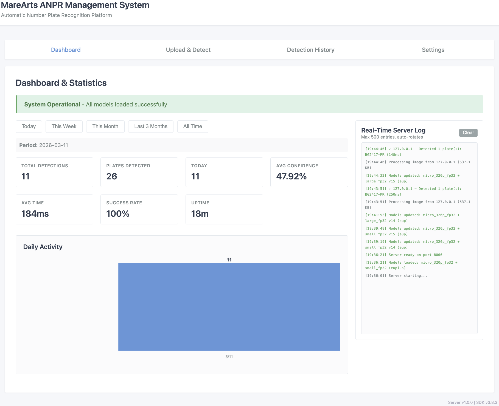
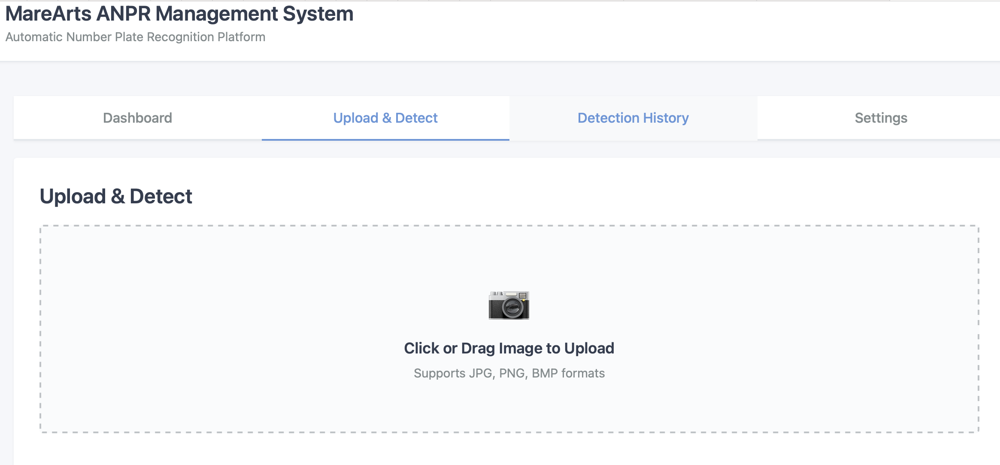
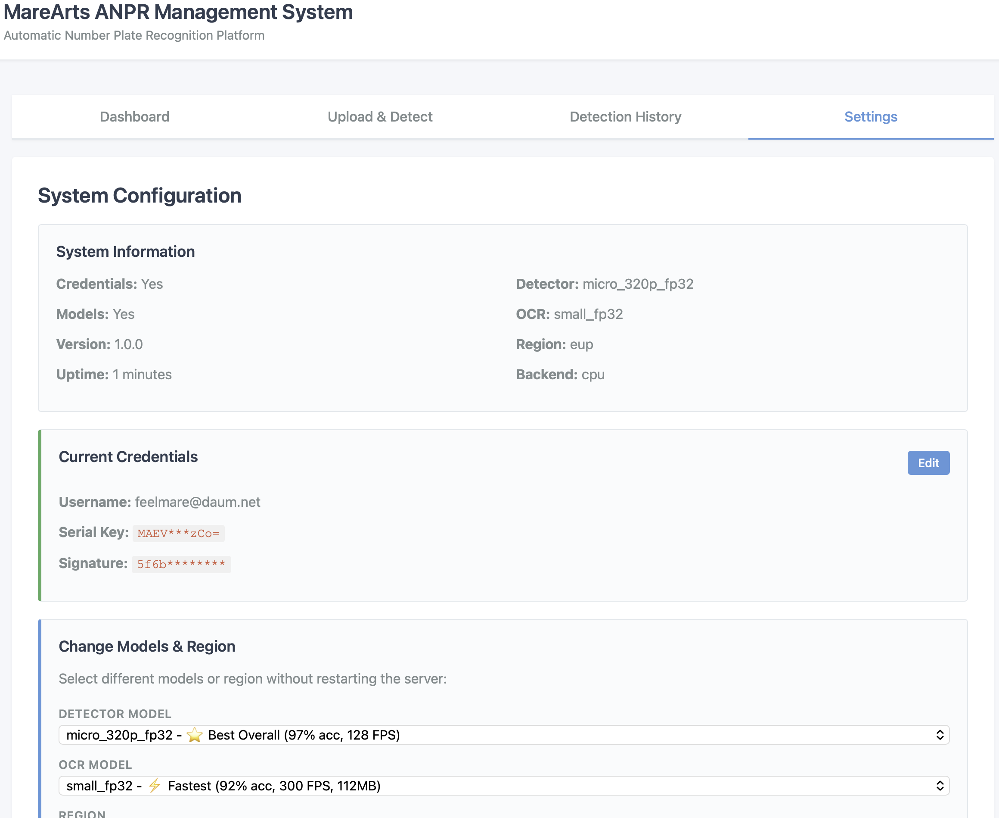

# MareArts ANPR Management Server

Professional ANPR server with REST API and Web Dashboard.



## Screenshots

<div align="center">

| Dashboard | Upload & Detect |
|:---------:|:---------------:|
|  |  |

| Detection History | Settings |
|:-----------------:|:--------:|
|  |  |

</div>

## Quick Start

```bash
# 1. Install
pip install -r requirements.txt

# 2. Configure (one time)
ma-anpr config

# 3. Start server
python server.py
# Or use: ./start_server.sh

# 4. Open browser
http://localhost:8000/
```

## Web Dashboard

### 4 Tabs

1. **Dashboard** - Statistics, charts & real-time server logs
2. **Upload & Detect** - Drag & drop images
3. **Detection History** - Browse by date
4. **Settings** - Models & configuration

### Dashboard Features

- **Statistics Cards** - Total, today, confidence, processing time
- **Daily Activity Chart** - Visual timeline
- **Real-Time Server Log** - Live API activity monitoring
  - Shows: Client IP, image size, plates detected, processing time
  - Retention: Last 500 entries (auto-rotates)
  - Color-coded: Info (gray), Success (green), Error (red), Warning (orange)
  - Clear button to reset logs

### History Filters

- Today | This Week | This Month | Last 3 Months | Custom Range | All Time

## REST API Usage

### Send Image - 3 Methods

**Method 1: File Upload**
```bash
curl -X POST http://localhost:8000/api/detect \
  -F "image=@plate.jpg"
```

**Method 2: Binary Data**
```bash
curl -X POST http://localhost:8000/api/detect/binary \
  --data-binary "@plate.jpg"
```

**Method 3: Base64**
```bash
BASE64=$(base64 -w 0 plate.jpg)
curl -X POST http://localhost:8000/api/detect/base64 \
  -H "Content-Type: application/json" \
  -d "{\"image\": \"$BASE64\"}"
```

### Python Client

```python
import requests

with open('plate.jpg', 'rb') as f:
    response = requests.post(
        'http://localhost:8000/api/detect',
        files={'image': f}
    )

result = response.json()
for plate in result['results']:
    print(f"{plate['plate_text']} - {plate['confidence']}%")
```

### Test Scripts

**Comprehensive Test Suite:**
```bash
./test_all.sh
```
Tests all API endpoints (file, binary, base64 upload) with sample images.

**Python Test Client:**
```bash
python test_client.py path/to/image.jpg
```
Shows health, stats, detection results, and history.

## API Response

```json
{
  "success": true,
  "detection_id": 1,
  "results": [
    {
      "plate_text": "ABC-123",
      "confidence": 98.5,
      "bbox": [120, 230, 380, 290]
    }
  ],
  "processing_time": 0.025
}
```

## API Endpoints

```
POST /api/detect              # Upload file
POST /api/detect/binary       # Raw bytes
POST /api/detect/base64       # Base64 image
GET  /api/stats               # Statistics
GET  /api/history             # Detection history
GET  /api/health              # Health check
GET  /docs                    # Swagger UI
```

## Configuration

### Credentials (Required)

**Option 1: ma-anpr config (Recommended)**
```bash
ma-anpr config  # Configure credentials once
python server.py  # Auto-loads
```

**Option 2: Web UI**
- Start server → Settings tab → Enter credentials → Activate

### Server Settings (Optional)

**Option 1: Config file**
```bash
# Edit server_config.yaml
python server.py
```

**Option 2: Settings tab**
- Change models, region, backend via web UI
- No restart needed


## Docker

```bash
docker build -t anpr-server .
docker run -d -p 8000:8000 \
  -e ANPR_MAX_LOGS=1000 \
  anpr-server
```

## Troubleshooting

**Credentials not found?**
```bash
ma-anpr config  # Or use Settings tab
```

**No plates detected?**
- Settings tab → Try different models
- Check correct region selected

**History shows 0?**
- Click "All Time" button
- Click "Debug Database" button

---

**Need help?** hello@marearts.com | https://www.marearts.com
