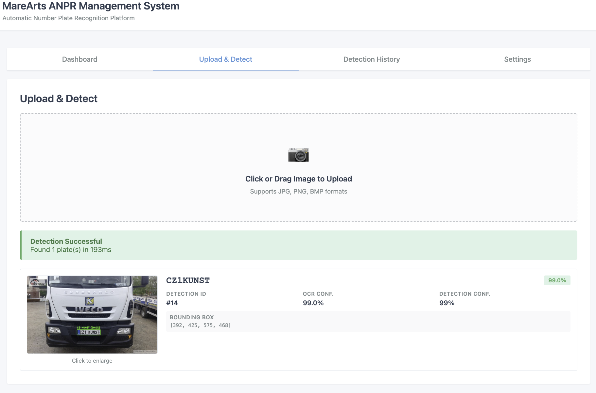
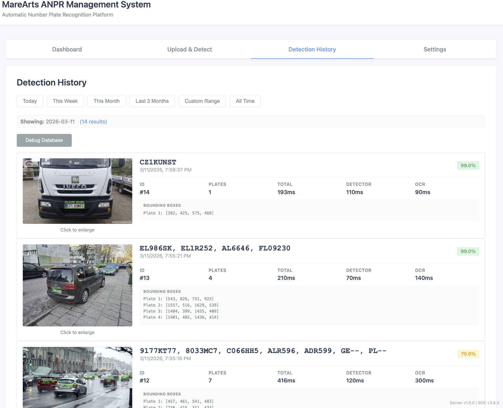
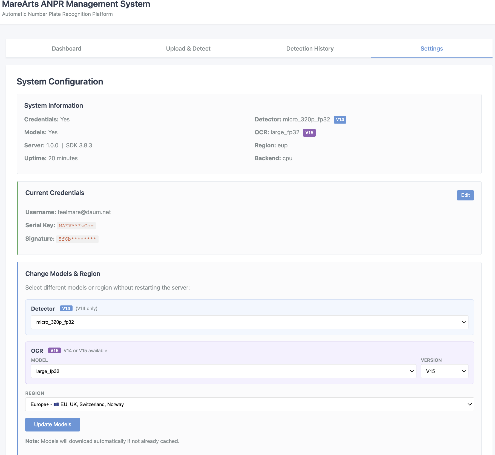
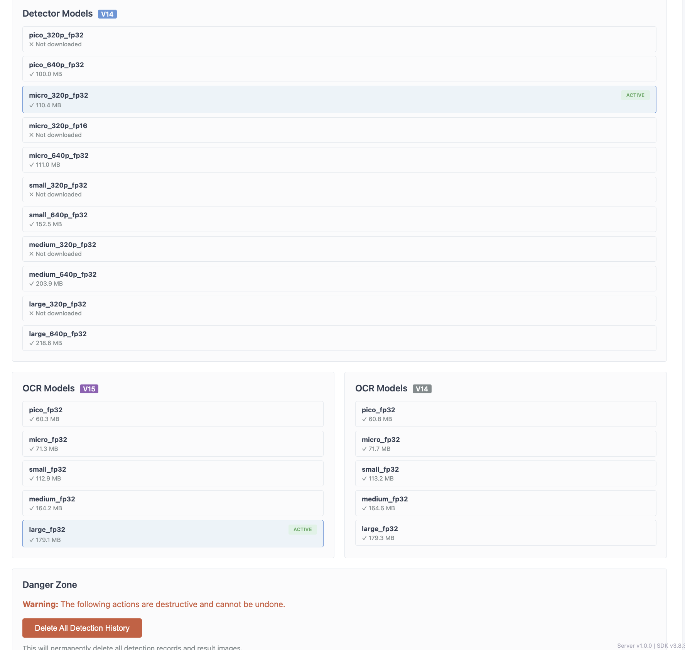

# MareArts ANPR Management Server

Professional ANPR server with REST API, Web Dashboard, and live model switching.


## Screenshots

<div align="center">

| Dashboard | Upload & Detect |
|:---------:|:---------------:|
|  |  |

| Detection History | Settings |
|:-----------------:|:--------:|
|  |  |

| Settings (Model Lists) |
|:-----------------------:|
|  |

</div>

## Quick Start

### Option A: Docker (Easiest)

```bash
# 1. Configure credentials (one time)
pip install marearts-anpr
ma-anpr config

# 2. Pull and run
docker pull public.ecr.aws/d1q9r5q2/marearts-anpr-server:latest
docker run -d -p 8000:8000 -v ~/.marearts:/root/.marearts \
  public.ecr.aws/d1q9r5q2/marearts-anpr-server:latest

# 3. Use it
# Web Dashboard: http://localhost:8000/
# REST API:
curl -X POST http://localhost:8000/api/detect -F "image=@plate.jpg"
```

Or with Docker Compose (if you cloned this repo):

```bash
ma-anpr config
docker compose up -d
```

### Option B: Direct Install (Linux/Mac)

```bash
# 1. Install dependencies
pip install -r requirements.txt

# 2. Configure credentials (one time)
ma-anpr config

# 3. Start server
./start_server.sh
# or: python server.py

# 4. Use it
# Web Dashboard: http://localhost:8000/
# REST API:
curl -X POST http://localhost:8000/api/detect -F "image=@plate.jpg"
```

### Option C: Direct Install (Windows)

```powershell
# 1. Create and activate virtual environment
python -m venv .venv
.venv\Scripts\Activate.ps1

# 2. Install dependencies
pip install -r requirements.txt

# 3. Configure credentials (one time)
ma-anpr config

# 4. Start server
.\start_server.ps1
# or: $env:PYTHONIOENCODING="utf-8"; python server.py

# 5. Use it
# Web Dashboard: http://127.0.0.1:8000/
```

> **Windows Notes:**
> - Use `start_server.ps1` instead of `start_server.sh`
> - If emoji characters appear garbled, set `$env:PYTHONIOENCODING='utf-8'` before running
> - Access via `127.0.0.1` or your LAN IP instead of `localhost` if needed

## Web Dashboard

### 4 Tabs

1. **Dashboard** - Statistics, charts & real-time server logs
2. **Upload & Detect** - Drag & drop images
3. **Detection History** - Browse by date
4. **Settings** - Models, OCR version, region & configuration

### Dashboard Features

- **Statistics Cards** - Total, today, confidence, processing time
- **Daily Activity Chart** - Visual timeline
- **Real-Time Server Log** - Live API activity monitoring
  - Shows: Client IP, image size, plates detected, processing time
  - Retention: Last 500 entries (auto-rotates)
  - Color-coded: Info (gray), Success (green), Error (red), Warning (orange)
  - Clear button to reset logs

### Settings Features

- **System Information** - Detector (V14), OCR (V14/V15), region, backend at a glance
- **Live Model Switching** - Change detector, OCR model, OCR version, region without restart
- **Model Download Status** - See which models are cached locally (V14 & V15 OCR listed separately)
- **Credential Management** - Edit credentials from the web UI

### History Filters

- Today | This Week | This Month | Last 3 Months | Custom Range | All Time

## Models

### Detector (V14 only)

| Model | Resolution |
|-------|-----------|
| `pico_320p_fp32` | 320p |
| `pico_640p_fp32` | 640p |
| `micro_320p_fp32` | 320p |
| `micro_320p_fp16` | 320p (half precision) |
| `micro_640p_fp32` | 640p |
| `small_320p_fp32` | 320p |
| `small_640p_fp32` | 640p |
| `medium_320p_fp32` | 320p |
| `medium_640p_fp32` | 640p |
| `large_320p_fp32` | 320p |
| `large_640p_fp32` | 640p |

### OCR (V14 and V15)

| Model | Versions |
|-------|----------|
| `pico_fp32` | V14, V15 |
| `micro_fp32` | V14, V15 |
| `small_fp32` | V14, V15 |
| `medium_fp32` | V14, V15 |
| `large_fp32` | V14, V15 |

### Regions

| Code | Region |
|------|--------|
| `kr` | Korea |
| `eup` | Europe+ (EU, UK, CH, NO) |
| `na` | North America (US, CA, MX) |
| `cn` | China |
| `univ` | Universal (all regions) |

## REST API

### Detect Plates - 3 Methods

**Method 1: File Upload**
```bash
curl -X POST http://localhost:8000/api/detect \
  -F "image=@plate.jpg"
```

**Method 2: Binary Data**
```bash
curl -X POST http://localhost:8000/api/detect/binary \
  --data-binary "@plate.jpg"
```

**Method 3: Base64**
```bash
BASE64=$(base64 -w 0 plate.jpg)
curl -X POST http://localhost:8000/api/detect/base64 \
  -H "Content-Type: application/json" \
  -d "{\"image\": \"$BASE64\"}"
```

### Switch Models via API

Change detector, OCR model, OCR version, and region on the fly:

```bash
curl -X POST http://localhost:8000/api/models/update \
  -H "Content-Type: application/json" \
  -d '{
    "detector_model": "micro_320p_fp32",
    "ocr_model": "small_fp32",
    "ocr_version": "v15",
    "region": "eup"
  }'
```

Switch OCR to V14:
```bash
curl -X POST http://localhost:8000/api/models/update \
  -H "Content-Type: application/json" \
  -d '{
    "detector_model": "micro_320p_fp32",
    "ocr_model": "large_fp32",
    "ocr_version": "v14",
    "region": "kr"
  }'
```

> Models download automatically if not already cached. Switching takes ~20-30 seconds.

### Python Client

```python
import requests

SERVER = "http://localhost:8000"

# Switch to V15 OCR, Europe region
requests.post(f"{SERVER}/api/models/update", json={
    "detector_model": "micro_320p_fp32",
    "ocr_model": "small_fp32",
    "ocr_version": "v15",
    "region": "eup"
})

# Detect plate
with open("plate.jpg", "rb") as f:
    response = requests.post(
        f"{SERVER}/api/detect",
        files={"image": f}
    )

result = response.json()
for plate in result["results"]:
    print(f"{plate['plate_text']} - {plate['confidence']}%")
```

### Test Scripts

**Comprehensive Test Suite:**
```bash
./test_all.sh
```
Tests all API endpoints (file, binary, base64 upload) with sample images.

**Python Test Client:**
```bash
python test_client.py path/to/image.jpg
```

## API Response

```json
{
  "success": true,
  "detection_id": 1,
  "results": [
    {
      "plate_text": "ABC-123",
      "confidence": 98.5,
      "bbox": [120, 230, 380, 290],
      "detection_confidence": 95.0
    }
  ],
  "processing_time": 0.148,
  "detector_time": 0.10,
  "ocr_time": 0.04,
  "image_url": "/results/detection_20260311_194440_505426.jpg"
}
```

## All API Endpoints

| Method | Endpoint | Description |
|--------|----------|-------------|
| `POST` | `/api/detect` | Upload file for detection |
| `POST` | `/api/detect/binary` | Raw bytes detection |
| `POST` | `/api/detect/base64` | Base64 image detection |
| `POST` | `/api/models/update` | Switch models/version/region |
| `GET` | `/api/models/status` | Model info & download status |
| `GET` | `/api/stats` | Detection statistics |
| `GET` | `/api/history` | Detection history |
| `GET` | `/api/health` | Health check & SDK version |
| `GET` | `/docs` | Swagger UI (auto-generated) |

## Configuration

### Credentials (Required)

**Option 1: ma-anpr config (Recommended)**
```bash
ma-anpr config    # Configure credentials once
python server.py  # Auto-loads from ~/.marearts/.marearts_env
```

**Option 2: Web UI**
- Start server → Settings tab → Enter credentials → Activate

### Server Settings (Optional)

**Config file** (`server_config.yaml`):
```yaml
models:
  detector: micro_320p_fp32
  ocr: small_fp32
  ocr_version: v15        # v14 or v15
  region: eup             # kr, eup, na, cn, univ
  backend: cpu            # cpu, cuda, directml
```

**Settings tab** - Change models, OCR version, region via web UI (no restart needed)

**API** - `POST /api/models/update` to switch programmatically

## Docker

### Pull from public registry

```bash
docker pull public.ecr.aws/d1q9r5q2/marearts-anpr-server:latest
```

### Run with credentials

The container needs access to `~/.marearts/` on the host, which contains your credentials and cached model files.

```bash
docker run -d -p 8000:8000 \
  -v ~/.marearts:/root/.marearts \
  public.ecr.aws/d1q9r5q2/marearts-anpr-server:latest
```

### Run with environment overrides

```bash
docker run -d -p 8000:8000 \
  -v ~/.marearts:/root/.marearts \
  -e ANPR_DETECTOR=small_320p_fp32 \
  -e ANPR_OCR=medium_fp32 \
  -e ANPR_REGION=kr \
  -e ANPR_OCR_VERSION=v15 \
  public.ecr.aws/d1q9r5q2/marearts-anpr-server:latest
```

### Docker Compose

```bash
docker compose up -d      # start
docker compose logs -f    # view logs
docker compose down       # stop
```

### Build locally (optional)

```bash
docker build -t anpr-server .
docker run -d -p 8000:8000 -v ~/.marearts:/root/.marearts anpr-server
```

## Troubleshooting

**Windows: Garbled emoji output?**
```powershell
$env:PYTHONIOENCODING = 'utf-8'
[Console]::OutputEncoding = [System.Text.Encoding]::UTF8
```

**Windows: Port already in use?**
```powershell
netstat -ano | findstr :8000     # Find the PID
taskkill /PID <pid> /F           # Kill it
```

**Credentials not found?**
```bash
ma-anpr config  # Or use Settings tab
```

**No plates detected?**
- Settings tab → Try different models or region
- Try V15 OCR for improved accuracy

**Model switch slow?**
- First switch downloads the model (~60-180MB depending on size)
- Subsequent switches are fast (loads from cache)

**History shows 0?**
- Click "All Time" button
- Click "Debug Database" button

---

**Need help?** hello@marearts.com | https://www.marearts.com
