# MareArts ANPR - App Guide

## ⭐ Important Notice

> **✅ No Additional License Required!**  
> This app can be used as an ANPR license without any additional purchase.  
> Get your license at: [MareArts ANPR Solution](https://www.marearts.com/products/anpr)
> 
> 🔍 **Find the app by searching "marearts anpr" in the App Store or Google Play**

---

## 📱 App Overview

MareArts ANPR is a professional license plate recognition app for parking management, security checkpoints, and vehicle tracking. All AI processing happens on-device for privacy and speed.

---

## 🆕 Latest Release

**Version 2.4.2 (Build 242)** - May 2026

**🚗 Vehicle Info — Now Official** - Vehicle Info (make, model, colour, type, side, nation) is out of beta and fully supported. Reliable cloud-based vehicle identification for all subscribers.

**☁️ Cloud Recognition API** - Enabled by default for all users. Cloud scan uses Gemini AI for OCR + vehicle info in one call.

**⚙️ Settings Improvements** - Plate Region selector always visible. Cleaner trial-mode experience with consistent default settings.

---
## 📲 Download

[](https://apps.apple.com/us/app/marearts-anpr/id6753904859) [](https://play.google.com/store/apps/details?id=com.marearts.anpr)

---
## 🧭 Navigation

The app has 5 main tabs at the bottom:

| Icon | Tab | Purpose |
|------|-----|---------|
| 📷 | **Scan** | Fast on-device plate scanning |
| 🕐 | **Detections** | View history and saved plates |
| ✅ | **Rules** | Manage whitelists/blacklists |
| 📊 | **Stats** | View statistics and charts |
| ⚙️ | **Settings** | Configure app behavior |

---

## 📷 1. Scan Page

<div align="center">
  
</div>

**Purpose**: Fast and accurate on-device license plate detection and recognition

### Landscape Mode Support 📱

Hold your phone sideways for landscape scanning:
- Detection, cropping, and bounding boxes work correctly in landscape
- Camera UI icons (capture, zoom, settings, flash) smoothly rotate to stay upright
- Guide box adapts to landscape orientation
- Bottom tab bar icons rotate to match device orientation (Scan page only)

### Features:

**Camera View** (middle 50% of screen)
- Live camera preview
- Tap anywhere to focus
- Automatic plate detection
- Green/red bounding boxes show detected plates

**Top Bar:**
- **Flash** 🔦 - Toggle camera flash
- **Zoom** - Pinch or tap to zoom (1x-5x)
- **Camera Switch** - Front/back camera toggle

**Bottom Controls:**
- **Single Capture** (⭕) - Capture one plate
- **Continuous Mode** (🔄) - Auto-scan continuously
- **Cloud Mode** (☁️) - Send to cloud API for processing (Gemini OCR + Vehicle Info)
- **Swipe left/right** - Quick switch between modes

**Status Display:**
- Shows last detected plate number
- Green/Red/Orange indicator for whitelist/blacklist status
- Confidence percentage
- Tap to view full details

**Free Trial Mode:**
- 10 scans per day
- Counter shows: "Today: X/10"
- Resets daily at midnight
- **Login for unlimited scans** (infinite usage)

### Camera Settings:

Tap the **⚙️ icon** next to the mode buttons to adjust:

**Resolution:**
- **1080p (1920×1080)** - Highest quality, best for detail (~140-160ms)
- **720p (1280×720)** - Balanced quality and speed (~100-130ms) ⭐ Recommended
- **480p (640×480)** - Fastest processing, good for high-volume (~80-110ms)

**Frame Rate:**
- **60 FPS** - Smooth preview (default)
- **30 FPS** - Battery saver mode

💡 **Tip:** Lower resolution = faster processing and less storage space!

---

## 🕐 2. Detections Page

**Purpose**: View all captured license plates

### Detection List

<div align="center">
  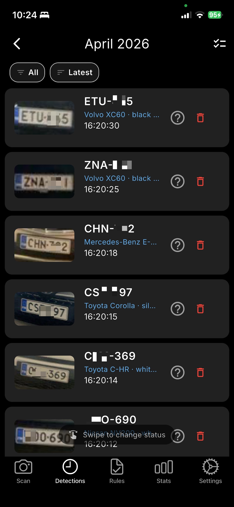
</div>

- All captured plates in chronological order
- Grouped by date (Today, Yesterday, This Week, etc.)
- Shows: Plate number, time, thumbnail
- **Vehicle Info** shown inline: make, model, colour (e.g. "Volvo XC60 · black...", "Toyota Corolla · sil...")
- **Swipe left to right** - Opens side menu to quickly change status (whitelist/blacklist/unknown)
- **Tap** to view full details
- **Status badges**: Green (whitelist), Red (blacklist), Orange (unknown)
- **Filter tabs**: All / Latest

<div align="center">
  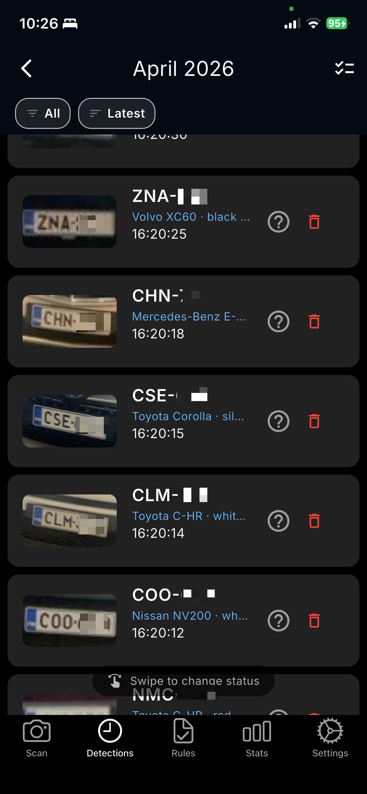
</div>

### Detection Preview (tap any detection)

<div align="center">
  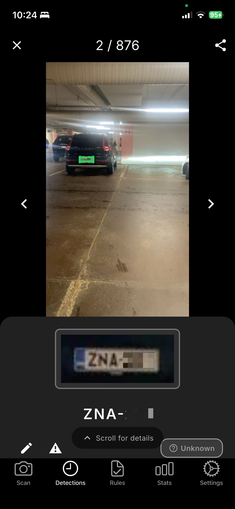
</div>

- Full-resolution captured image with green bounding box overlay
- Cropped plate image for close-up view
- Plate number displayed prominently
- "Scroll for details" hint for more information
- Swipe left/right to browse between detections
- Navigation counter (e.g. "2 / 876")

### Detection Details & Vehicle Info

<div align="center">
  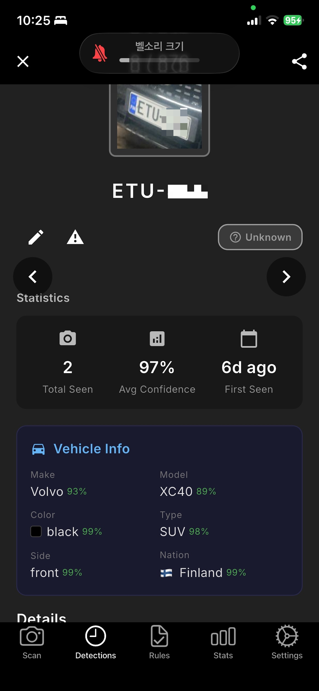
</div>

- **Statistics**: Total Seen count, Average Confidence %, First Seen date
- **Vehicle Info** card with detailed identification:
  - **Make** with confidence (e.g. Volvo 93%)
  - **Model** with confidence (e.g. XC40 89%)
  - **Color** with swatch and confidence (e.g. black 99%)
  - **Type** with confidence (e.g. SUV 98%)
  - **Side** — front or rear of vehicle (e.g. front 99%)
  - **Nation** — country flag + name (e.g. 🇫🇮 Finland 99%)
- **Status badge**: Whitelist / Blacklist / Unknown
- **Action buttons**: Edit ✏️, Add to Rule ⚠️

### Map & Detection History

<div align="center">
  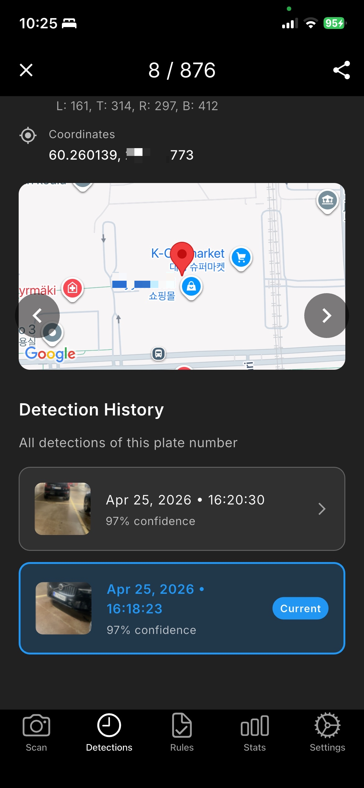
</div>

- **Bounding Box** coordinates in LTRB format (Left, Top, Right, Bottom)
- **GPS Coordinates** with embedded Google Maps view
- **Detection History** — all past detections of the same plate number:
  - Date, time, confidence for each sighting
  - "Current" badge on the active detection
  - Tap any history entry to jump to that detection

### Map View

<div align="center">
  
</div>

- Shows all plates on a map
- **Clusters** nearby detections (shows count)
- **Tap cluster** to zoom in
- **Tap marker** to see plate details
- **Top buttons**:
  - 🛰️ **Satellite/Road** toggle
  - 🏷️ **Show Labels** - Display all plate numbers
- **Search bar**: Filter by plate number

### 🚗 Vehicle Info

Vehicle Info is a cloud-based AI service that identifies vehicle make, model, colour, type, side, and nation for each detection.

**In Detection List:**
- Vehicle info line shown below each detection (e.g. "Toyota Corolla · silver · Sedan")
- Data enriched automatically by cloud AI after sync

**In Detection Detail:**
- Full Vehicle Info card with 6 fields and confidence scores
- Side (front/rear) and Nation (country flag + name) identification

**On Web Dashboard:**

View and filter vehicle information on marearts.com:

<div align="center">
  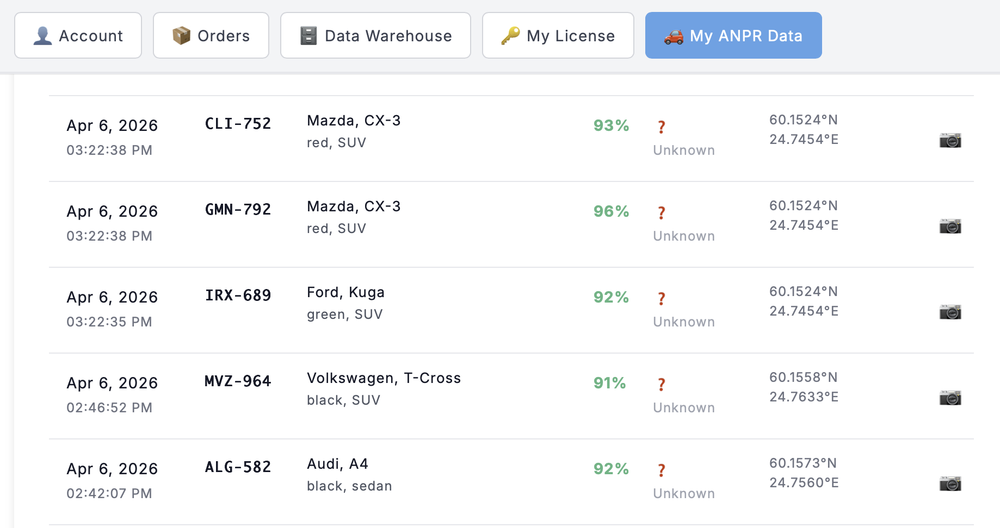
</div>

<div align="center">
  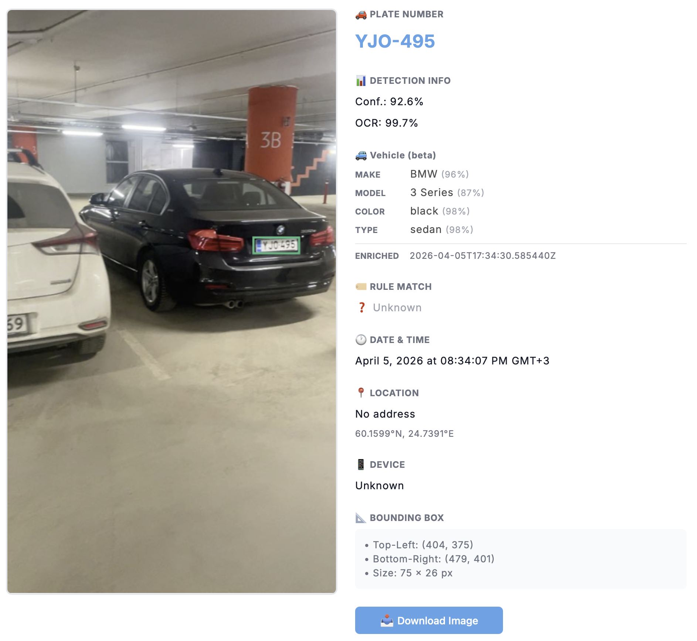
</div>

**Filter by Vehicle Info:**

<div align="center">
  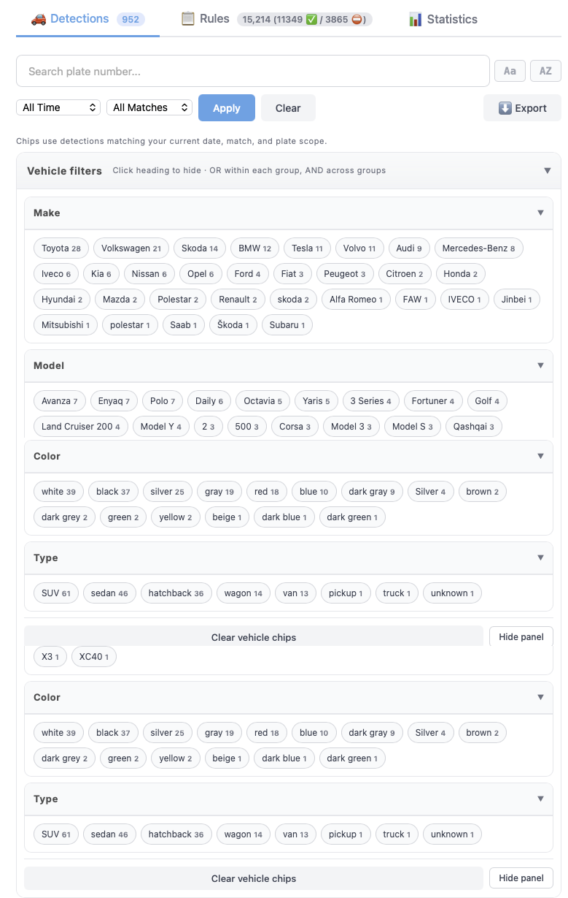
</div>

- Filter detections by vehicle make, model, color, or type
- Available on web dashboard

💡 **Tip:** Vehicle Info syncs automatically when you tap "Sync Now" in Settings. In Cloud scan mode, Vehicle Info is included instantly with each scan!

---

### Export Data:

Tap **⋮ menu** in top-right corner:

**Export All Data (CSV)**
- Downloads all your detections as a CSV file
- Includes: Plate number, date, time, GPS coordinates, confidence scores, bounding box (LTRB), rule note, reporter email
- **Vehicle Info columns**: Make, Model, Color, Type, Side, Nation
- Device model and app version auto-detected per export
- Compatible with Excel, Google Sheets, and marearts.com
- Share via AirDrop, Files app, or email

💡 **Tip:** Export regularly to keep backups of your detection history!

---

## ✅ 3. Rules Page

<div align="center">
  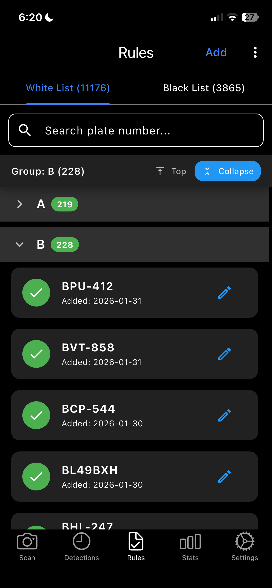
</div>

**Purpose**: Manage plate whitelists and blacklists

### Features:

**Whitelist** (Green)
- Allowed/approved vehicles
- Shows green badge on scan
- Plays "success" sound

**Blacklist** (Red)
- Blocked/unwanted vehicles
- Shows red badge on scan
- Plays "alert" sound

**Smart Grouping** 📋
- Rules organized by letter (A, B, C... sections)
- Tap section header to expand/collapse
- Easy to navigate with hundreds or thousands of rules
- Quick scroll to any letter

**Management:**
- **Search Bar** - Type to filter plates (real-time)
- **Tab Counter** - Shows total: "White List (200)"
- **+ Button** (bottom center) - Add new plate
- **Swipe left** to delete
- **Group Sections** - Tap to expand/collapse
- Type full plate number or partial (e.g., "ABC" matches "ABC-123")
- Auto-uppercase
- Tap "X" to clear search, "Done" to dismiss keyboard

**Use Cases:**
- Parking: Whitelist residents, blacklist violators
- Security: Whitelist staff, blacklist banned vehicles
- Delivery: Track known vehicles

### Bulk Management:

Tap **⋮ menu** in top-right corner for more options:

**Export All Rules**
- Downloads all your whitelist and blacklist plates as CSV
- Compatible with Excel, Google Sheets, and marearts.com
- Perfect for backup or editing in spreadsheet

**Import Rules**
- Upload a CSV file to add rules to your phone
- Download sample template first to see the format
- Great for bulk adding plates (e.g., 100+ employee vehicles)

**Download Sample CSV**
- Get a template file with instructions
- Fill in: Plate Number, Type (whitelist/blacklist), Note
- Import when ready

💡 **Workflow:** Export → Edit in Excel → Import back for bulk updates!

---

### Download Rules from Web 🌐

<div align="center">
  
</div>

**Upload rules on marearts.com, download on your phone:**

**Step 1: Upload on Web**

<div align="center">
  
</div>

1. Go to marearts.com/my-account
2. Click "Upload Rule Package" button
3. Choose your CSV file
4. Click upload

<div align="center">
  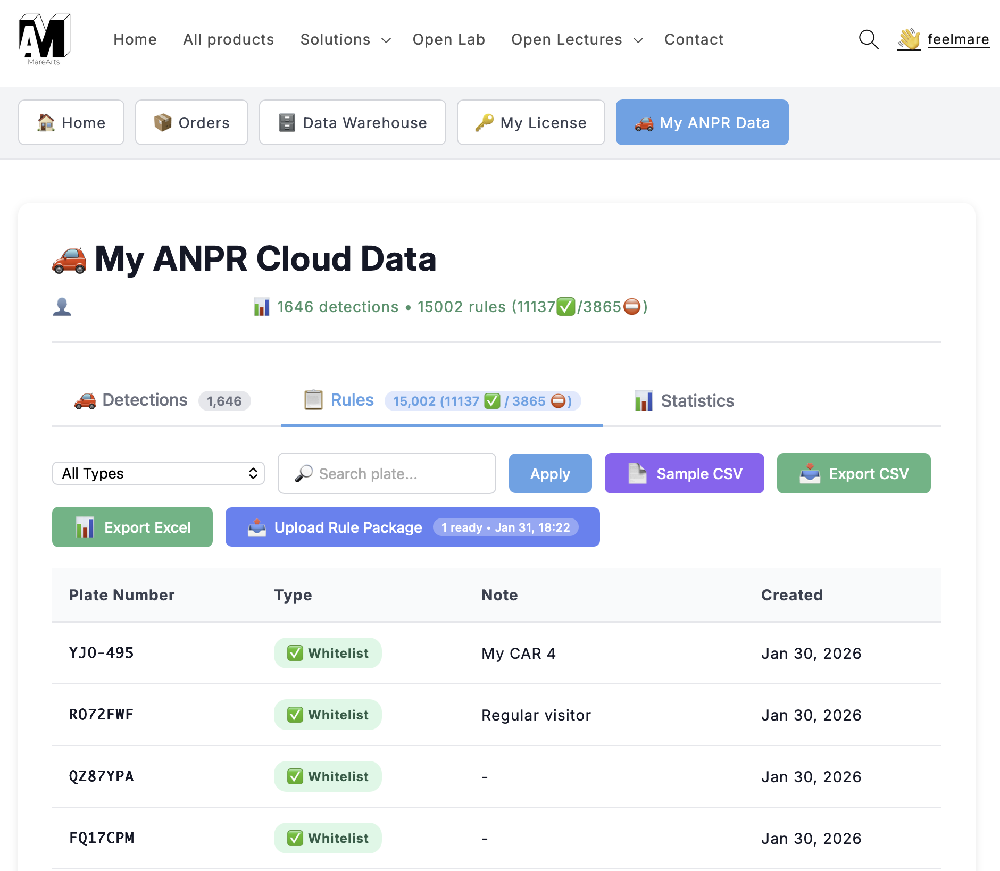
</div>

**Step 2: Download on Phone**
1. Open Rules page in app
2. See blue banner: "Rules package ready"
3. Tap to download
4. Choose "Replace All" or "Add to Existing"
5. Done! Rules imported automatically

**Benefits:**
- Upload large CSV files on computer (easier than phone)
- Share rules between team members
- Bulk import thousands of rules at once
- Works across all your devices

💡 **Tip:** Great for importing company vehicle lists or large databases!

---

## 📊 4. Stats Page

<div align="center">
  
</div>

**Purpose**: View scanning statistics and trends

### Overview Section:
- **Total Scans** - All-time count
- **Today** - Scans captured today
- **This Week** - Last 7 days
- **This Month** - Current month
- **This Year** - Year-to-date

### Top 10 Vehicles:
- Most frequently detected plates
- Shows scan count for each
- **Tap** to view all scans for that plate

### Time Period Selector:
- **Today** - Hourly breakdown
- **This Week** - Monday to today (calendar week)
- **This Month** - First day to today
- **Year** - Full year with year selector (2024, 2025, 2026...)
- **Custom Range** - Pick any start and end dates

### Charts:
- Automatic layout based on period selected
- **Date range displayed** below selector (e.g., "Dec 1, 2025 - Jan 7, 2026")
- Scrollable for year view (12 months)

### Status Filter:
- **All** - Show everything
- **Whitelist** - Green plates only
- **Blacklist** - Red plates only
- **Unknown** - Orange plates only

**Pull down** to refresh data

---

## ⚙️ 5. Settings Page

### Account & Cloud Sync

<div align="center">
  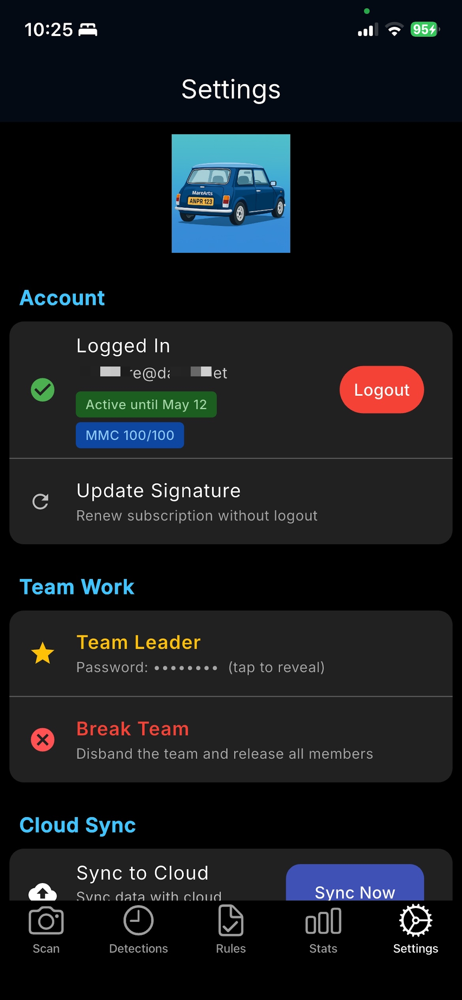
</div>

**Account Section:**
- Login with email + signature for unlimited scans
- Shows subscription status with badge: **Active until [date]** (green)
- **MMC quota badge**: Shows daily Vehicle Info usage (e.g. **MMC 100/100** in blue)
- Update Signature to renew without logout
- Trial mode: 10 scans/day, resets at midnight

**Team Work:**
- **Team Leader**: Create team, share password, view all member data
- **Team Member**: Join with password, contribute data
- Break Team / Leave Team options

**Cloud Sync:**
- **Sync to Cloud** — Two-way sync across all devices
- **Auto Sync** — Automatically syncs when app goes to background
- Runs in background with real-time progress
- Syncs detections, rules, images, and vehicle info

### Detection Settings

<div align="center">
  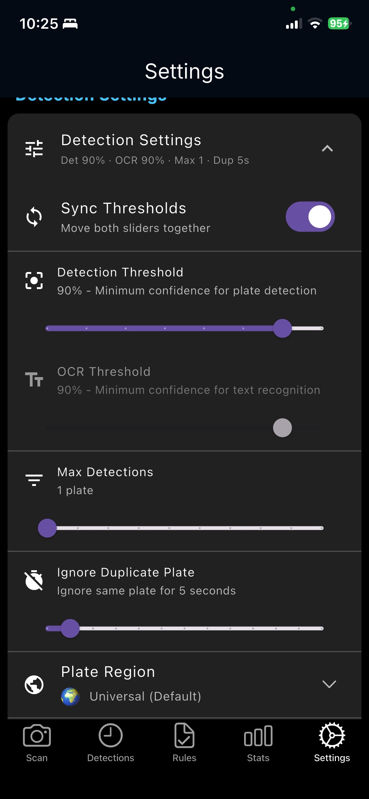
</div>

Collapsible section with one-line summary (e.g. "Det 90% · OCR 90% · Max 1 · Dup 5s"):

**Sync Thresholds** 🔄
- Toggle to sync detection + OCR thresholds together

**Detection Threshold** (60-95%)
- Minimum confidence to detect plate
- **Recommended**: 90%

**OCR Threshold** (60-95%)
- Minimum confidence for text recognition
- **Recommended**: 90%

**Max Detections** (1-10)
- Maximum plates to capture per scan
- **Recommended**: 1 (parking/security)

**Ignore Duplicate Plate** (0-60 seconds)
- Prevents saving same plate multiple times
- 5s = Default

**Plate Region** 🌍
- 🌍 **Universal (Default)** - All regions, multi-language support
- 🇪🇺 **Europe+** - EU countries + UK, Norway, Switzerland, Serbia, Indonesia
- 🇰🇷 **Korea** - South Korea (한국 자동차 번호판)
- 🇺🇸🇨🇦🇲🇽 **North America** - USA, Canada, Mexico
- 🇨🇳 **China** - China (中国车牌识别)
- Always visible for quick access

### Advanced Settings

<div align="center">
  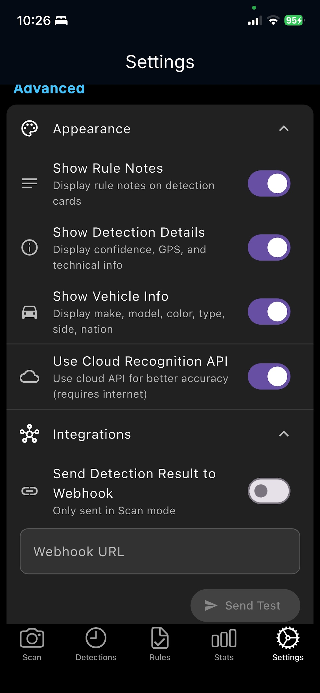
</div>

**Appearance:**
- **Show Rule Notes** - Display rule notes on detection cards
- **Show Detection Details** - Display confidence, GPS, and technical info
- **Show Vehicle Info** - Display make, model, color, type, side, nation
- Trial users see these as locked (login required)

**Use Cloud Recognition API** ☁️
- Cloud API for better accuracy (requires internet)
- Enabled by default for all users
- Uses Gemini AI for OCR + Vehicle Info in one call

**Integrations (Webhook)** 🔗
- Send real-time plate detections to external services
- Works with **Discord**, **Slack**, **Zapier**, **Make**, or any custom server
- Enter Webhook URL and tap **Send Test** to verify

**Webhook Payload (JSON):**
- `plate_number` - Detected plate text
- `timestamp` - ISO 8601 detection time
- `detection_confidence` / `ocr_confidence` - AI confidence scores
- `bbox` - Bounding box coordinates (left, top, right, bottom)
- `gps` - Latitude, longitude, address
- `rule_status` - whitelist / blacklist / unknown
- `note` - Rule note (if any)
- `reporter` - Account email or "trial"
- `scan_mode` - single / continuous
- `image` - Base64-encoded plate image (if available)

💡 **Tip:** Use Discord webhooks for instant notifications on your phone or desktop!

**Build Your Own Webhook Receiver:**

We provide a ready-to-use Python server you can run on your own machine or cloud:

👉 [**webhook_receiver.py**](https://github.com/MareArts/MareArts-ANPR/blob/main/example_code/webhook_receiver.py)

```bash
# Install
pip install fastapi uvicorn python-multipart

# Run
python webhook_receiver.py
```

- Saves plate images + JSON metadata to `received_plates/` folder
- Prints detected plates to console in real-time
- Optional forwarding to **Slack** and **Telegram** (with images)
- Discord-compatible format (multipart/form-data)
- Runs on port 9000 - set `http://YOUR_IP:9000/webhook` in the app

### Other Settings:

**Notifications:**
- **Sound** 🔊 - Audio alerts for detections (different for whitelist/blacklist)
- **Vibration** 📳 - Haptic feedback on detection

**Storage:**
- **Save Images** 📷 - Save full-resolution images with detections
- **Clear All Data** 🗑️ - Delete all detections AND rules (syncs deletion to cloud if logged in)
- **Factory Reset** 🔄 - Fresh start, keeps cloud backup safe for restore
- **Data Retention** (7-365 days) - Auto-delete old detections

**Location:**
- **Enable GPS** 📍 - Save location with each detection (required for Map view)

**About:**
- App name & version
- Website: www.marearts.com
- Support email: hello@marearts.com
- **Report Bug / Request Feature** - Opens GitHub Issues

---

## 👥 6. Team Work

**Purpose**: Collaborate with your team — share detections and rules across multiple users

### How It Works

A **Team Leader** creates a team and shares a password. **Team Members** join using that password. All team data syncs to the cloud and is accessible from the web dashboard.

### Team Leader

<div align="center">
  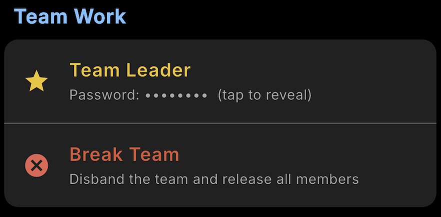
</div>

- **Create Team**: Automatically becomes the team leader
- **Share Password**: Give the team password to members (tap to reveal)
- **View All Data**: See every member's detections and rules on the web dashboard
- **Switch Members**: Web dashboard dropdown lets you view any member's data
- **Break Team**: Disband the team and release all members

<div align="center">
  
</div>

### Team Member

<div align="center">
  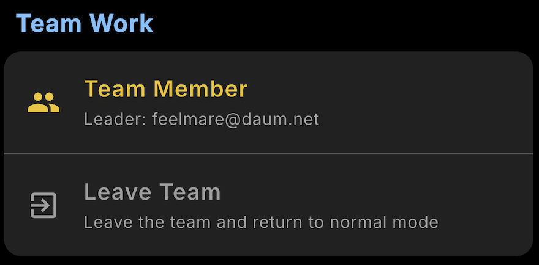
</div>

- **Join Team**: Enter the leader's password to join
- **Contribute Data**: Your detections and rules sync to the team
- **See Leader Info**: Shows who your team leader is
- **Leave Team**: Leave anytime and return to normal (solo) mode

<div align="center">
  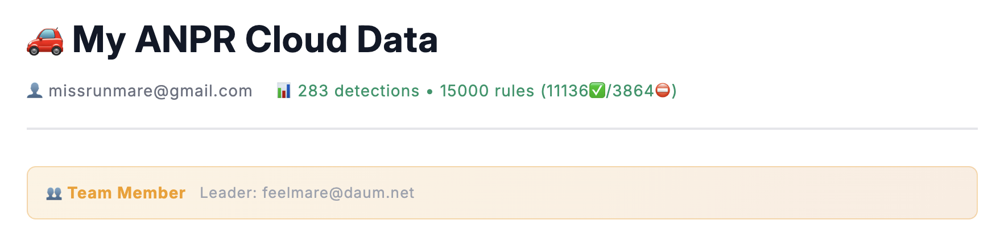
</div>

### Use Cases:
- **Parking management**: Multiple guards scanning, one supervisor monitoring all data
- **Security teams**: Distributed checkpoints reporting to a central dashboard
- **Fleet management**: Multiple drivers, one operations manager

💡 **Tip:** The team leader can view all members' detections on [marearts.com](https://www.marearts.com) — great for monitoring without being on-site!

---

## 🎯 Common Workflows

### Parking Management:
1. **Add residents** to Whitelist (Rules page)
2. **Scan** vehicles entering (Scan page)
3. **Check status** - Green = Allowed, Red = Blocked
4. **Review** violations (Detections page)

### Security Checkpoint:
1. **Add approved** vehicles to Whitelist
2. **Add banned** vehicles to Blacklist
3. **Continuous scan** at entrance
4. **Audio/vibration** alerts for blacklist

### Vehicle Tracking:
1. **Scan** vehicles continuously
2. **View history** in Detections
3. **Use Map** to see locations
4. **Export** data (via share button)

---

## 💡 Tips & Best Practices

### For Best Detection:

✅ **Distance**: 2-3 meters from vehicle  
✅ **Angle**: Perpendicular to plate (not tilted)  
✅ **Lighting**: Good outdoor light (daytime)  
✅ **Focus**: Tap plate area to focus  
✅ **Stability**: Hold steady while capturing  

❌ **Avoid**:
- Too far (>5 meters)
- Extreme angles
- Low light conditions
- Motion blur
- Dirty/damaged plates

---

## 🔒 Privacy & Security

✅ **100% On-Device**: All AI processing on your device  
✅ **Local Database**: All data stored locally  
✅ **GPS Optional**: Can disable location tracking  
✅ **Your Control**: Cloud sync only when you choose  

**Cloud Mode** (Optional):
- Sends image to API for processing via Gemini AI
- Used when Cloud Recognition API is enabled
- Returns OCR + Vehicle Info in one call
- Requires internet connection

**Cloud Sync** (Optional):
- Manual "Sync Now" or Auto Sync in background
- Images uploaded only if you enable sync
- Can work 100% offline if preferred

---

## 📞 Support

**Email**: hello@marearts.com  
**Website**: https://www.marearts.com  

**For Issues**:
- Include app version (Settings page)
- Describe the problem
- Include screenshot if possible 

---

## ⭐ Remember

> **✅ No Additional License Required!**  
> This app can be used as an ANPR license without any additional purchase.  
> Get your license at: [MareArts ANPR Solution](https://www.marearts.com/products/anpr)
> 
> 🔍 **Find the app by searching "marearts anpr" in the App Store or Google Play**

---

**Need help?** Contact hello@marearts.com
