# MareArts ANPR - App Guide

## ⭐ Important Notice

> **✅ No Additional License Required!**  
> This app can be used as an ANPR license without any additional purchase.  
> Get your license at: [MareArts ANPR Solution](https://www.marearts.com/products/anpr)
> 
> 🔍 **Find the app by searching "marearts anpr" in the App Store or Google Play**

---

## 📱 App Overview

MareArts ANPR is a professional license plate recognition app for parking management, security checkpoints, and vehicle tracking. All AI processing happens on-device for privacy and speed.

---

## 🆕 Latest Release

**Version 2.3.0 (Build 230)** - April 2026

**📱 Landscape Camera Support** - Scan license plates in landscape mode — detection, cropping, and bounding boxes all work correctly when holding your phone sideways. Camera UI icons smoothly rotate to stay upright.

**🚗 Vehicle Info (Beta)** - Get vehicle make, model, color, and type data from our cloud AI. Information syncs incrementally — only new data is downloaded each time.

**🔄 MareArts MMC Sync** - Seamless synchronization with MareArts Management Cloud for enterprise deployments.

[📖 View Release Notes](https://github.com/MareArts/MareArts-ANPR/releases/latest)

---
## 📲 Download

[](https://apps.apple.com/us/app/marearts-anpr/id6753904859) [](https://play.google.com/store/apps/details?id=com.marearts.anpr)

---
## 🧭 Navigation

The app has 5 main tabs at the bottom:

| Icon | Tab | Purpose |
|------|-----|---------|
| 📷 | **Scan** | Fast on-device plate scanning |
| 🕐 | **Detections** | View history and saved plates |
| ✅ | **Rules** | Manage whitelists/blacklists |
| 📊 | **Stats** | View statistics and charts |
| ⚙️ | **Settings** | Configure app behavior |

---

## 📷 1. Scan Page

<div align="center">
  
</div>

**Purpose**: Fast and accurate on-device license plate detection and recognition

### Landscape Mode Support (NEW! 📱)

Hold your phone sideways for landscape scanning:
- Detection, cropping, and bounding boxes work correctly in landscape
- Camera UI icons (capture, zoom, settings, flash) smoothly rotate to stay upright
- Guide box adapts to landscape orientation
- Bottom tab bar icons rotate to match device orientation

### Features:

**Camera View** (middle 50% of screen)
- Live camera preview
- Tap anywhere to focus
- Automatic plate detection
- Green/red bounding boxes show detected plates

**Top Bar:**
- **Flash** 🔦 - Toggle camera flash
- **Zoom** - Pinch or tap to zoom (1x-5x)
- **Camera Switch** - Front/back camera toggle

**Bottom Controls:**
- **Single Capture** (⭕) - Capture one plate
- **Continuous Mode** (🔄) - Auto-scan continuously
- **Cloud Mode** (☁️) - Send to cloud API for processing
- **Swipe left/right** - Quick switch between modes

**Status Display:**
- Shows last detected plate number
- Green/Red/Orange indicator for whitelist/blacklist status
- Confidence percentage
- Tap to view full details

**Free Trial Mode:**
- 50 scans per day
- Counter shows: "Today: X/50"
- Resets daily at midnight
- **Login for unlimited scans** (infinite usage)

### Camera Settings:

Tap the **⚙️ icon** next to the mode buttons to adjust:

**Resolution:**
- **1080p (1920×1080)** - Highest quality, best for detail (~140-160ms)
- **720p (1280×720)** - Balanced quality and speed (~100-130ms) ⭐ Recommended
- **480p (640×480)** - Fastest processing, good for high-volume (~80-110ms)

**Frame Rate:**
- **60 FPS** - Smooth preview (default)
- **30 FPS** - Battery saver mode

💡 **Tip:** Lower resolution = faster processing and less storage space!

---

## 🕐 2. Detections Page

**Purpose**: View all captured license plates

### Three View Modes:

#### **📋 List View** (Default)
- All captured plates in chronological order
- Grouped by date (Today, Yesterday, This Week, etc.)
- Shows: Plate number, time, location, thumbnail
- **Swipe left to right** - Opens side menu to quickly change status (whitelist/blacklist/unknown)
- **Tap** to view full details
- **Status badges**: Green (whitelist), Red (blacklist), Orange (unknown)

<div align="center">
  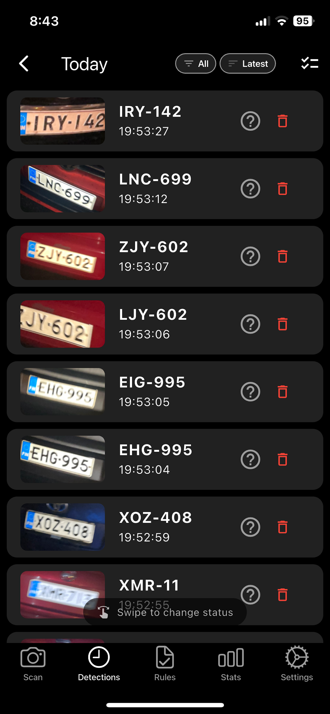
</div>

#### **📸 Full Preview** (tap any detection)

<div align="center">
  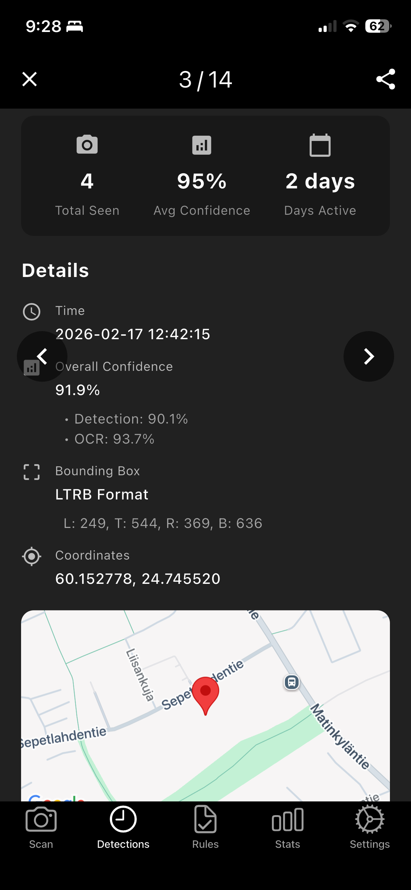
</div>

- **Plate summary** at top: Total Seen count, Average Confidence, Days Active
- Large plate image with bounding box overlay
- Plate number (tap ✏️ to edit)
- Status badge (whitelist/blacklist/unknown)
- **Details section:**
  - Time (date and time of detection)
  - Overall Confidence with breakdown (Detection % + OCR %)
  - Bounding Box in LTRB format (Left, Top, Right, Bottom)
  - GPS Coordinates with embedded map
- **Buttons**:
  - 📋 **Copy** - Copy plate number
  - 🗑️ **Delete** - Remove from history
  - ➕ **Add to Whitelist**
  - ➖ **Add to Blacklist**
  - 📤 **Share** - Share detection details in machine-readable format
- **Navigation**: Swipe left/right or use arrow buttons to browse between detections

<div align="center">
  
</div>

#### **🗺️ Map View**
- Shows all plates on a map
- **Clusters** nearby detections (shows count)
- **Tap cluster** to zoom in
- **Tap marker** to see plate details
- **Top buttons**:
  - 🛰️ **Satellite/Road** toggle
  - 🏷️ **Show Labels** - Display all plate numbers
- **Search bar**: Filter by plate number
- **Header**: Shows total locations count

### 🚗 Vehicle Info (Beta)

Get vehicle make, model, color, and type information from our cloud AI service.

#### Detection List View

<div align="center">
  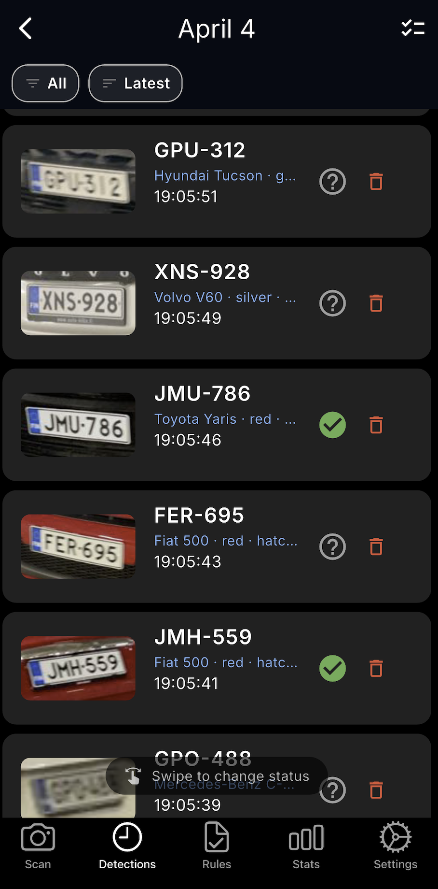
</div>

- Vehicle info badge appears below each detection
- Shows: Make, Model, Color, Vehicle Type
- Data syncs incrementally — only new info downloaded each sync

#### Detection Detail View

<div align="center">
  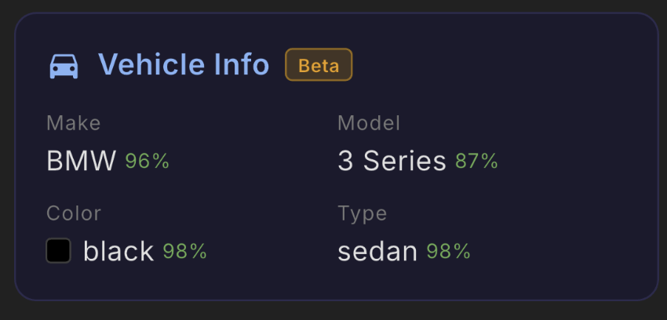
</div>

- Detailed vehicle information section in detection preview
- Tap any detection to see full vehicle details
- Information retrieved from cloud AI analysis

#### Web Dashboard

View vehicle information on the web at marearts.com:

<div align="center">
  
</div>

<div align="center">
  
</div>

#### Filter by Vehicle Info

<div align="center">
  
</div>

- Filter detections by vehicle make, model, color, or type
- Available on web dashboard

💡 **Tip:** Vehicle Info syncs automatically when you tap "Sync Now" in Settings. The sync is non-blocking — if vehicle data pull fails, your main sync still completes!

---

### Export Data:

Tap **⋮ menu** in top-right corner:

**Export All Data (CSV)**
- Downloads all your detections as a CSV file
- Includes: Plate number, date, time, GPS coordinates, confidence scores, bounding box (LTRB), rule note, reporter email
- Device model and app version auto-detected per export
- Compatible with Excel, Google Sheets, and marearts.com
- Use for backup, analysis, or reporting
- Share via AirDrop, Files app, or email

💡 **Tip:** Export regularly to keep backups of your detection history!

---

## ✅ 3. Rules Page

<div align="center">
  
</div>

**Purpose**: Manage plate whitelists and blacklists

### Features:

**Whitelist** (Green)
- Allowed/approved vehicles
- Shows green badge on scan
- Plays "success" sound

**Blacklist** (Red)
- Blocked/unwanted vehicles
- Shows red badge on scan
- Plays "alert" sound

**Smart Grouping** (NEW! 📋)
- Rules organized by letter (A, B, C... sections)
- Tap section header to expand/collapse
- Easy to navigate with hundreds or thousands of rules
- Quick scroll to any letter

**Management:**
- **Search Bar** - Type to filter plates (real-time)
- **Tab Counter** - Shows total: "White List (200)"
- **+ Button** (bottom center) - Add new plate
- **Swipe left** to delete
- **Group Sections** - Tap to expand/collapse
- Type full plate number or partial (e.g., "ABC" matches "ABC-123")
- Auto-uppercase
- Tap "X" to clear search, "Done" to dismiss keyboard

**Use Cases:**
- Parking: Whitelist residents, blacklist violators
- Security: Whitelist staff, blacklist banned vehicles
- Delivery: Track known vehicles

### Bulk Management:

Tap **⋮ menu** in top-right corner for more options:

**Export All Rules**
- Downloads all your whitelist and blacklist plates as CSV
- Compatible with Excel, Google Sheets, and marearts.com
- Perfect for backup or editing in spreadsheet

**Import Rules**
- Upload a CSV file to add rules to your phone
- Download sample template first to see the format
- Great for bulk adding plates (e.g., 100+ employee vehicles)

**Download Sample CSV**
- Get a template file with instructions
- Fill in: Plate Number, Type (whitelist/blacklist), Note
- Import when ready

💡 **Workflow:** Export → Edit in Excel → Import back for bulk updates!

---

### Download Rules from Web (NEW! 🌐)

<div align="center">
  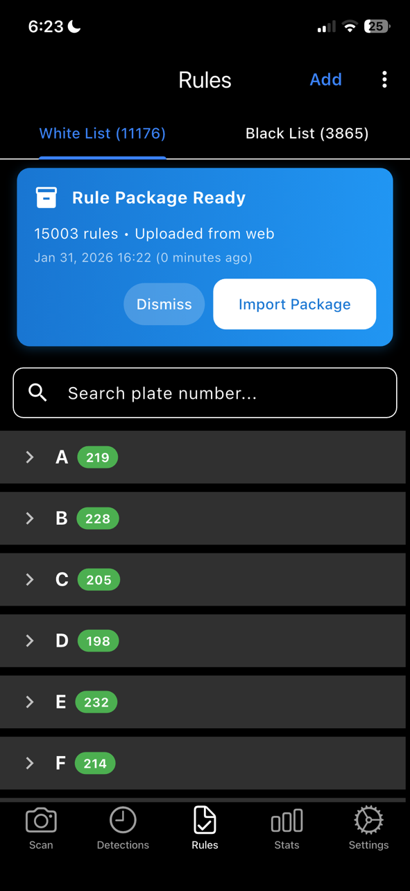
</div>

**Upload rules on marearts.com, download on your phone:**

**Step 1: Upload on Web**

<div align="center">
  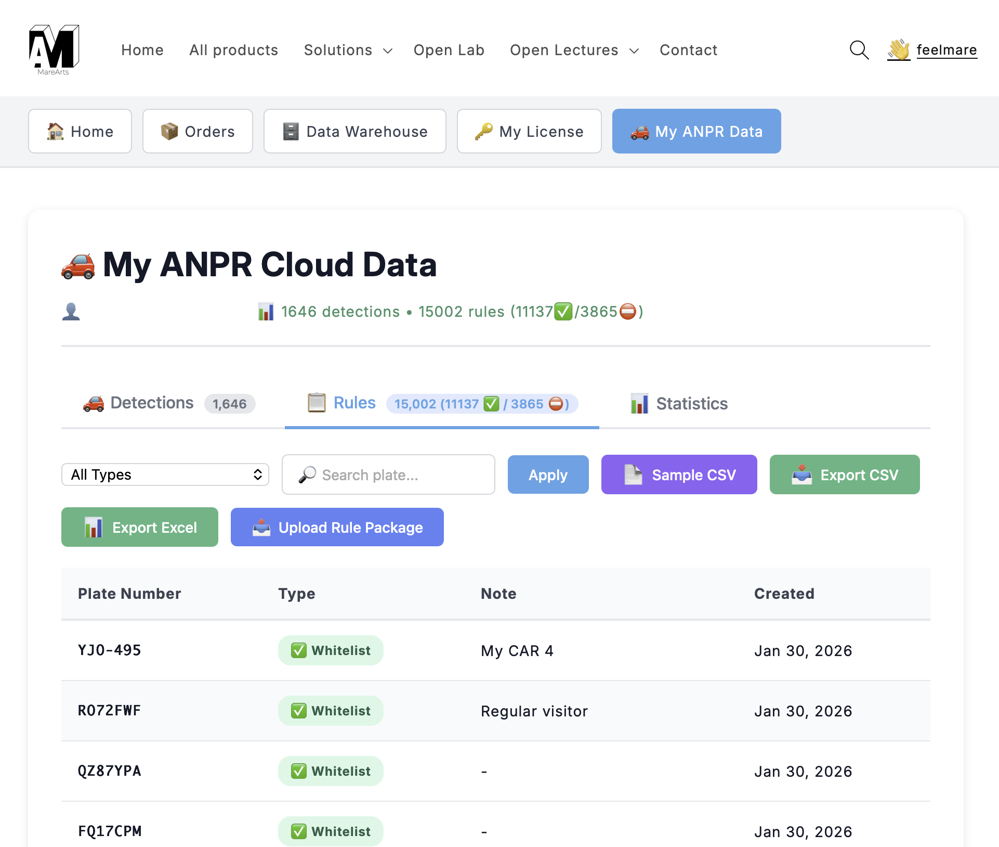
</div>

1. Go to marearts.com/my-account
2. Click "Upload Rule Package" button
3. Choose your CSV file
4. Click upload

<div align="center">
  
</div>

**Step 2: Download on Phone**
1. Open Rules page in app
2. See blue banner: "Rules package ready"
3. Tap to download
4. Choose "Replace All" or "Add to Existing"
5. Done! Rules imported automatically

**Benefits:**
- Upload large CSV files on computer (easier than phone)
- Share rules between team members
- Bulk import thousands of rules at once
- Works across all your devices

💡 **Tip:** Great for importing company vehicle lists or large databases!

---

## 📊 4. Stats Page

<div align="center">
  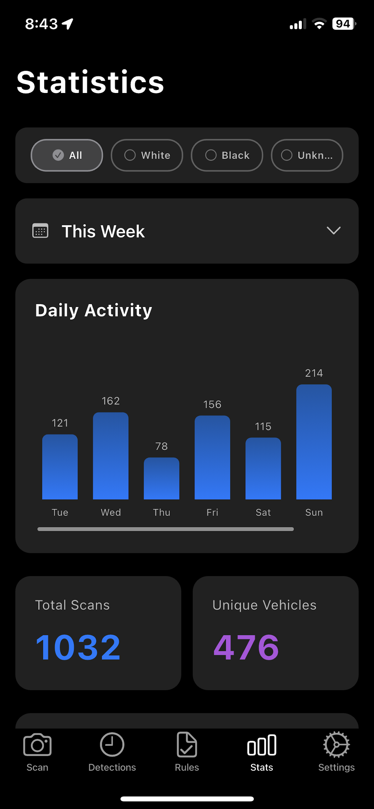
</div>

**Purpose**: View scanning statistics and trends

### Overview Section:
- **Total Scans** - All-time count
- **Today** - Scans captured today
- **This Week** - Last 7 days
- **This Month** - Current month
- **This Year** - Year-to-date

### Top 10 Vehicles:
- Most frequently detected plates
- Shows scan count for each
- **Tap** to view all scans for that plate

### Time Period Selector:
- **Today** - Hourly breakdown
- **This Week** - Monday to today (calendar week)
- **This Month** - First day to today
- **Year** - Full year with year selector (2024, 2025, 2026...)
- **Custom Range** - Pick any start and end dates

### Charts:
- Automatic layout based on period selected
- **Date range displayed** below selector (e.g., "Dec 1, 2025 - Jan 7, 2026")
- Scrollable for year view (12 months)

### Status Filter:
- **All** - Show everything
- **Whitelist** - Green plates only
- **Blacklist** - Red plates only
- **Unknown** - Orange plates only

**Pull down** to refresh data

---

## ⚙️ 5. Settings Page

<div align="center">
  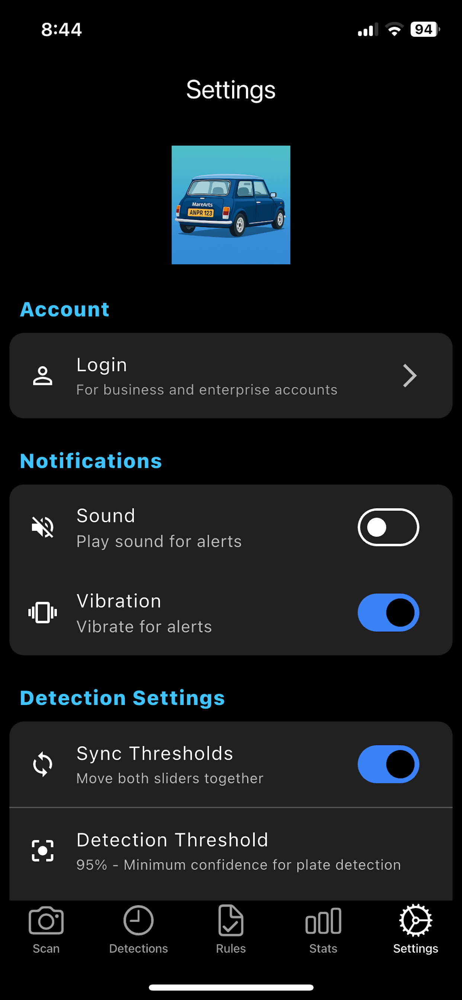
</div>

**Purpose**: Configure app behavior

### Account Section:

**Login** (Business/Enterprise accounts)
- Enter email + signature
- **Infinite scans** (unlimited usage)
- Shows expiry date
- **Logout** button when logged in

**Free Trial Mode**
- Shows daily limit: X/50 scans
- Resets at midnight
- **Login for infinite scans**

### Cloud Sync:

<div align="center">
  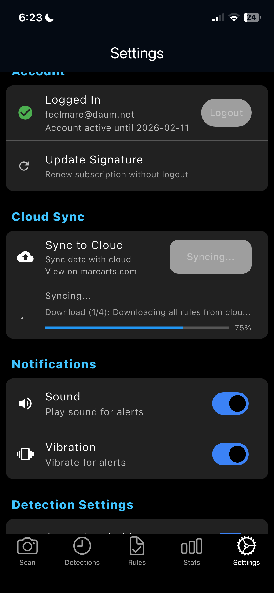
</div>

**Sync to Cloud** (Login required)
- **Two-way sync** - Keeps data in sync across all devices
- Tap **"Sync Now"** button to synchronize
- **Runs in background** - Keep using the app while syncing
- **Step 1:** Upload your device changes to cloud
- **Step 2:** Download data from cloud (other devices/web)
- **Step 3:** Merge changes automatically
- **Progress shown** - See sync status in real-time

**What Gets Synced:**
- ✅ All detections (plate numbers, timestamps, GPS)
- ✅ All rules (whitelist & blacklist)
- ✅ Detection images from all devices
- ✅ Changes from marearts.com web

**Benefits:**
- 📱 Use multiple devices with same account
- 🌐 View all data on marearts.com web dashboard
- 🔄 Rules added on web appear on all devices
- 💾 Cloud backup of all your data
- ⚡ Keep using app while syncing (NEW!)

<div align="center">
  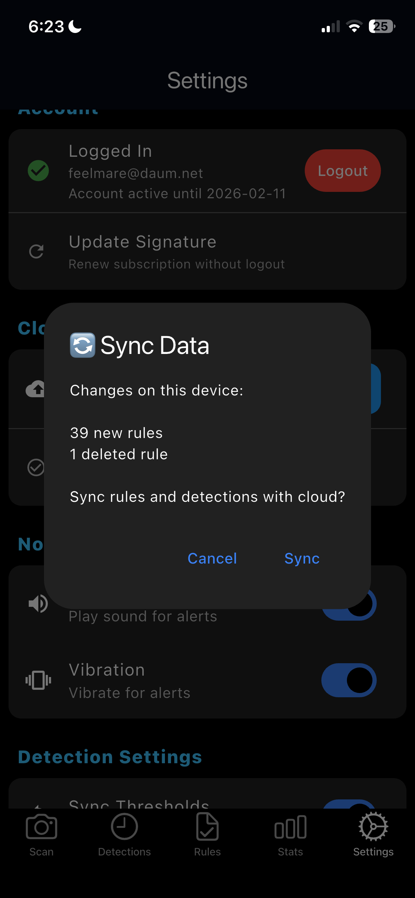
  <p><i>See what's synced and when</i></p>
</div>

💡 **Tip:** Sync runs in background - no need to wait!

### Integrations (Webhook):

<div align="center">
  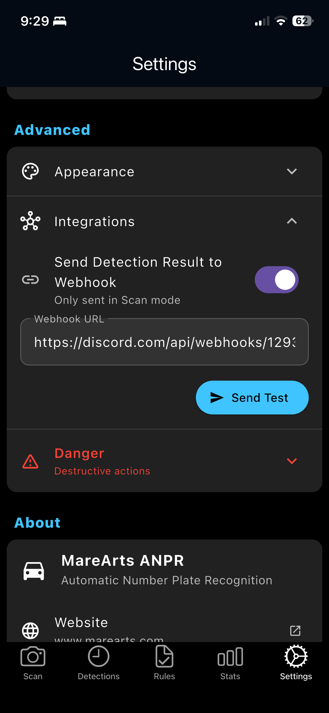
</div>

**Send Detection Result to Webhook** 🔗
- Send real-time plate detections to external services
- Works with **Discord**, **Slack**, **Zapier**, **Make**, or any custom server
- Only sent during Scan mode (Single or Continuous)
- Toggle on/off in Settings → Advanced → Integrations

**Setup:**
1. Enter your Webhook URL (e.g., Discord webhook URL)
2. Tap **Send Test** to verify connection
3. Start scanning - detections are sent automatically

**Webhook Payload (JSON):**
- `plate_number` - Detected plate text
- `timestamp` - ISO 8601 detection time
- `detection_confidence` / `ocr_confidence` - AI confidence scores
- `bbox` - Bounding box coordinates (left, top, right, bottom)
- `gps` - Latitude, longitude, address
- `rule_status` - whitelist / blacklist / unknown
- `note` - Rule note (if any)
- `reporter` - Account email or "trial"
- `scan_mode` - single / continuous
- `image` - Base64-encoded plate image (if available)

💡 **Tip:** Use Discord webhooks for instant notifications on your phone or desktop!

**Build Your Own Webhook Receiver:**

We provide a ready-to-use Python server you can run on your own machine or cloud:

👉 [**webhook_receiver.py**](https://github.com/MareArts/MareArts-ANPR/blob/main/example_code/webhook_receiver.py)

```bash
# Install
pip install fastapi uvicorn python-multipart

# Run
python webhook_receiver.py
```

- Saves plate images + JSON metadata to `received_plates/` folder
- Prints detected plates to console in real-time
- Optional forwarding to **Slack** and **Telegram** (with images)
- Discord-compatible format (multipart/form-data)
- Runs on port 9000 - set `http://YOUR_IP:9000/webhook` in the app

### Notifications:

**Sound** 🔊
- Play audio alerts for detections
- Green plates: "Success" sound
- Red plates: "Alert" sound
- Orange plates: "Unknown" sound

**Vibration** 📳
- Haptic feedback on detection
- Different patterns for whitelist/blacklist

### Detection Settings:

**Sync Thresholds** 🔄
- Toggle to sync detection + OCR thresholds together
- Simplifies tuning

**Detection Threshold** (60-95%)
- Minimum confidence to detect plate
- Higher = fewer false positives
- Lower = more detections
- **Recommended**: 90%

**OCR Threshold** (60-95%)
- Minimum confidence for text recognition
- Higher = more accurate text
- Lower = read more plates
- **Recommended**: 90%

**Max Detections** (1-10)
- Maximum plates to capture per scan
- **Recommended**: 1 (parking/security)
- Higher for busy intersections

**Ignore Duplicate Plate** (0-60 seconds)
- Prevents saving same plate multiple times
- 0 = Save all (no filtering)
- 5s = Default (ignore if seen within 5 seconds)
- 60s = Maximum (ignore for 1 minute)

**Plate Region** 🌍

<div align="center">
  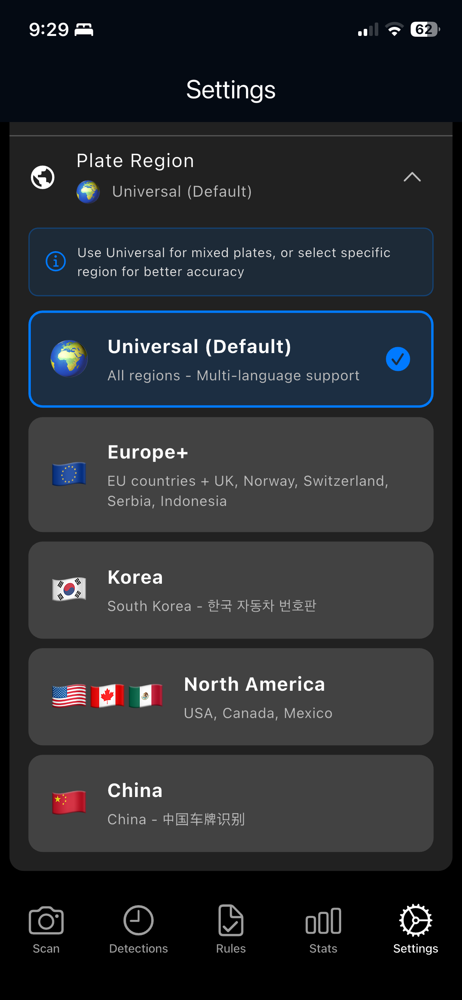
</div>

- 🌍 **Universal (Default)** - All regions, multi-language support
- 🇪🇺 **Europe+** - EU countries + UK, Norway, Switzerland, Serbia, Indonesia
- 🇰🇷 **Korea** - South Korea (한국 자동차 번호판)
- 🇺🇸🇨🇦🇲🇽 **North America** - USA, Canada, Mexico
- 🇨🇳 **China** - China (中国车牌识别)
- Selecting specific region improves accuracy

### Storage:

**Save Images** 📷
- Save full-resolution images with detections
- Viewable in Detections page
- Uses device storage

**Clear All Data** 🗑️
- Delete all detections AND rules
- Shows count before deletion
- **Warning**: Cannot be undone unless logged in (syncs deletion to cloud)

**Factory Reset** 🔄 (NEW!)
- Fresh start - deletes all local data
- **Cloud backup stays safe** - can sync to restore
- Resets settings to defaults
- Keeps login credentials
- Located in Advanced section at bottom
- **Use when:** Corrupted data, want fresh start, or troubleshooting

**Data Retention** (7-365 days)
- Auto-delete old detections
- **Default**: 30 days
- Applies to detections only (rules kept)

### Location:

**Enable GPS** 📍
- Save location with each detection
- Required for Map view
- Shows address in details

### About:

- App name & version
- Website: www.marearts.com
- Support email: hello@marearts.com
- **Report Bug / Request Feature** - Opens GitHub Issues
- Build number (for troubleshooting)

---

## 👥 6. Team Work

**Purpose**: Collaborate with your team — share detections and rules across multiple users

### How It Works

A **Team Leader** creates a team and shares a password. **Team Members** join using that password. All team data syncs to the cloud and is accessible from the web dashboard.

### Team Leader

<div align="center">
  
</div>

- **Create Team**: Automatically becomes the team leader
- **Share Password**: Give the team password to members (tap to reveal)
- **View All Data**: See every member's detections and rules on the web dashboard
- **Switch Members**: Web dashboard dropdown lets you view any member's data
- **Break Team**: Disband the team and release all members

<div align="center">
  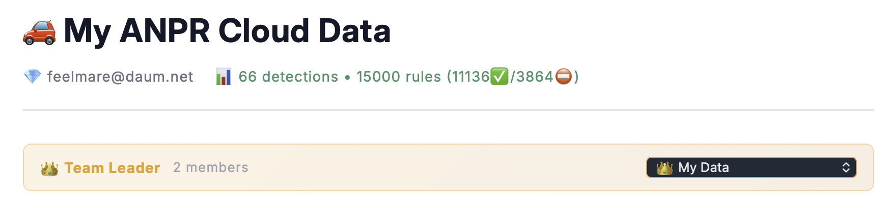
</div>

### Team Member

<div align="center">
  
</div>

- **Join Team**: Enter the leader's password to join
- **Contribute Data**: Your detections and rules sync to the team
- **See Leader Info**: Shows who your team leader is
- **Leave Team**: Leave anytime and return to normal (solo) mode

<div align="center">
  
</div>

### Use Cases:
- **Parking management**: Multiple guards scanning, one supervisor monitoring all data
- **Security teams**: Distributed checkpoints reporting to a central dashboard
- **Fleet management**: Multiple drivers, one operations manager

💡 **Tip:** The team leader can view all members' detections on [marearts.com](https://www.marearts.com) — great for monitoring without being on-site!

---

## 🎯 Common Workflows

### Parking Management:
1. **Add residents** to Whitelist (Rules page)
2. **Scan** vehicles entering (Scan page)
3. **Check status** - Green = Allowed, Red = Blocked
4. **Review** violations (Detections page)

### Security Checkpoint:
1. **Add approved** vehicles to Whitelist
2. **Add banned** vehicles to Blacklist
3. **Continuous scan** at entrance
4. **Audio/vibration** alerts for blacklist

### Vehicle Tracking:
1. **Scan** vehicles continuously
2. **View history** in Detections
3. **Use Map** to see locations
4. **Export** data (via share button)

---

## 💡 Tips & Best Practices

### For Best Detection:

✅ **Distance**: 2-3 meters from vehicle  
✅ **Angle**: Perpendicular to plate (not tilted)  
✅ **Lighting**: Good outdoor light (daytime)  
✅ **Focus**: Tap plate area to focus  
✅ **Stability**: Hold steady while capturing  

❌ **Avoid**:
- Too far (>5 meters)
- Extreme angles
- Low light conditions
- Motion blur
- Dirty/damaged plates

---

## 🔒 Privacy & Security

✅ **100% On-Device**: All AI processing on your device  
✅ **Local Database**: All data stored locally  
✅ **GPS Optional**: Can disable location tracking  
✅ **Your Control**: Cloud sync only when you choose  

**Cloud Mode** (Optional):
- Sends image to API for processing
- Used only when you tap cloud button
- More accurate (server-side AI)
- Requires internet connection

**Cloud Sync** (Optional):
- Only syncs when you tap "Sync Now"
- Images uploaded only if you enable sync
- Can work 100% offline if preferred

---

## 📞 Support

**Email**: hello@marearts.com  
**Website**: https://www.marearts.com  

**For Issues**:
- Include app version (Settings page)
- Describe the problem
- Include screenshot if possible 

---

## ⭐ Remember

> **✅ No Additional License Required!**  
> This app can be used as an ANPR license without any additional purchase.  
> Get your license at: [MareArts ANPR Solution](https://www.marearts.com/products/anpr)
> 
> 🔍 **Find the app by searching "marearts anpr" in the App Store or Google Play**

---

**Need help?** Contact hello@marearts.com

