# MareArts ANPR — App Guide

On-device license-plate recognition for iOS and Android. White List, Black List, Overstay, vehicle info, team sync, a web viewer, and a desktop viewer share one account.

**App 2.6.5.** No extra license: a subscription from [marearts.com/products/anpr](https://www.marearts.com/products/anpr) covers the app. Search **marearts anpr** on the App Store or Google Play. Trial is 10 scans per day without login.

[](https://apps.apple.com/us/app/marearts-anpr/id6753904859) [](https://play.google.com/store/apps/details?id=com.marearts.anpr)

Same guide on the site: [marearts.com/pages/marearts-anpr-mobile-app](https://www.marearts.com/pages/marearts-anpr-mobile-app)

---

## Contents

| | |
|---|---|
| [01 Overview](#01-overview) | Account, trial, demo |
| [02 What’s new](#02-whats-new) | Add unknowns, Overstay, Send history |
| [03 Scan](#03-scan) | Single, Continuous, Cloud |
| [04 Detections](#04-detections) | List, detail, map, CSV |
| [05 Rules](#05-rules) | White / Black, Add unknowns, Overstay |
| [06 Settings](#06-settings) | Account, thresholds, webhook |
| [07 Web viewer](#07-web-viewer) | Browser review |
| [08 Desktop](#08-desktop) | Read-only companion |
| [09 Support](#09-support) | Start, keys, contact |

---

## 01 Overview

License-plate recognition on the phone. The camera finds the plate, reads the characters, and stores time plus GPS when location is on.

[Demo video](https://www.youtube.com/watch?v=6gVQOJvNBNE)

| Tab | Does |
|---|---|
| Scan | Camera. Single, Continuous, or Cloud. |
| Detections | History, detail, map, CSV export. |
| Rules | White List, Black List, Add unknowns, Overstay, import/export. |
| Stats | Counts and charts by period and list status. |
| Settings | Account, sync, thresholds, region, webhook. |

---

## 02 What’s new

Features in **2.6.5** (landed 2.5.3–2.5.9):

| Where | What |
|---|---|
| Rules ⋮ | **Add unknowns…** — unique plates from detections that are on neither list, for All / Today / a date range, onto White or Black. Existing rules stay. |
| Rules ⋮ | **Overstay…** — same plate, same place, longer than the time you set. GPS required. Not a White/Black row and not in CSV. |
| Settings → Integrations | Webhook URL first. Live Scan and Continuous. Auto-send after vehicle info. **Send history** for detections already on this phone. |

---

## 03 Scan

Hold the phone at the lane. No extra camera box.

<div align="center">
  
</div>

| Mode | Does |
|---|---|
| Single | One capture. |
| Continuous | Keeps scanning. A duplicate window (default 5 s) skips the same plate. |
| Cloud | Sends the frame for OCR plus vehicle info in one step. |

Camera: 1080p, **720p recommended**, or 480p. Preview 60 or 30 fps. Zoom 1× / 2×, flash, front or rear. Landscape keeps boxes and controls upright.

- Tap the plate to focus.
- Distance about 2–3 m, square to the plate, outdoor light when you can.

---

## 04 Detections

<div align="center">
  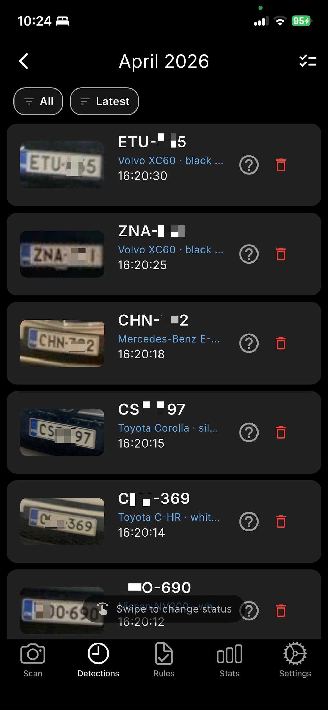
  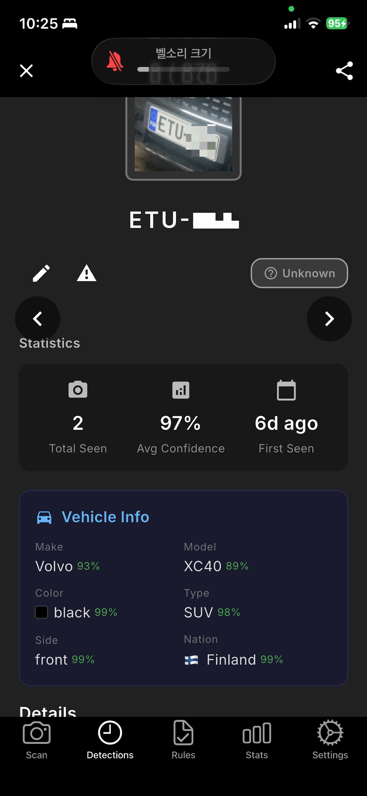
</div>

- Grouped by day. Swipe a row to White, Black, or Unknown.
- Detail: full frame, crop, confidence, first/last seen, GPS, history of that plate.
- Overstay detections show a yellow chip and the time at that place.
- CSV export includes plate, time, GPS, confidences, note, and vehicle-info columns.

<div align="center">
  
</div>

Map: clusters, satellite or road, search by plate.

### Vehicle info (MMC)

Cloud vehicle identity: make, model, colour, type, side, nation. Cloud scan writes it immediately. On-device scans pick it up on sync. Daily usage is in Settings. Included with the subscription.

Web filters:

<div align="center">
  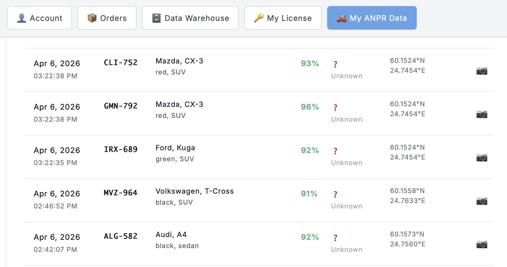
</div>

<div align="center">
  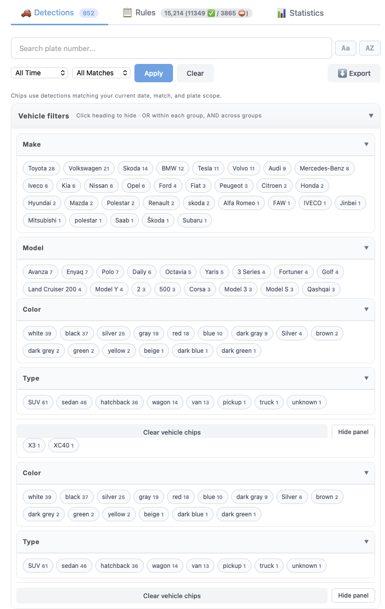
</div>

---

## 05 Rules

A rule marks a plate as allowed (green) or blocked (red) on the next scan, with sound and vibration. Notes stay on the card. `FSA 200` and `FSA200` are the same plate: spaces and hyphens are ignored.

<div align="center">
  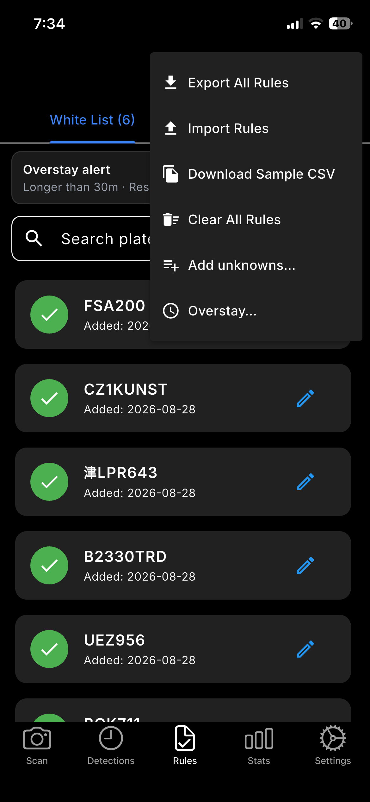
</div>

| Menu | Does |
|---|---|
| Export All Rules | CSV of White and Black on this phone. |
| Import Rules | Load a CSV. Sample CSV is in the same menu. |
| Clear All Rules | Removes list rows. Overstay settings are not a list row. |
| Add unknowns… | Bulk-add plates from detections that are on neither list. |
| Overstay… | Same plate, same place, too long. See below. |

Large lists can be uploaded on [the web viewer](https://www.marearts.com/pages/my-anpr-data), then pulled on the phone (replace or merge). Team members cannot edit rules.

### Add unknowns to a list

Rules ⋮ → **Add unknowns…**. Choose White or Black, then All, Today, or a date range. The count is unique plates not already on either list. Existing rules are not overwritten.

<div align="center">
  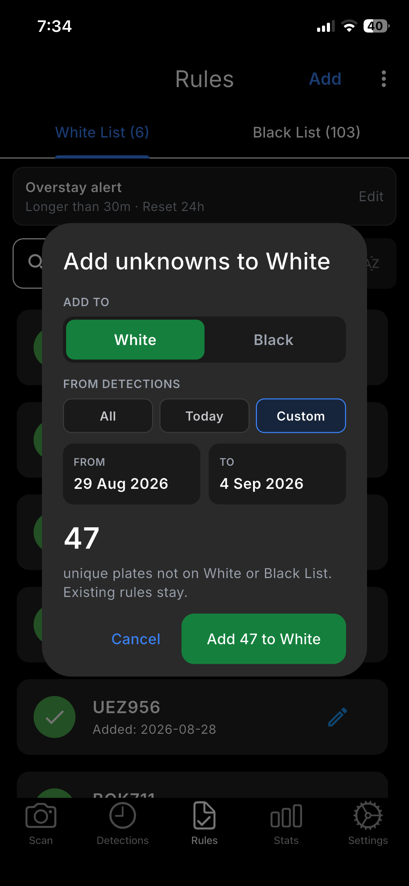
</div>

### Overstay alert

Same plate still at the same place longer than the time you set. This is not a third list. It is not written into CSV. Midnight does not reset the clock.

<div align="center">
  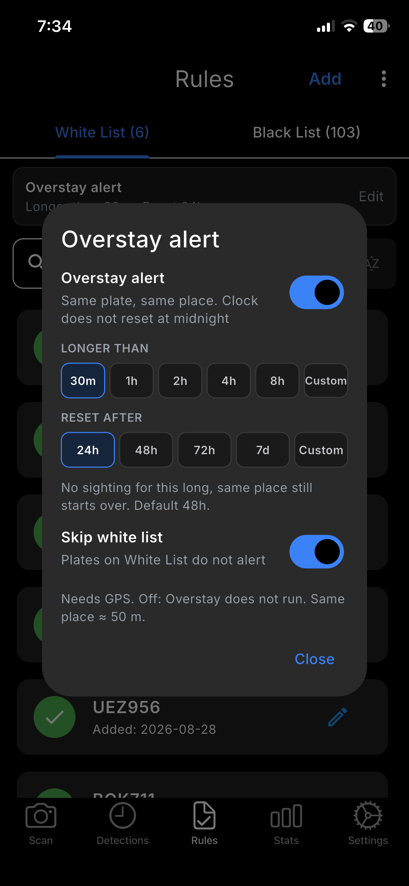
</div>

| Setting | Meaning |
|---|---|
| Overstay alert | On or off. Off: Overstay does not run. |
| Longer than | 30m, 1h, 2h, 4h, 8h, or Custom. Time at this place, not time since the last photo. |
| Reset after | No sighting for this long at the same place starts over. Default 48h. |
| Skip white list | On: plates on White List do not alert. |

Same place is about 50 m. GPS off: Overstay does not run. Changing place ends the stay. A team member sees a read-only card; the camera uses the leader’s values.

### Stats

Today / week / month / year / custom. Filter by White, Black, or Unknown.

<div align="center">
  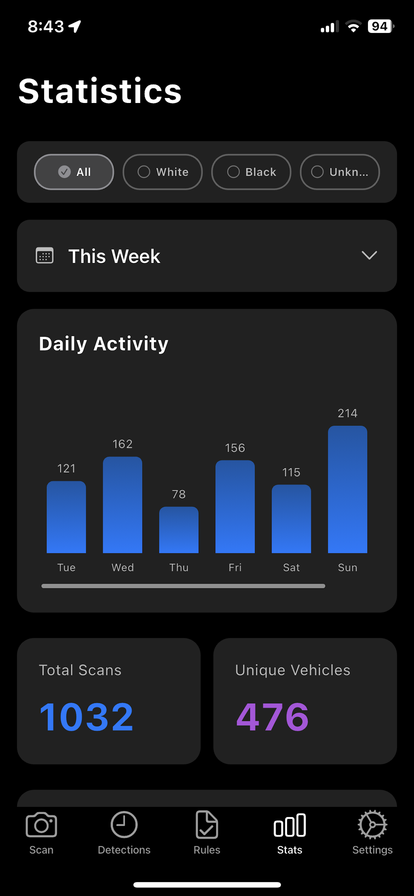
</div>

---

## 06 Settings

| Block | Does |
|---|---|
| Account | Login (email + signature). Subscription and vehicle-info quota. |
| Cloud Sync / Auto Sync | Two-way sync. Auto Sync can run when the app goes to the background. |
| Detection | Thresholds 60–95% (90% recommended). Max plates per frame 1–10. Ignore duplicate 0–60 s (default 5 s). |
| Plate Region | Region presets plus country list. |
| GPS | Required for map and for Overstay. |

<div align="center">
  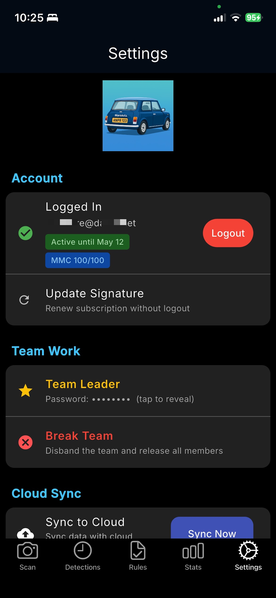
  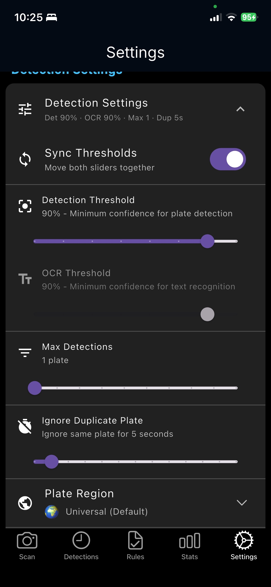
</div>

### Webhook

Settings → Integrations. Paste an `https://` URL first. Until the URL is valid, Send Test, live send, Auto-send, and Send history stay locked.

<div align="center">
  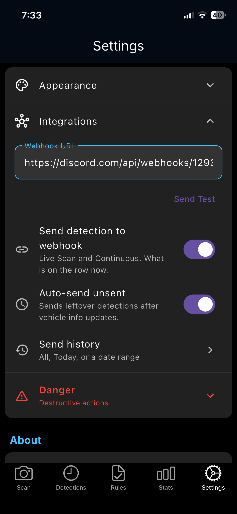
  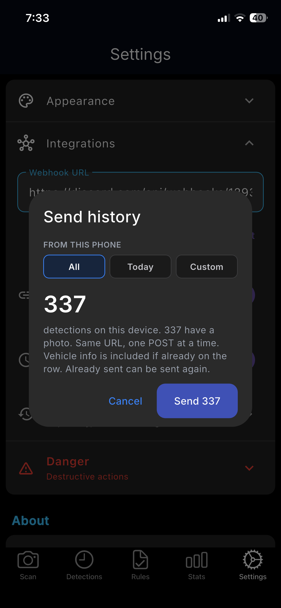
</div>

| Control | Does |
|---|---|
| Send Test | One test POST to the URL. Does not unlock the rest by itself. |
| Send detection to webhook | Live Scan and Continuous. What is on the row now. Photo attached when the file is on the phone. |
| Auto-send unsent | After vehicle info updates, leftover rows that were not sent yet. |
| Send history | Detections already stored on this phone. Already sent can be sent again. Live sending waits until this finishes or is stopped. |

History and live webhooks send what is on this device. Cloud-only rows on another device are not in this queue.

Receiver example: [`webhook_receiver.py`](https://github.com/MareArts/MareArts-ANPR/blob/main/mobile_app/example_code/webhook_receiver.py)

```bash
pip install fastapi uvicorn python-multipart
python webhook_receiver.py
```

Runs on port 9000. Set `http://YOUR_IP:9000/webhook` in the app. Saves JSON to `received_plates/`; saves the image only when the request includes a file. Optional Slack / Telegram forward.

Overstay detections keep `rule.status` and add `overstay` / `stay_seconds` only on those rows.

Typical payload fields: `plate_number`, `timestamp`, `detection_confidence`, `ocr_confidence`, `bbox`, `gps`, `rule_status`, `note`, `reporter`, `scan_mode`, `image` (when present).

### Team

The leader creates a team and shares a password. Members join and contribute detections. White/Black and Overstay settings follow the leader. Members cannot edit rules.

<div align="center">
  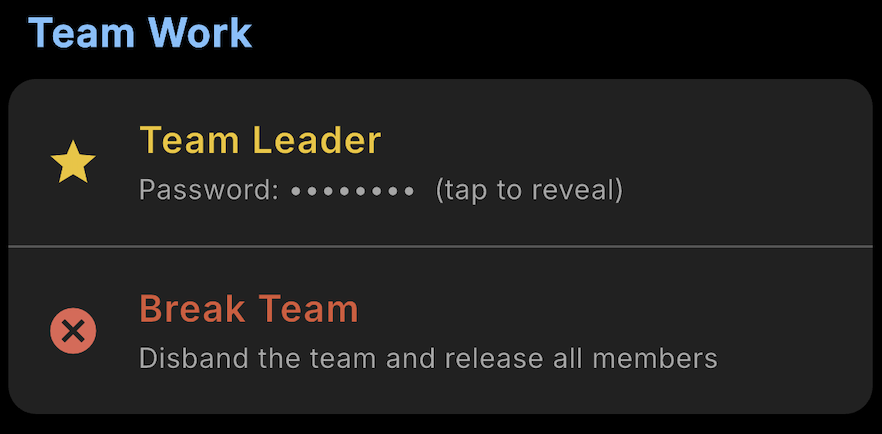
  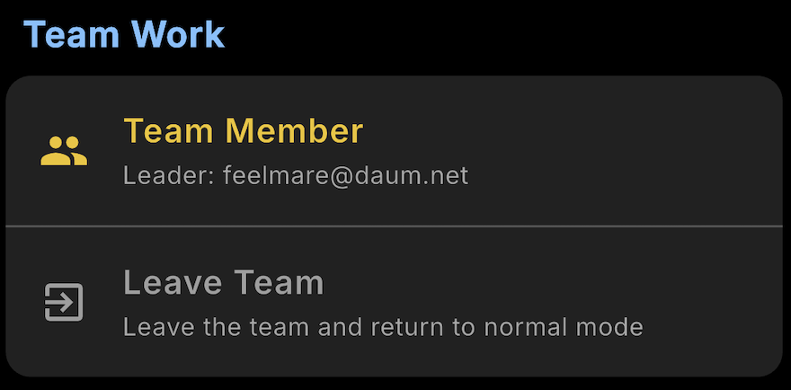
</div>

The leader reviews every member on [the web viewer](https://www.marearts.com/pages/my-anpr-data) and on the desktop viewer.

---

## 07 Web viewer

After login, [My ANPR Data](https://www.marearts.com/pages/my-anpr-data) is detections, vehicle-info filters, rule packages, and team member switch. The phone captures. The browser reviews.

---

## 08 Desktop

[MareArts ANPR Desktop](https://www.marearts.com/pages/anpr-desktop-download) for Windows, macOS, and Linux. Same login. It downloads cloud data and does not edit or delete it. Capture and rule changes stay on the phone.

| Detections | Map | Rules |
| --- | --- | --- |
| 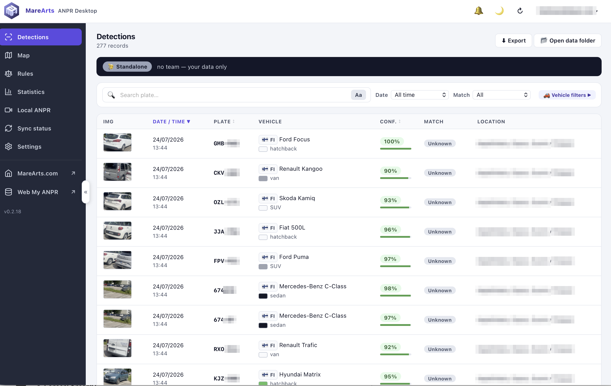 | 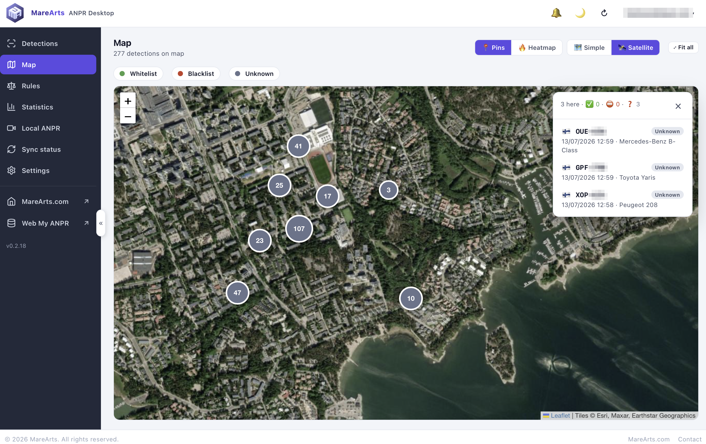 | 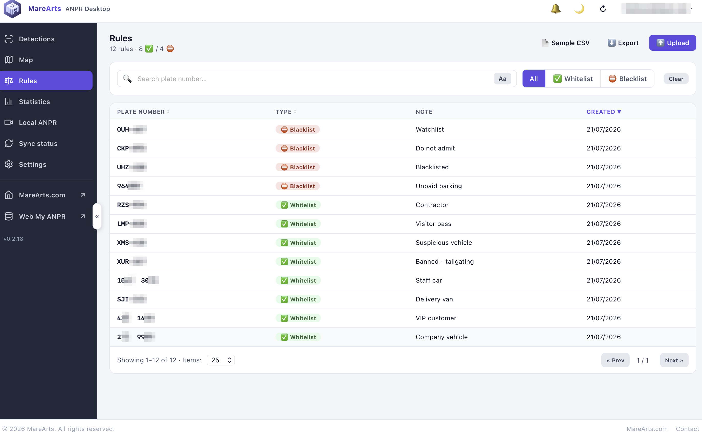 |

| Statistics | Local ANPR | Sync |
| --- | --- | --- |
| 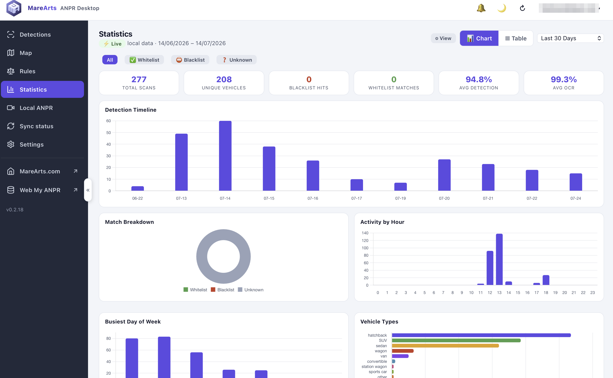 | 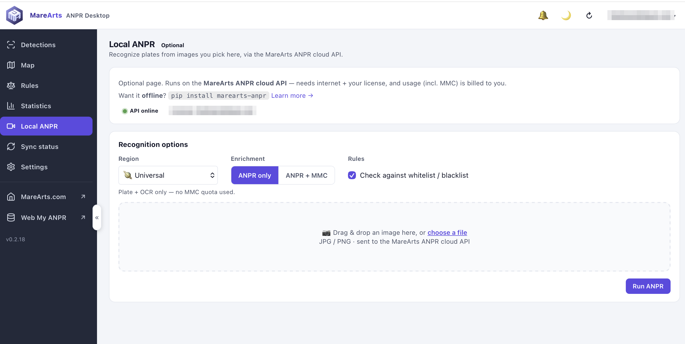 | 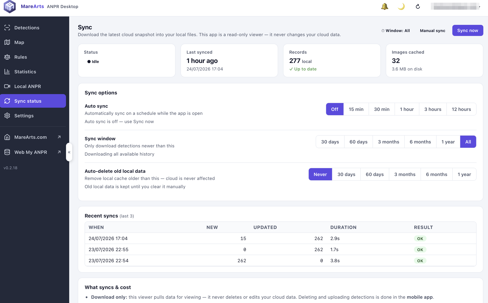 |

---

## Workflows

| Job | Steps |
|---|---|
| Parking | Residents on White. Scan at the gate. Green allowed, red blocked. Review the rest in Detections. Optionally Add unknowns after a day of captures. |
| Checkpoint | Approved on White, banned on Black. Continuous at the entrance. Sound on Black. Overstay if a vehicle must not linger. |
| Own server | Integrations URL → Send Test → live send on. Send history for what is already on this phone. |

---

## Tips and privacy

- 2–3 m, square to the plate, tap to focus. 720p unless you need 1080p crops.
- Detection and OCR run on the phone after models are installed.
- Data stays on the device until you sync, export, or send a webhook.
- GPS is optional, except Overstay and the map need it.

---

## 09 Support

1. Install MareArts ANPR.
2. Use the daily trial on Scan.
3. Subscribe on [the product page](https://www.marearts.com/products/anpr). The serial key is emailed to the PayPal address and also appears after login.
4. Sign in under Settings. Sync fills the web viewer and the desktop viewer.

Keys are bound to the PayPal email and cannot be moved.

Email [hello@marearts.com](mailto:hello@marearts.com) · [GitHub issues](https://github.com/MareArts/MareArts-ANPR/issues)
