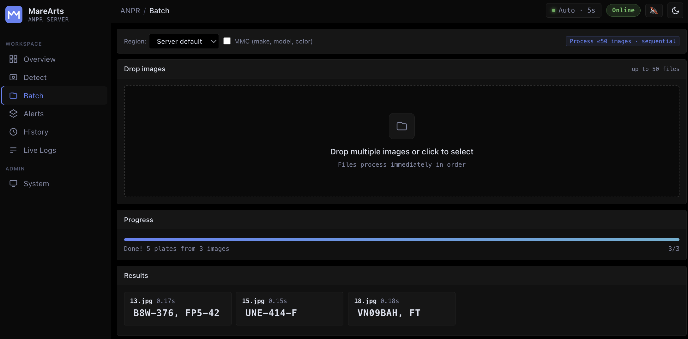
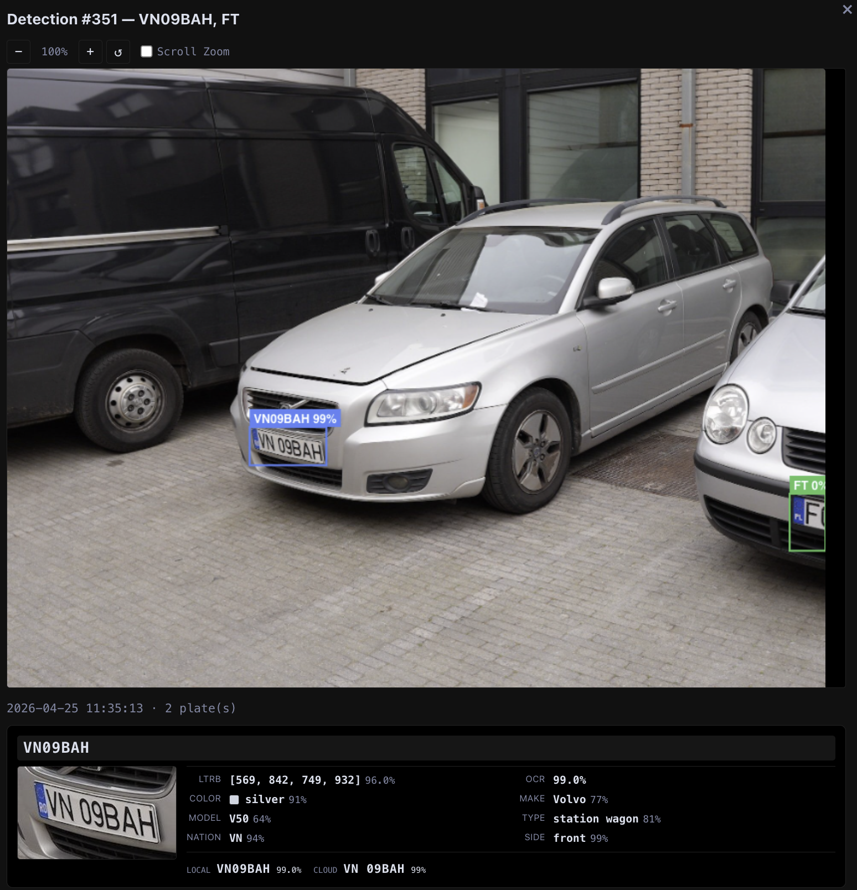
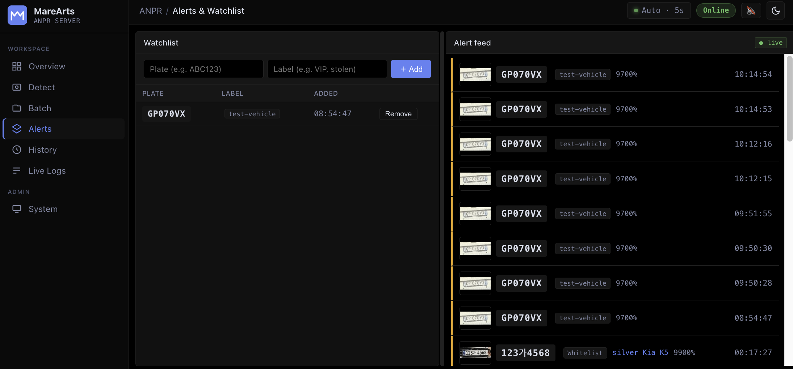
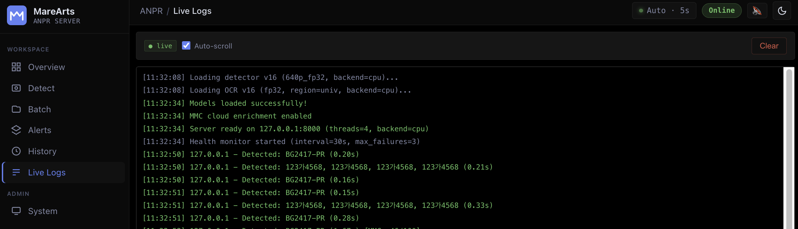
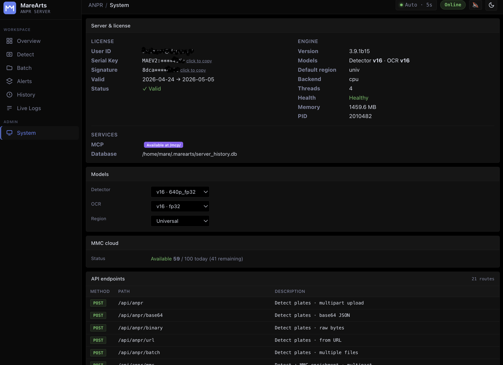

# MareArts ANPR — Server

Built-in REST API server with web dashboard, detection history, watchlist alerts, and MMC vehicle enrichment.

## Quick Start

```bash
pip install marearts-anpr           # server included in base install
ma-anpr config                     # one-time credential setup
ma-anpr validate                   # verify everything works
ma-anpr server start               # starts on http://127.0.0.1:8000
```

Open http://127.0.0.1:8000 for the web dashboard, or http://127.0.0.1:8000/docs for interactive Swagger UI.

### Run in Background

```bash
ma-anpr server start --daemon
ma-anpr server status
ma-anpr server logs --follow
ma-anpr server stop
```

### Options

```bash
ma-anpr server start --host 0.0.0.0 --port 9000 --threads 8
ma-anpr server start --daemon --workers 2
ma-anpr server start --config /path/to/server_config.yaml
```

---

## CLI Server Commands

Manage the server and interact with the API directly from the command line:

```bash
# Lifecycle
ma-anpr server start              # foreground
ma-anpr server start --daemon     # background
ma-anpr server stop               # stop current config server
ma-anpr server stop --force       # force kill
ma-anpr server stop --port 8001   # stop specific instance by port
ma-anpr server stop --pid 12345   # stop specific instance by PID
ma-anpr server stop --all         # stop all running ANPR servers
ma-anpr server restart            # restart daemon
ma-anpr server status             # check status + version
ma-anpr server list               # list all running ANPR instances
ma-anpr server upgrade            # upgrade package + restart (preserves GPU mode)
ma-anpr server logs               # view logs
ma-anpr server logs --follow      # tail -f logs

# API wrappers (server must be running)
ma-anpr server detect car.jpg             # detect plates (local only)
ma-anpr server detect car.jpg --mmc       # detect + MMC enrichment
ma-anpr server detect car.jpg --region kr # detect with specific region
ma-anpr server detect "*.jpg"             # batch detect with glob pattern
ma-anpr server health                     # detailed server health
ma-anpr server mmc                        # show MMC status and quota
ma-anpr server region                     # show current default region
ma-anpr server region kr                  # change default region
```

### Server Stop — Safety

All `stop` commands verify the target is a MareArts ANPR server before killing it. The server exposes a unique `server_id: "marearts-anpr"` in its health endpoint — only processes that respond with this ID are considered ANPR servers.

| Command | Behavior |
|---------|----------|
| `ma-anpr server stop` | Stops the server matching your current config. Checks `server_id`. |
| `ma-anpr server stop --port 8001` | Stops the server on port 8001. Checks `server_id`. Refuses to kill non-ANPR processes. |
| `ma-anpr server stop --all` | Stops all MareArts ANPR servers. Checks `server_id` on every port. Will never kill other applications. |
| `ma-anpr server stop --pid 12345` | Stops the process by PID. Warns if it's not an ANPR server. Requires `--force` to override. |

> **The only way to kill a non-ANPR process is `--pid` + `--force`, which requires you to explicitly choose to do it.**

---

## MMC and Internet Connectivity

MMC (Make, Model, Color) is a cloud AI feature that requires internet. The server provides **two separate endpoint groups** so you choose per request:

- **`/api/anpr`** — Local-only detection. No internet needed. Fastest response.
- **`/api/anpr/mmc`** — Detection + MMC cloud enrichment (7 features). Requires internet.

No toggle or global setting — the endpoint you call determines whether MMC is used.

- **Startup with internet:** MMC is initialized and available for `/api/anpr/mmc` endpoints.
- **Startup without internet:** `/api/anpr` works normally. `/api/anpr/mmc` returns local ANPR results + `mmc_error`.
- **Internet drops while running:** `/api/anpr` unaffected. `/api/anpr/mmc` calls timeout (10s) and return local ANPR results + `mmc_error`.
- **Daily quota exhausted:** `/api/anpr/mmc` immediately returns local ANPR results (no cloud call) + `mmc_error` explaining the quota is exhausted. No waiting, no wasted network call. Quota resets daily.

In all error cases the response still contains full local ANPR detection results — plates, OCR text, bounding boxes, confidence scores. Only the 7 MMC fields are missing, and `mmc_error` explains why.

---

## API Reference

Base URL: `http://127.0.0.1:8000`

> **Note:** All JSON responses are pretty-printed (indented) by default. Append `?pretty=false` for compact output:
> ```bash
> curl "http://127.0.0.1:8000/api/health?pretty=false"
> ```

### Health and Info

```bash
# Health check (includes user_id, masked credentials, license info)
curl http://127.0.0.1:8000/api/health

# Detailed health check
curl http://127.0.0.1:8000/api/health/check

# Supported OCR regions
curl http://127.0.0.1:8000/api/regions

# Current default region and cached regions
curl http://127.0.0.1:8000/api/region
```

### Detection (ANPR) — Local Only

Local detection endpoints. No internet required. Fastest response.

All endpoints support an optional `region` parameter for per-request OCR region override.

```bash
# From file upload
curl -X POST http://127.0.0.1:8000/api/anpr -F "image=@car.jpg"

# With specific region
curl -X POST http://127.0.0.1:8000/api/anpr -F "image=@car.jpg" -F "region=kr"

# From base64
curl -X POST http://127.0.0.1:8000/api/anpr/base64 \
  -H "Content-Type: application/json" \
  -d '{"image": "'$(base64 -w0 car.jpg)'", "region": "eup"}'

# From raw binary
curl -X POST http://127.0.0.1:8000/api/anpr/binary \
  -H "Content-Type: application/octet-stream" --data-binary @car.jpg

# From URL (public URLs only — private/internal IPs are blocked)
curl -X POST http://127.0.0.1:8000/api/anpr/url \
  -H "Content-Type: application/json" \
  -d '{"url": "https://example.com/car.jpg"}'

# Batch (multiple files)
curl -X POST http://127.0.0.1:8000/api/anpr/batch \
  -F "images=@car1.jpg" -F "images=@car2.jpg" -F "images=@car3.jpg"
```

### Detection + MMC (Cloud Enrichment)

Same endpoints under `/api/anpr/mmc` — adds 7 cloud AI features per plate: make, model, color, type, front/rear, plate nation, plate OCR.

```bash
# From file upload + MMC
curl -X POST http://127.0.0.1:8000/api/anpr/mmc -F "image=@car.jpg"

# Base64 + MMC
curl -X POST http://127.0.0.1:8000/api/anpr/mmc/base64 \
  -H "Content-Type: application/json" \
  -d '{"image": "'$(base64 -w0 car.jpg)'"}'

# Binary + MMC
curl -X POST http://127.0.0.1:8000/api/anpr/mmc/binary \
  -H "Content-Type: application/octet-stream" --data-binary @car.jpg

# URL + MMC
curl -X POST http://127.0.0.1:8000/api/anpr/mmc/url \
  -H "Content-Type: application/json" \
  -d '{"url": "https://example.com/car.jpg"}'

# Batch + MMC
curl -X POST http://127.0.0.1:8000/api/anpr/mmc/batch \
  -F "images=@car1.jpg" -F "images=@car2.jpg"
```

### Response Format

```json
{
  "success": true,
  "detection_id": 42,
  "timestamp": "2026-04-19T12:30:00",
  "results": [
    {
      "plate_text": "ABC1234",
      "confidence": 98.5,
      "bbox": [120.0, 230.0, 380.0, 290.0],
      "detection_confidence": 95.0,
      "mmc_make": "Toyota",
      "mmc_make_conf": 0.92,
      "mmc_model": "Camry",
      "mmc_model_conf": 0.87,
      "mmc_color": "white",
      "mmc_color_conf": 0.95,
      "mmc_type": "sedan",
      "mmc_type_conf": 0.91,
      "mmc_plate": "ABC1234",
      "mmc_plate_conf": 0.88,
      "mmc_plate_nation": "US",
      "mmc_plate_nation_conf": 0.85,
      "mmc_vehicle_side": "front",
      "mmc_vehicle_side_conf": 0.97
    }
  ],
  "processing_sec": 0.35,
  "detector_sec": 0.10,
  "ocr_sec": 0.04,
  "mmc_model_sec": 1.52,
  "mmc_request_sec": 1.65,
  "mmc_daily_limit": 500,
  "mmc_calls_today": 5,
  "mmc_request_id": "req_abc123"
}
```

**Notes:**
- All times are in **seconds**, rounded to 3 decimal places.
- `processing_sec` is the total time including detection, OCR, and MMC.
- MMC fields (`mmc_*`) only appear when using `/api/anpr/mmc` endpoints and enrichment succeeds. When using `/api/anpr` endpoints, these fields are never present.
- `mmc_error` appears if enrichment fails (quota exhausted, timeout, no internet). Local ANPR results are still returned — only MMC fields are missing.
- `mmc_plate` / `mmc_plate_conf` is **cloud AI OCR** — a separate plate reading performed by the MMC server. It differs from the local `plate_text` produced by on-device ANPR. In some cases the cloud OCR is more accurate; you can compare both and choose the better result.
- `mmc_plate_nation` / `mmc_plate_nation_conf` identifies the plate's country of origin.
- `mmc_vehicle_side` / `mmc_vehicle_side_conf` indicates whether the image shows the front or rear of the vehicle.

### Model Selection

Change detector and OCR models at runtime (no restart required):

```bash
# Change detector and/or OCR model
curl -X PUT http://127.0.0.1:8000/api/models \
  -H "Content-Type: application/json" \
  -d '{"detector_model": "640p_fp32", "ocr_model": "fp32"}'
```

### Region Management

Change the server's default OCR region at runtime (no restart required):

```bash
# Get current region and cached regions
curl http://127.0.0.1:8000/api/region

# Change default region
curl -X PUT http://127.0.0.1:8000/api/region \
  -H "Content-Type: application/json" \
  -d '{"region": "kr"}'
```

The region can also be set per-request via the `region` parameter on detection endpoints, without changing the server default.

### Credential Hot-Reload

Update credentials without stopping the server:

```bash
# 1. Update credentials
ma-anpr config

# 2. Hot-reload into running server (no restart needed)
curl -X POST http://127.0.0.1:8000/api/credentials/reload
```

This re-reads `~/.marearts/.marearts_env`, reinitializes all models and MMC with the new credentials.

### Stats and History

```bash
# Detection stats
curl http://127.0.0.1:8000/api/stats

# Hourly chart + top plates
curl http://127.0.0.1:8000/api/stats/chart

# Detection history (paginated)
curl "http://127.0.0.1:8000/api/history?limit=20&offset=0"

# Single detection detail (includes watchlist alerts)
curl http://127.0.0.1:8000/api/history/42

# Search plates
curl "http://127.0.0.1:8000/api/history/search?q=BG2417&min_confidence=90"

# Search with date range
curl "http://127.0.0.1:8000/api/history/search?q=BG&date_from=2026-04-01&date_to=2026-04-30"

# Search by vehicle (MMC filters)
curl "http://127.0.0.1:8000/api/history/search?mmc_make=Toyota&mmc_color=white"

# Export all history as CSV (one row per plate, includes MMC info)
curl http://127.0.0.1:8000/api/history/export/csv -o history.csv

# Export all history as JSON
curl http://127.0.0.1:8000/api/history/export/json -o history.json

# Export with limit
curl "http://127.0.0.1:8000/api/history/export/csv?limit=100" -o recent.csv

# Delete a detection
curl -X DELETE http://127.0.0.1:8000/api/history/42

# Batch delete detections
curl -X POST http://127.0.0.1:8000/api/history/batch-delete \
  -H "Content-Type: application/json" \
  -d '{"ids": [1, 2, 3]}'
```

### Watchlist and Alerts

```bash
# List watchlist
curl http://127.0.0.1:8000/api/watchlist

# Add plate to watchlist (plate number + label)
curl -X POST http://127.0.0.1:8000/api/watchlist \
  -H "Content-Type: application/json" \
  -d '{"plate": "BG2417PR", "label": "stolen vehicle"}'

# Remove from watchlist
curl -X DELETE http://127.0.0.1:8000/api/watchlist/1

# View alerts (watchlist hits)
curl http://127.0.0.1:8000/api/alerts

# Alert count (unacknowledged)
curl http://127.0.0.1:8000/api/alerts/count

# Mark all alerts as read
curl -X POST http://127.0.0.1:8000/api/alerts/read
```

When a detected plate matches a watchlist entry, an alert is created automatically. Alerts also apply retroactively when a new watchlist entry is added.

### MMC — Vehicle Enrichment (7 Features)

Cloud AI enrichment adds 7 features per detected plate: **make, model, color, type, front/rear view, plate nation, and plate OCR** (cross-check).

MMC is included with your license. Usage is tracked per day with a daily limit based on your plan.

Use `/api/anpr/mmc` endpoints (see Detection + MMC above) to include MMC in results. Use `/api/anpr` for local-only detection.

```bash
# MMC status and quota
curl http://127.0.0.1:8000/api/mmc/status
```

### System

```bash
# View thread pool info
curl http://127.0.0.1:8000/api/threads

# Resize thread pool (live, no restart)
curl -X PUT "http://127.0.0.1:8000/api/threads?count=8"

# View recent logs
curl http://127.0.0.1:8000/api/logs

# SSE live log stream (stays open)
curl http://127.0.0.1:8000/api/events
```

---

## Endpoint Summary

| Method | Endpoint | Description |
|--------|----------|-------------|
| **Health and Info** | | |
| GET | `/api/health` | Health check, model info, credentials |
| GET | `/api/health/check` | Detailed health check |
| GET | `/api/regions` | Supported OCR regions |
| GET | `/api/region` | Current default region |
| PUT | `/api/region` | Change default region |
| PUT | `/api/models` | Change detector/OCR models at runtime |
| GET | `/api/config` | Server config (credentials/secrets masked) |
| **Detection** | | |
| POST | `/api/anpr` | Detect from file upload |
| POST | `/api/anpr/base64` | Detect from base64 image |
| POST | `/api/anpr/binary` | Detect from raw binary (local) |
| POST | `/api/anpr/url` | Detect from image URL (local) |
| POST | `/api/anpr/batch` | Detect from multiple files (local) |
| **Detection + MMC** | | |
| POST | `/api/anpr/mmc` | Detect + MMC (multipart file) |
| POST | `/api/anpr/mmc/base64` | Detect + MMC (base64 JSON) |
| POST | `/api/anpr/mmc/binary` | Detect + MMC (raw binary) |
| POST | `/api/anpr/mmc/url` | Detect + MMC (image URL) |
| POST | `/api/anpr/mmc/batch` | Detect + MMC (multiple files) |
| **Stats and History** | | |
| GET | `/api/stats` | Detection statistics |
| GET | `/api/stats/chart` | Hourly chart and top plates |
| GET | `/api/history` | Detection history (paginated) |
| GET | `/api/history/{detection_id}` | Single detection detail |
| GET | `/api/history/search` | Search plates with filters |
| GET | `/api/history/export/{fmt}` | Export as CSV or JSON (all records by default) |
| DELETE | `/api/history/{detection_id}` | Delete a detection |
| POST | `/api/history/batch-delete` | Batch delete (JSON: `{ids:[…]}`) |
| **Watchlist and Alerts** | | |
| GET | `/api/watchlist` | List watchlist entries |
| POST | `/api/watchlist` | Add to watchlist (plate + label) |
| DELETE | `/api/watchlist/{watchlist_id}` | Remove from watchlist |
| GET | `/api/alerts` | View watchlist hit alerts |
| GET | `/api/alerts/count` | Unacknowledged alert count |
| POST | `/api/alerts/read` | Mark all alerts as read |
| **MMC Status** | | |
| GET | `/api/mmc/status` | MMC quota, license info |
| **Admin** | | |
| POST | `/api/credentials/reload` | Hot-reload credentials (no restart) |
| **System** | | |
| GET | `/api/threads` | Thread pool info |
| PUT | `/api/threads` | Resize thread pool |
| GET | `/api/logs` | Recent logs |
| GET | `/api/events` | SSE live log stream |
| **Images** | | |
| GET | `/api/images/{filename}` | Serve saved detection image |
| **Web UI** | | |
| GET | `/` | Web dashboard |
| GET | `/docs` | Swagger UI |
| GET | `/redoc` | ReDoc |

---

## Web Dashboard

The built-in dashboard at `http://127.0.0.1:8000` provides a full-featured UI for detection, monitoring, and administration. Stats refresh every 5 seconds.

### Overview

Live KPIs (uptime, requests, plates found, avg response time, threads, alert count), plates-per-hour chart, success rate ring, top-5 plates, recent detections feed, and a live log mirror.


### Detect

Upload a single image via drag-and-drop, paste, or file picker. Results show annotated bounding boxes on the image with per-plate OCR confidence, detection confidence, and full MMC enrichment (make, model, color, type, side, nation, cloud OCR cross-check). Region selector and MMC toggle at the top.


### Batch

Drop up to 50 images for sequential processing. Progress bar tracks completion, and results are summarized per file with detected plates and timing.



### History

Browse all detections with search by plate text, date range, and vehicle filters (make, model, color, type, nation, side). Inline thumbnails expand to show the full image with MMC details. Export as CSV or JSON.


### Detection Detail

Click any detection to open a full detail view with zoomable annotated image, plate crops, and complete MMC breakdown: color, make, model, type, nation, front/rear side, plus local vs cloud OCR comparison.



### Alerts & Watchlist

Manage a watchlist of plates (plate number + label). When a detected plate matches, an alert is created in the live alert feed with thumbnail, confidence, and timestamp. Alerts also apply retroactively.



### Live Logs

Real-time server log stream via SSE with auto-scroll. Shows detection events, model loading, region changes, thread pool resizes, and watchlist activity.



### System

Server & license info (masked credentials, validity dates), engine details (version, models, region, backend, threads, health, memory, PID), services (MCP availability, database path), model selectors (detector, OCR, region — changeable at runtime), MMC cloud quota status, and a full API endpoint reference table.



---

## Python Client Example

```python
import requests

SERVER = "http://127.0.0.1:8000"

# Local detection (fastest, no internet needed)
with open("car.jpg", "rb") as f:
    resp = requests.post(f"{SERVER}/api/anpr", files={"image": f})

data = resp.json()
for plate in data["results"]:
    print(f"{plate['plate_text']} ({plate['confidence']}%)")

# Detection + MMC enrichment (requires internet)
with open("car.jpg", "rb") as f:
    resp = requests.post(f"{SERVER}/api/anpr/mmc", files={"image": f})

data = resp.json()
for plate in data["results"]:
    print(f"{plate['plate_text']} ({plate['confidence']}%)")
    if plate.get("mmc_make"):
        print(f"  Vehicle: {plate['mmc_color']} {plate['mmc_make']} {plate['mmc_model']}")

# When quota is exhausted or MMC unavailable, you still get local ANPR results
if data.get("mmc_error"):
    print(f"  MMC skipped: {data['mmc_error']}")
    # data["results"] still contains plates, OCR, bboxes — just no mmc_* fields

# Detect with specific region
with open("car.jpg", "rb") as f:
    resp = requests.post(f"{SERVER}/api/anpr",
                         files={"image": f},
                         data={"region": "kr"})

# Search history
resp = requests.get(f"{SERVER}/api/history/search",
                    params={"q": "ABC", "limit": 10})

# Search by vehicle make
resp = requests.get(f"{SERVER}/api/history/search",
                    params={"mmc_make": "Toyota", "mmc_color": "white"})

# Add to watchlist (plate + label)
requests.post(f"{SERVER}/api/watchlist", json={
    "plate": "ABC1234",
    "label": "stolen vehicle"
})

# Check MMC quota
resp = requests.get(f"{SERVER}/api/mmc/status")
status = resp.json()
print(f"MMC: {status['mmc_calls_today']}/{status['mmc_daily_limit']} today")

# Change default region
requests.put(f"{SERVER}/api/region",
             json={"region": "eup"})
```

---

## Configuration

### Environment Variables

| Variable | Description | Default |
|----------|-------------|---------|
| `ANPR_HOST` | Bind address | `127.0.0.1` |
| `ANPR_PORT` | Port | `8000` |
| `ANPR_THREADS` | Thread pool size | `4` |
| `ANPR_DETECTOR_VERSION` | `v16` or `v14` | `v16` |
| `ANPR_DETECTOR` | Detector model | `640p_fp32` |
| `ANPR_OCR_VERSION` | `v16`, `v15`, or `v14` | `v16` |
| `ANPR_OCR` | OCR model | `fp32` |
| `ANPR_REGION` | Default region code | `univ` |
| `ANPR_BACKEND` | `cpu`, `cuda`, `directml` | `cpu` |
| `ANPR_CONFIDENCE` | Detection threshold | `0.25` |
| `ANPR_MMC_ENABLED` | Enable MMC cloud enrichment | `true` |
| `ANPR_MMC_SECRET` | MMC API secret (if required) | `""` |

### Config File

Create `~/.marearts/server_config.yaml`:

```yaml
server:
  host: 0.0.0.0
  port: 8000
  threads: 4

models:
  detector_version: v16
  detector_model: 640p_fp32
  ocr_version: v16
  ocr_model: fp32
  region: univ
  backend: cpu
  confidence: 0.25

storage:
  save_images: true
  max_history: 1000
  max_logs: 500

health:
  enabled: true
  interval: 30
  max_failures: 3

mmc:
  enabled: true

logging:
  level: info
```

> **Note:** `ma-anpr config` automatically hot-reloads credentials into a running server (no restart needed). You can also trigger a manual reload:
> ```bash
> curl -X POST http://127.0.0.1:8000/api/credentials/reload
> ```

---

## Available Regions

**V16** uses **per-country character sets** — pass a 2-letter country code (e.g. `de`, `au`, `ru`) for best accuracy, or a group code (`eu`, `asia`, `eup`, `na`, `univ`, etc.).

Supports **80+ countries** across 12 regional groups. Unknown regions fall back to `univ` with a warning.

See **[Full Region & Country Reference](../python-sdk/README.md#regions)** for the complete table with all country codes and flags.

Use `curl http://127.0.0.1:8000/api/regions` for the runtime list of supported codes.

---

## Testing

Full server API test suite in [tests/](../tests/):

```bash
# Start the server, then run the test
ma-anpr server start
python ../tests/test_server.py
```

Covers all endpoints: health, detection (file/base64/binary/batch), MMC, history, search, export, watchlist, alerts, region config, and thread control. See [tests/README.md](../tests/README.md) for details.

---

## Support

- Homepage: [marearts.com](https://marearts.com)
- Contact: [hello@marearts.com](mailto:hello@marearts.com)
